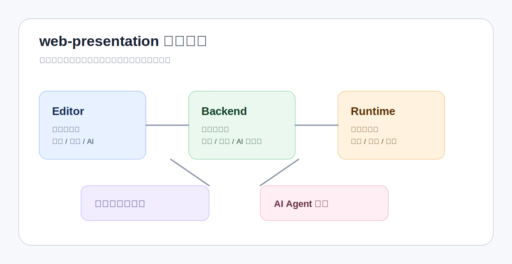

<!-- 文件功能：项目首页文档，面向最终用户介绍 web-presentation 的产品定位、核心能力、部署入口与文档导航。 -->
# web-presentation

`web-presentation` 是一个面向 AI 的演示文稿创作平台，用于创作 PPT、图文卡片、专题报告页、数据解读页等视觉化内容。平台把页面内容代码化，把资源、组件、主题和样式沉淀为可复用资产，再通过 Vue、Vite 和 Runtime 预览链路提供快速反馈，让 AI 更适合参与内容生成、结构调整、样式改写和多场景复用。



## 产品定位

现有 PPT 制作 skill 已经覆盖了几条典型路径，证明了 AI 很适合处理演示文稿中的内容组织、视觉生成和代码化表达。

| 方向 | 典型产物 | 主要优势 | 常见边界 |
| :--- | :--- | :--- | :--- |
| HTML deck skill | 单文件 HTML 演示页 | 风格稳定、轻交付、适合演讲和封面/配图扩展 | 更偏单次文件生成，团队资产、权限、版本和引用关系通常不进入系统模型 |
| 原生 PPTX skill | 可逐元素编辑的 `.pptx` | 保留 PowerPoint 文本、形状、图表、动画和模板复刻能力 | 重点在最终 PPTX 质量，运行时能力和跨项目资产复用不是核心 |
| 前端 slides skill | 零依赖 HTML / Web Slides | 浏览器预览、视觉风格探索、响应式和动效表现强 | 多以本地工作流为中心，项目上下文和组件资产沉淀有限 |
| `web-presentation` | 平台化页面、组件、资源与构建产物 | 工作空间资产管理、上下文注入、Runtime 预览构建、多用户隔离和私有化部署 | 更适合长期项目和团队资产沉淀，不是追求一次性生成单个文件的最短路径 |

`web-presentation` 的定位不同：它不是一次性的 PPT 生成 skill，也不是单纯的 HTML-to-PPTX 转换链路，而是面向 AI 的演示文稿创作平台。平台把资源、组件、主题、样式和字体抽象为工作空间资产，把页面内容代码化，让不同项目、不同风格、不同内容类型的演示资产可以持续沉淀和复用。AI 看到的是经过隔离和注入的项目上下文、页面上下文、资源清单、组件能力和样式约束；Runtime 负责承载 Vue/Vite 预览、构建、资源加载和基础能力，既利用前端框架的表达力，又避免运行环境细节干扰 AI 的创作任务。

## 核心能力

- **AI 原生创作**：页面内容以代码、结构化配置和工具调用契约表达，进入 LLM 更擅长理解、生成、修改和审查的领域。
- **资产抽象复用**：工作空间沉淀资源、组件、主题、样式和字体，支持 PPT、图文卡片、报告页、展示页等不同内容形态复用同一套基础资产。
- **快速可视反馈**：Runtime 基于 Vue 与 Vite 加载页面、组件和配置包，为 Editor 提供 iframe 预览、截图预览、组件预览和构建能力。
- **上下文隔离与注入**：Backend 为 AI 构造当前项目、页面、组件和资源的必要上下文，让 AI 聚焦具体创作，不需要关心 Runtime 内部实现。
- **平台化管理**：支持多用户、工作空间、项目、页面、组件、资源、主题、样式、AI 设置和构建产物的集中管理。
- **私有化交付**：平台镜像、Runtime 镜像和 compose 模板支持在自有环境中部署，便于团队控制数据、模型凭证和发布流程。

## 产品组成

| 模块 | 面向用户的角色 | 说明 |
| :--- | :--- | :--- |
| Editor | 创作工作台 | 管理工作空间、项目、页面、组件、资源、主题和样式，并提供代码编辑、AI 侧边栏和实时预览 |
| Backend | 平台控制面 | 负责用户、权限、数据持久化、AI Agent、预览上下文、构建任务和产物托管 |
| Runtime | 预览与构建引擎 | 基于 Vue/Vite 渲染页面和组件，承接预览、截图、诊断和发布构建 |
| Infra | 部署与运行环境 | 提供 Docker 镜像、compose 模板、发布流程和运行时依赖约束 |

详细架构、模块边界和目标业务流程见 [平台架构说明](./docs/developer/platform-architecture.md)。

## 快速部署

试部署推荐使用内置依赖的单机编排。它会拉起平台镜像、Runtime 镜像、PostgreSQL 和 Redis，适合在一台机器上快速验证完整链路。

1. 准备 Docker Engine 与 Docker Compose v2。
2. 打开 `deploy/docker-compose.with-deps.yml`，修改文件顶部注释列出的密码、访问地址和 `AI_SECRET_ENCRYPTION_KEY`。
3. 在 `deploy/` 目录启动服务：

```bash
docker compose -f docker-compose.with-deps.yml pull
docker compose -f docker-compose.with-deps.yml up -d
```

默认启动后访问 `http://127.0.0.1:8080`。外部 PostgreSQL/Redis、production env 版、HTTPS、升级和回滚见 [生产部署指南](./docs/developer/deployment-guide.md)。

## 当前阶段

平台已经具备登录、多用户隔离、工作空间/项目/页面管理、资源库、组件库、主题库、样式库、AI Agent 会话、工具确认、预览、截图、构建和容器发布的基础能力，主链路可以支撑从创作到预览、构建和私有化部署的闭环。

下一阶段会重点补齐共享样式库、共享组件库和共享资源库，增强多用户协作，优化预览、截图等高频链路性能，并继续优化项目上下文，让项目上下文与工作空间上下文保持更清晰的软隔离。

更详细的能力清单见 [当前状态与路线](./docs/user/project-status.md)。

## 文档导航

| 文档 | 内容 |
| :--- | :--- |
| [文档中心](./docs/README.md) | 用户文档、开发文档和图片资源目录 |
| [平台介绍](./docs/user/platform-overview.md) | 产品定位、核心概念、典型场景和平台组成 |
| [用户快速上手](./docs/user/getting-started.md) | 登录、工作空间、项目页面、AI、预览和构建流程 |
| [AI 协作创作指南](./docs/user/ai-assisted-creation/README.md) | AI 侧边栏、工具确认、上下文注入和协作建议 |
| [主题、字体与样式管理体系](./docs/user/design-system-management.md) | 主题库、字体注册、样式库、离线包和项目应用边界 |
| [组件管理体系](./docs/user/component-management.md) | 组件草稿、发布版本、引用升级、离线包和 AI 协作方式 |
| [资源管理体系](./docs/user/resource-management.md) | 资源类型、可编辑内容、替换归档删除、引用检查和字体资源 |
| [当前状态与路线](./docs/user/project-status.md) | 已落地能力、建设中事项和后续方向 |
| [平台架构说明](./docs/developer/platform-architecture.md) | 平台目标、模块职责、目标流程和 Runtime 子模块协作 |
| [开发与测试指南](./docs/developer/development-guide.md) | 本地依赖、测试入口、测试数据和运行态维护 |
| [测试治理说明](./docs/developer/testing-strategy.md) | L0-L3 测试分层、目录归属和 CI 策略 |
| [生产部署指南](./docs/developer/deployment-guide.md) | 外部依赖简化版、内置依赖简化版、production env 版 compose 部署与运维 |
| [CI/CD 与容器部署说明](./docs/developer/deployment-cicd.md) | 平台镜像、Runtime 镜像、Docker Hub 发布和 compose 策略 |
| [Runtime 项目说明](./runtime/README.md) | `web-runtime-vue` 子项目自身的能力、运行方式和对接文档 |

## 仓库结构

```text
web-presentation/
├── backend/                 # Backend 控制面服务
├── editor/                  # Editor 创作工作台
├── runtime/                 # web-runtime-vue Git 子模块
├── tests/                   # 根仓契约测试与 E2E smoke
├── docs/                    # 用户文档、开发文档和文档图片资源
├── deploy/                  # 外部依赖简化版、内置依赖简化版和 production env 版 compose 模板
├── Dockerfile               # 平台单镜像构建入口
└── docker-compose.dev.yml   # 本地开发/测试 PostgreSQL 与 Redis 入口，非部署模板
```

## License

当前仓库顶层内容采用 Apache License 2.0，见 [LICENSE](./LICENSE)。

`runtime/` 是独立项目 `web-runtime-vue` 的 Git 子模块，继续遵循它自身仓库内声明的许可证，见 [runtime/LICENSE](./runtime/LICENSE)。
