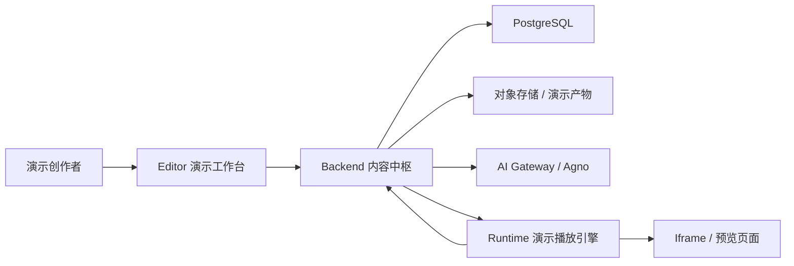
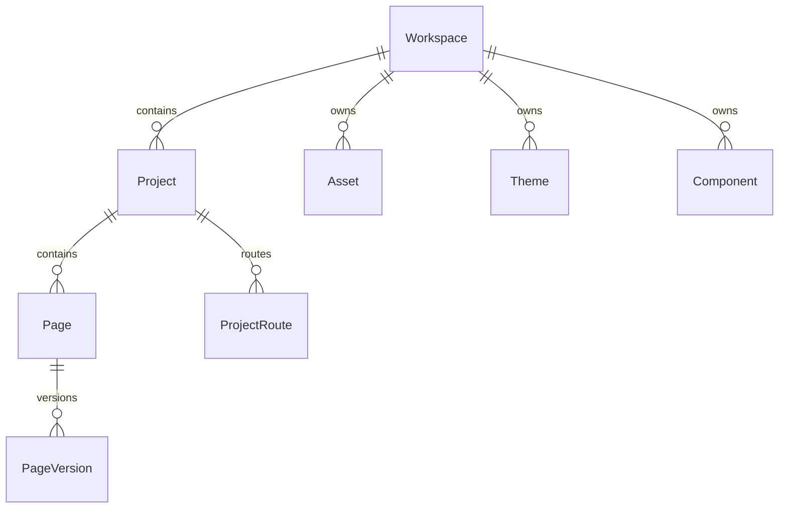
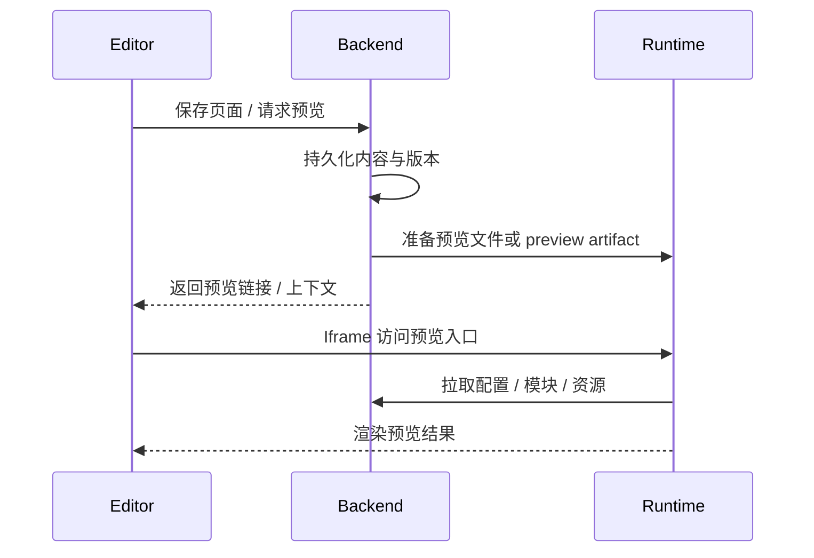
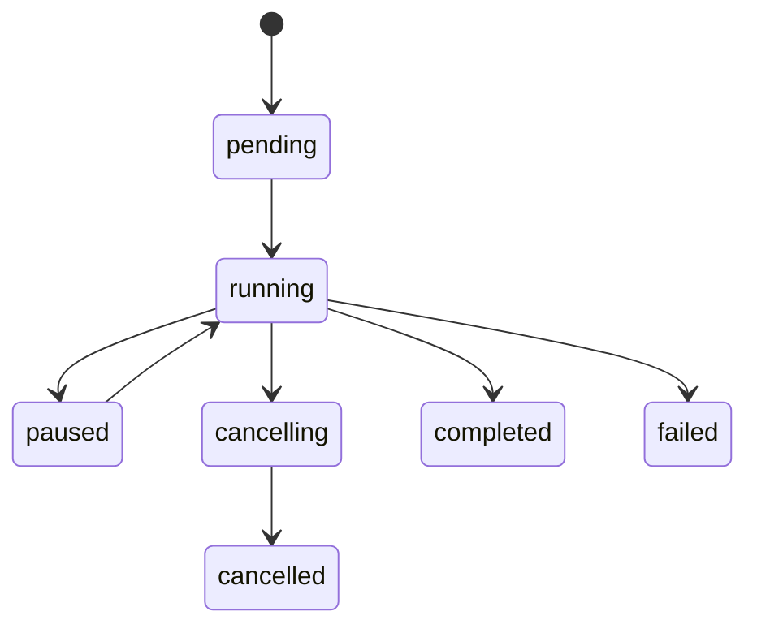

<!-- 文件功能：沉淀 web-presentation 当前项目介绍的 PPT 页面级大纲，面向最终用户讲清楚平台如何用 Vue Web 演示页面重塑 PPT 制作流程。 -->
# 当前项目介绍 PPT 大纲

本文档整理 `web-presentation` 当前项目介绍用 PPT 的详细大纲。新版叙事偏极客向，但主要面向最终用户：它不是先讲一个 Vue 技术平台，而是先讲一个用 Web 页面重塑 PPT 制作流程的产品。内容口径基于仓库 `README.md`、`backend/README.md`、`editor/README.md`、`runtime/README.md` 与 `docs/testing-strategy.md`，整理时间为 2026-05-15。

这里的“PPT”不是指必须输出 `.pptx` 文件，而是指最终用户熟悉的演示型内容：一页一页组织、有封面、有章节、有导航、有播放、有导出和交付需求的演示页面。当前项目的最终产物更准确地说是“类似 PPT 的 Vue Web 演示页面 / 演示项目”，后续可围绕 PDF、Zip、静态访问地址或标准 artifact 做交付。

## 1. 汇报定位

### 1.1 建议标题

**用 Vue Web 页面重塑 PPT 制作流程**

可选副标题：

- 把每一页演示内容变成可运行、可复用、可追踪的 Web 页面
- 面向极客创作者和团队内容生产的下一代演示工作台
- 不只是做 PPT，而是把 PPT 变成一个可编排的 Vue 演示项目

### 1.2 适用场景

- 产品介绍会：向最终用户说明这个工具如何替代传统 PPT 的重复劳动。
- 客户演示会：展示“演示内容即 Web 页面”的制作、预览、播放和交付体验。
- 技术型销售 / 解决方案会：用偏极客的方式解释为什么它比模板型 PPT 工具更强。
- 内部评审会：说明当前已落地能力、未覆盖范围与下一阶段产品化重点。

### 1.3 目标受众

- 高频做演示的人：关注能否更快做出统一、稳定、可复用的演示内容。
- 产品经理 / 售前 / 方案团队：关注如何管理模板、品牌、素材、版本和交付链接。
- 极客型创作者 / 前端能力用户：关注 Vue、组件化、主题、资源、交互和自动化能力。
- 团队负责人：关注多人协作、资产治理、权限、版本、AI 辅助和私有化部署。
- 工程与运维团队：关注平台底座是否可靠、可测试、可扩展、可审计。

### 1.4 建议时长与页数

- 15 分钟版本：保留 12-15 页，只讲用户痛点、产品体验、核心能力、当前状态和路线图。
- 30 分钟版本：保留 22-26 页，补充极客能力、AI、资源治理、交付方式和安全可信。
- 45 分钟版本：保留 30 页左右，适合产品深度演示、技术型客户介绍或内部架构评审。

### 1.5 汇报主线

1. 这个项目看起来是 Vue 页面平台，但对最终用户来说，它是一个重新设计 PPT 制作流程的演示生产工具。
2. 最终产物不是传统静态幻灯片文件，而是一组类似 PPT 的 Vue Web 演示页面：可播放、可导航、可预览、可复用、可交付。
3. 用户可以像做 PPT 一样组织页面，又能像做 Web 产品一样使用组件、主题、资源、数据、交互和 AI。
4. 平台底层通过 Backend、Editor、Runtime、AI Gateway 和测试治理保证内容资产可管理、演示效果可复现、AI 操作可审计。
5. 下一阶段重点是补齐从创作、预览、协作、构建到交付的完整演示生产闭环。

## 2. 建议章节结构

| 章节 | 建议页数 | 主要回答的问题 |
| :--- | :--- | :--- |
| 用户问题 | 4-5 页 | 为什么传统 PPT 流程需要被重塑 |
| 产品体验 | 6-8 页 | 用户如何从想法做出可播放的 Web 演示页面 |
| 极客能力 | 7-9 页 | Vue、组件、主题、资源、Runtime 和 AI 带来什么差异 |
| 可信底座 | 4-5 页 | 权限、版本、测试、交付和部署如何保证团队可用 |
| 当前状态与路线图 | 4-5 页 | 已完成什么，还有什么风险，下一步怎么产品化 |

## 3. 页面级大纲

### 第 1 页：封面

**标题：用 Vue Web 页面重塑 PPT 制作流程**

核心信息：

- 项目名称：`web-presentation`
- 项目形态：面向演示页面生产的 Web 工作台 / 平台集成仓库
- 关键词：PPT-like Web Pages、Vue、组件化、AI 协作、Runtime、私有化部署
- 日期：2026-05-15

建议视觉：

- 背景可使用“传统 PPT 页面变成 Web 演示页面”的视觉隐喻：左侧是静态幻灯片，右侧是可运行页面。
- 画面气质可以偏极客，但主体必须是最终用户能理解的演示制作场景。

讲稿提示：

- 开场先说明：我们不是再做一个 PPT 模板站，而是在把 PPT 制作流程迁移到可编排、可复用、可运行的 Web 页面体系里。
- 技术是可信度和差异化，不是第一层卖点；第一层卖点是“更快、更稳、更可复用地做演示内容”。

### 第 2 页：一句话定位

**标题：这不是普通 PPT 编辑器，而是演示页面生产系统**

核心结论：

- 平台让用户用类似 PPT 的心智组织内容，用 Vue Web 页面的能力承载最终演示效果。

内容要点：

- 用户最终得到的是一个个可播放的演示页面，而不是散落的截图、模板和本地文件。
- 创作过程仍然保留 PPT 的熟悉结构：项目、页面、封面、目录、章节、内容页、结束页。
- 底层能力则升级为 Web 原生：Vue 组件、主题变量、资源库、实时预览、版本、AI 辅助和构建交付。
- 对极客用户，可以开放代码、组件和 Runtime 能力；对普通用户，可以沉淀为模板、主题和可视化工作流。

建议视觉：

- 使用一条端到端链路：`想法 -> 页面 -> 组件 -> 主题 -> AI 修改 -> 实时预览 -> 播放 / 导出 / 交付`。
- 每个节点下方放 1 个代表能力：页面画布、组件库、品牌主题、AI 助手、播放链接、PDF / Zip / Artifact。

讲稿提示：

- 这页不要展开架构细节，只建立听众对“新一代 PPT 制作流程”的第一印象。

### 第 3 页：为什么需要这个平台

**标题：传统 PPT 流程的痛点，本质是生产方式太静态**

核心结论：

- 传统 PPT 适合快速拼页面，但当演示内容进入团队化、品牌化、组件化和多版本交付后，静态文件流程会快速失控。

内容要点：

- 结构断点：每一页都是手工排版，复用靠复制粘贴，改一处全局同步很痛。
- 资产断点：Logo、字体、图标、图表、主题色、素材散落在个人文件夹和聊天记录里。
- 版本断点：客户版、内部版、路演版、培训版不断分叉，最终很难知道哪一版可信。
- 交付断点：PPT 文件、PDF、截图、在线链接和演示现场常常不是同一个来源。
- AI 断点：AI 能生成内容，但如果没有上下文、权限和确认机制，很难放心让它直接修改作品。

建议视觉：

- 左侧放传统 PPT 工作流：复制模板、找素材、手动对齐、导出文件、反复发版本。
- 右侧放 Web 演示工作流：统一资产、组件复用、AI 修改、实时预览、链接 / Artifact 交付。

讲稿提示：

- 可以用一个实际场景说明：同一套产品介绍需要做路演版、客户版和培训版，传统 PPT 往往变成多个文件分叉；平台希望把它变成同一个演示项目下的多页面、多版本、多交付形态。

### 第 4 页：平台目标

**标题：目标是把 PPT 从文件流程升级为项目流程**

核心结论：

- 项目目标不是复制一个在线版 PowerPoint，而是把演示内容变成可管理、可复用、可运行、可交付的 Web 项目。

内容要点：

1. 像 PPT 一样组织：项目、章节、页面、封面、目录和播放顺序都符合演示心智。
2. 像 Web 一样表达：页面可以使用 Vue 组件、图表、主题、资源、交互和运行时能力。
3. 像代码一样治理：内容、配置、版本、组件、主题和资源都可追踪、可校验、可恢复。
4. 像产品一样交付：预览链接、PDF、Zip、静态访问或 artifact 可以围绕同一来源生成。

建议视觉：

- 四象限图：演示心智、Web 表达、资产治理、交付闭环。
- 每个象限给出用户能理解的结果，例如“少复制粘贴”“主题一处更新”“页面可回滚”“链接即交付”。

讲稿提示：

- 说明这四个目标共同指向一件事：让演示制作从手工文件劳动，升级为可持续演进的内容工程。

### 第 5 页：用户看见产品，背后是平台

**标题：一个演示工具，背后是一套可治理的内容生产平台**

核心结论：

- 最终用户看到的是“做演示页面”的工作台；团队真正需要的是支撑资产、版本、权限、AI 和交付的生产平台。

内容要点：

- 对用户：它是一个可以创建演示项目、编辑页面、预览播放、调用 AI 和交付成果的工作台。
- 对团队：它统一管理工作空间、项目、页面、组件、主题、字体、资源和模型配置。
- 对工程：它是一个 Monorepo 平台集成仓库，负责模块协作、接口契约、测试入口和部署集成。
- `runtime/` 是独立项目 `web-runtime-vue` 的 Git 子模块接入目录，承载演示播放和预览底座。
- `backend/`、`editor/`、`runtime/`、`tests/` 共同支撑最终用户感知到的一条演示生产链路。

建议视觉：

```text
web-presentation/
├── backend/   内容、版本、权限、AI 与任务中枢
├── editor/    演示创作工作台
├── runtime/   web-runtime-vue 演示播放底座
├── tests/     契约与 E2E
├── docs/      平台文档
└── docker-compose.dev.yml
```

讲稿提示：

- 这页可以用“用户只想做演示，但团队必须管理演示生产流程”来过渡到后面的极客能力。

### 第 6 页：总体架构

**标题：极客底座：把演示页当作可运行应用来生产**

核心结论：

- 一页演示不再只是静态画布，而是由数据、组件、主题、资源、运行时和 AI 共同驱动的 Web 页面。

内容要点：

- Editor：用户直接使用的演示工作台，提供项目、页面、资源、主题、组件、预览和 AI 入口。
- Backend：内容与权限中枢，负责认证、数据持久化、版本管理、任务调度、产物托管和 AI BFF。
- Runtime：演示播放引擎，负责页面渲染、导航、全屏、PDF、Runtime Kit 和未来构建执行。
- AI Gateway：Backend 内嵌 Agno 智能体运行时，让 AI 能在有上下文、有权限、有确认的前提下修改内容。
- Infra：Docker / Compose、PostgreSQL、对象存储和内部网络。

建议视觉：



讲稿提示：

- 面向最终用户时不要把这页讲成纯架构图；要讲成“为什么页面可以像 PPT 一样播放，又能像 Web 应用一样被管理和复用”。

### 第 7 页：模块职责总览

**标题：四个角色共同完成一套演示生产流程**

核心结论：

- 用户只感知一条顺滑流程，背后由四类能力分工协作。

内容要点：

| 模块 | 用户能感知的角色 | 技术选型 | 主要职责 |
| :--- | :--- | :--- | :--- |
| Backend | 记住一切、管住权限、托住版本 | Python 3.10+ / FastAPI / SQLAlchemy async | 认证、工作空间、项目、页面、资源、主题、组件、构建任务、AI BFF |
| Editor | 创作、管理和预览演示内容的工作台 | Vue 3 / Vite / Pinia / Element Plus | CRUD、代码编辑、预览 iframe、组件工作台、AI 侧栏 |
| Runtime | 真正播放演示页面的引擎 | Node.js / Vite Core API / Vue | 项目预览、页面预览、组件预览、Runtime Kit、PDF、构建 |
| AI Gateway | 会使用平台工具的内容助手 | Backend 内嵌 Agno | Agent 目录、会话、run task、事件、HITL、工具鉴权 |
| Infra | 部署编排 | Docker / Compose | 数据库、网络隔离、容器自愈 |

建议视觉：

- 表格可以保留技术列，但第一列解释要偏用户语言，避免全篇像内部架构汇报。

讲稿提示：

- 强调“AI 不是外接聊天框”，而是能在平台上下文中修改页面、管理组件和读取资源的助手。

### 第 8 页：核心用户路径

**标题：从想法到可播放 Web 演示页面**

核心结论：

- 用户可以把一次 PPT 制作拆成可管理的项目流程：创建演示项目、组织页面、套用主题、复用组件、调用 AI、实时预览并交付。

内容要点：

1. 用户进入工作空间，选择品牌主题和资源库。
2. 创建一个演示项目，设置页面尺寸、基础字号、图标规格和默认主题。
3. 像整理 PPT 一样创建封面页、目录页、内容页和结束页。
4. 在页面工作台中编辑内容，必要时进入代码或组件级细节。
5. 从组件库复用图表、版式、资产渲染器或业务组件。
6. 通过 AI 侧栏让助手改文案、补页面、调整风格、检查组件或管理资源。
7. 在 Runtime Iframe 中即时预览播放效果。
8. 发起构建或生成交付产物，形成链接、PDF、Zip 或标准 artifact。

建议视觉：

- 横向流程图，按“准备素材、组织页面、增强表达、预览播放、构建交付”分段。

讲稿提示：

- 这页可以作为后续详细能力介绍的目录页，也可以在正式演示时配合真实产品录屏。

### 第 9 页：Backend 当前能力

**标题：Backend 是用户看不见的演示内容中枢**

核心结论：

- 最终用户不直接关心 Backend，但他们关心“内容不会丢、版本能恢复、链接可访问、AI 操作可追踪”。

内容要点：

- 单管理员登录与 Cookie 会话，支撑私有化和受控访问。
- 工作空间、项目、页面 CRUD，承载演示内容组织结构。
- 页面版本管理：最新基线、向后 diff、重点快照、历史恢复。
- 工作空间组件草稿、发布版本和历史发布预览。
- 工作空间资源、图标、字体、主题等主数据管理，支撑品牌一致性。
- Runtime 文件上传、预览链接、项目级运行配置下发。
- 项目构建任务和构建产物代理，支撑从预览到交付。
- 用户级大模型配置、模型槽位绑定和 API Key 加密存储。
- Agno 智能体会话、run task、事件回放、HITL 与工具鉴权。

建议视觉：

- 用“用户承诺 -> Backend 能力”的方式展示，例如“不丢稿 -> 版本管理”“不乱改 -> 权限与 HITL”“能交付 -> 构建产物”。
- 能力可按内容、资产、交付、AI、安全五组排列。

讲稿提示：

- 面向用户讲“可靠感”，面向技术听众再补充数据模型、任务状态和工具鉴权。

### 第 10 页：Editor 当前能力

**标题：Editor 是演示创作者每天使用的工作台**

核心结论：

- Editor 承担传统 PPT 软件的主界面角色，但它同时接入组件、资源、主题、AI 和 Runtime 预览。

内容要点：

- 工作空间、项目和页面列表帮助用户管理多套演示内容。
- 页面详情工作台承载内容编辑、配置调整和 Runtime Iframe 预览。
- 主题库、字体库和资源库让团队可以维护品牌素材。
- 组件预览工作台让常用版式、图表、业务组件进入版本化复用。
- 全局左侧 AI 侧栏作为内容助手入口，可在不同场景切换总控智能体和组件助手。
- 账户 AI 设置页让用户理解工具能力边界，而不是让 AI 黑箱修改内容。

建议视觉：

- 可以用 4 个界面缩略图占位：演示项目列表、页面详情预览、组件工作台、AI 侧栏。
- 如果制作正式 PPT，建议从本地环境截取真实界面，增强可信度。

讲稿提示：

- 强调 Editor 不是后台管理系统，而是把“做 PPT、管素材、调样式、问 AI、看预览”放在一起的创作工作台。

### 第 11 页：Runtime 当前能力与定位

**标题：Runtime 是 Web 演示页面的播放引擎**

核心结论：

- 用户看到的播放、翻页、目录、全屏、PDF 和页面渲染效果，都由 `web-runtime-vue` 这个 Runtime 底座承载。

内容要点：

- 当前 Runtime 项目定位已收敛为面向 SaaS 平台的只读预览 Runtime。
- 支持配置驱动的 PPT-like 演示页面渲染。
- 支持 `app.config.yaml` 驱动页面画布尺寸。
- 支持目录导航、翻页、全屏放映、PDF 导出。
- 维护 `runtime/src/runtime-kit/manifest/runtime-kit.manifest.json`，作为页面可引用 Runtime 基础能力的公开清单。
- 支持 `x-runtime-preview-context` + JWKS 验签启动整项目预览。
- 支持通过 preview artifact 清单白名单解析远程页面模块与静态资源。

需要解释的口径：

- 顶层平台文档中仍记录了早期页面文件推送与 HMR 预览基线。
- Runtime 子项目文档已明确后续平台接入方向：只读、无状态、基于 PreviewContextToken 和 PreviewArtifact。
- 汇报时建议用“已具备预览接入基线，正在向 artifact 化只读 Runtime 演进”表述，避免把阶段能力和目标架构混为一个完成态。

建议视觉：

- Runtime 内部结构图：Preview Entry、Runtime Shell、Runtime Kit、Config Bundle、Remote Modules、PDF Export。
- 对最终用户可以把它表达成“播放器 + 页面运行环境 + 导出引擎”。

讲稿提示：

- 面向用户强调“播放效果一致、导出来源一致”；面向极客用户再解释 Runtime shell 与 Runtime Kit 的边界。

### 第 12 页：Runtime Kit 公开能力边界

**标题：高级页面能力通过 Runtime Kit 受控开放**

核心结论：

- 极客用户可以使用 Runtime Kit 写出更强的演示页，但平台会通过 manifest 控制哪些能力可被页面安全引用。

内容要点：

- Manifest 路径：`runtime/src/runtime-kit/manifest/runtime-kit.manifest.json`。
- Backend 读取 manifest 并校验 `@runtime-kit` / `@workspace-components` 导入边界。
- 页面和工作空间组件只能引用公开的基础组件、composable、工具和类型。
- Runtime shell、component-preview 宿主页、PDF 导出、侧栏、Toast、ErrorBoundary 等壳层能力不得通过 `@runtime-kit` 暴露。
- 该机制保证页面内容可迁移、可校验、可安全执行，也避免用户演示页误依赖内部壳层能力。

建议视觉：

- 左侧“允许暴露”：基础组件、资产组件、页面组件、主题 / 资源 composable。
- 右侧“禁止暴露”：壳层、宿主页、调试能力、内部渲染器、错误边界。

讲稿提示：

- 面向最终用户可以解释成“插件能力清单”；面向工程听众再解释为什么不能让页面任意 import Runtime 内部代码。

### 第 13 页：工作空间、项目与页面模型

**标题：演示内容从单个文件升级为工作空间、项目和页面**

核心结论：

- 传统 PPT 把所有东西塞进一个文件；平台把团队资产、演示项目和单页内容拆开管理。

内容要点：

- 工作空间：资源库、组件库、主题库、字体、默认主题和团队级治理边界。
- 项目：一套演示内容，包含页面集合、播放顺序、展示规格、主题引用和构建配置。
- 页面：类似 PPT 的单页内容，包含页面源码、版本历史、截图、组件使用索引和资源引用。
- 页面版本：支持普通版本号、重点快照、历史恢复和 diff 压缩存储。
- 页面展示配置：宽高、基础字号、默认描边宽度维护在项目配置中；Icon 默认尺寸跟随基础字号，局部尺寸通过 Tailwind 尺寸类控制。

建议视觉：



讲稿提示：

- 说明平台把可复用资源放到工作空间，把演示结构放到项目，把具体画面放到页面。

### 第 14 页：资源库、主题库与字体治理

**标题：品牌素材不再散落在每个 PPT 文件里**

核心结论：

- 平台把图标、字体、主题、Logo 和项目图标变成工作空间级主数据，让演示页面天然保持品牌一致。

内容要点：

- 工作空间资源库维护图标、渲染资源、字体等资产。
- 主题库维护颜色、字体绑定、Logo 和项目图标。
- 项目配置通过 `theme_key` 引用主题。
- 组件预览默认配置也通过主题引用和 page 参数覆盖控制预览环境。
- 新主题配置不再输出基础字号和图标默认规格，这些规格归属项目页面展示配置。
- Runtime 在线拉取 `app/icons/routes/themes` 配置，支持 legacy 主题配置兼容。

建议视觉：

- 展示“工作空间主题库 -> 演示项目主题引用 -> Runtime themes.config.yaml -> 页面渲染”的链路。

讲稿提示：

- 强调主题不是单页样式片段，而是团队演示内容的品牌资产。

### 第 15 页：组件库与组件预览工作台

**标题：把常用幻灯片块沉淀为可复用组件**

核心结论：

- 常用图表、封面版式、指标卡、流程图、资产渲染器和业务说明模块，可以从复制粘贴升级为版本化组件。

内容要点：

- 组件草稿保存与正式发布版本管理。
- 历史发布预览。
- 组件预览 schema 管理参数、默认配置和预览布局。
- 组件依赖与资源引用索引。
- 组件源码可通过 `@workspace-components/<component_code>/v/<version_no>` 引用。
- 默认导入名由组件 `import_name` 提供。
- 组件助手可以读取 Runtime Kit 能力、生成 diff、检查代码、发布组件或删除组件。

建议视觉：

- 组件生命周期图：创建草稿 -> 预览 -> 检查 -> 发布 -> 页面引用 -> 版本回溯。

讲稿提示：

- 说明组件库是重塑 PPT 流程的关键：团队不再复制某一页，而是复用一个稳定组件。

### 第 16 页：项目路由与运行配置

**标题：播放顺序、页面规格和主题引用都由项目统一管理**

核心结论：

- 对用户来说，这是“目录、章节、页面规格、主题选择”的配置；对 Runtime 来说，它会被转成可执行的运行配置。

内容要点：

- 项目路由由 Editor UI 编排并由 Backend 结构化存储，对应演示的目录和播放顺序。
- Runtime 所需的 `component` 路由结构由 Backend 动态组装下发。
- `routes.config.yaml` 不再依赖手写配置作为唯一来源。
- `app.config.yaml` 下发页面宽高、基础字号、图标默认尺寸和描边宽度。
- `icons.config.yaml` 和 `themes.config.yaml` 由 Backend 根据项目与工作空间数据生成。

建议视觉：

- 用“Editor 配置 -> Backend 结构化数据 -> Runtime YAML / Config Bundle”的三段图。

讲稿提示：

- 这页可以解释为什么一套演示不应该只靠本地配置文件，而应该由平台统一管理播放结构。

### 第 17 页：预览链路

**标题：实时预览让 Web 演示像 PPT 一样可见即所得**

核心结论：

- 用户在工作台里修改页面后，可以在 Iframe 中看到接近真实播放环境的预览；背后由 Backend 和 Runtime 保证权限、上下文和渲染一致性。

内容要点：

- Editor 保存页面内容后调用 Backend。
- Backend 持久化页面内容和版本信息。
- Editor 显式发起页面文件上传或预览准备动作。
- Backend 调用 Runtime 内网接口或生成预览上下文。
- Runtime 渲染页面 / 项目 / 组件预览，呈现最终演示效果。
- Editor 在 Iframe 中展示预览结果。
- Backend 可调用 Runtime 预览页进行截图保存。

建议视觉：



讲稿提示：

- 面向用户讲“改完就能看，预览就是最终播放环境”；面向架构评审再说明预览入口需要鉴权，不能让 Runtime 成为无权限的数据出口。

### 第 18 页：构建与产物链路

**标题：交付不再是另存为文件，而是从同一来源生成产物**

核心结论：

- 平台目标是让一套演示项目可以从同一内容来源生成可预览、可播放、可下载或可托管的交付形态。

内容要点：

- 用户在 Editor 中选择演示项目或页面范围并发起构建。
- Backend 创建构建任务并记录任务状态。
- Runtime 根据任务上下文动态生成入口并调用 Vite build。
- Runtime 将产物压缩为 Zip 或标准 artifact。
- Backend 接收、托管并提供下载、静态访问代理或后续发布入口。
- 当前仓库已有项目构建任务、构建产物字段和相关测试基础。

建议视觉：

- 构建流水线：演示项目 -> Build Job -> Runtime Build -> Artifact -> Backend Storage -> 下载 / 访问 / 归档。

讲稿提示：

- 说明用户不需要维护多个版本文件；预览、播放和交付都应围绕同一套项目数据生成。

### 第 19 页：AI Gateway 总体设计

**标题：AI 是会使用平台工具的演示制作助手**

核心结论：

- 用户需要的不是一个只会聊天的 AI，而是一个知道当前项目、页面、组件、资源和权限边界的演示制作助手。

内容要点：

- Backend 直接构建 Agno `Agent` 或 `Team`，不挂载 AgentOS routes。
- Editor 通过 `/api/admin/ai/*` 调用 Backend BFF。
- 当前稳定入口：
  - `agent-coordinator`：内容助手 Team 入口。
  - `component-manager`：组件助手。
  - `resource-manager`：资源助手。
- 页面编辑与项目管理能力由 `agent-coordinator` 内容助手主执行，例如读取页面、修改页面、读取项目配置、处理截图上下文。
- 组件与资源能力可独立运行，也可作为 Team 成员按需协作。

建议视觉：

- 一个 Agent Team 图：Coordinator 位于中心，Component Manager 与 Resource Manager 作为成员，工具能力按页面、项目、组件、资源、截图分组。
- 旁边可以放最终用户命令示例：“把这一页改成客户汇报风格”“把指标卡组件做成深色主题”“检查这个组件有没有引用非法能力”。

讲稿提示：

- 强调 AI 不是旁路能力；它越能改内容，就越必须被纳入权限、上下文、确认和审计。

### 第 20 页：AI 会话与后台运行机制

**标题：AI 修改演示内容，需要可恢复、可追踪、可解释**

核心结论：

- 对最终用户来说，AI 任务不应该因为关闭侧栏、切换页面或网络抖动就丢失；对团队来说，AI 修改过程必须有状态、有事件、有回放。

内容要点：

- 用户视角：一次 AI 协作就是一个会话，围绕当前演示项目和页面持续工作。
- 前端视角：Editor 围绕 `session_id` 工作，SSE 只是订阅事件，不决定任务生命周期。
- 后端视角：Backend 创建 `ai_agent_run_tasks` 并启动后台任务。
- 事件视角：Agno stream events 被规范化写入 `ai_agent_run_events`，支持断线后回放。
- 恢复视角：回到会话后可通过 `active-run` 和事件 stream 恢复界面。
- 状态视角：`pending / running / paused / cancelling` 表示非终态，`completed / cancelled / failed` 表示终态。

建议视觉：



讲稿提示：

- 这页可以偏极客，但要落到用户价值：AI 不是一次性聊天气泡，而是可恢复的演示制作任务。

### 第 21 页：HITL、工具确认与结构化提问

**标题：AI 可以动手改页面，但关键动作必须由用户拍板**

核心结论：

- 平台允许 AI 修改页面、组件、样式和资源，但涉及高风险动作时会暂停，让用户确认或回答结构化问题。

内容要点：

- AI 不确定用户意图时，可以通过 `ask_user` 提出结构化单选问题。
- Editor 在输入区覆盖展示确认或逐题选择界面，用户不用离开当前创作流。
- 用户可继续、取消或在需要时强制释放 session 占用。
- 项目样式配置写入、路由整树覆盖、路由节点移除、组件删除等操作需要确认。
- 工具调用通过 run 级授权校验当前用户、会话、Agent、来源、scope 和 run 状态。
- 工具授权使用短租约滑动刷新，不再签发嵌套工具 JWT。

建议视觉：

- 左侧展示 AI 想执行的动作，右侧展示“暂停 -> 用户确认 -> 恢复执行”的控制门。

讲稿提示：

- 强调人在环不是打断体验，而是让用户敢把真实演示项目交给 AI 改。

### 第 22 页：Agent 工具规格单一事实源

**标题：AI 工具不是黑箱，工具说明和风险等级可被用户看见**

核心结论：

- 面向最终用户，AI 工具需要可理解、可配置、可追责；面向工程团队，工具元数据必须来自同一个规格源。

内容要点：

- 用户在账户 AI 设置页可以看到工具说明、参数 schema、调用示例、返回示例、上下文要求和运行时披露组。
- 工具风险、确认要求和参数契约由系统控制，不能被用户随意绕过。
- 文件：`backend/app/ai/tool_specs.py`。
- 维护工具 key、工具组、说明、风险级别、确认要求、上下文要求、参数 schema、调用格式和返回示例。
- `agent_catalog.py`、`tools/disclosure.py`、组件管理工具注册、Editor Agent 配置页都应从规格派生。
- 用户只允许编辑智能体描述、业务补充提示词、Team 成员描述、工具说明和工具提示词。

建议视觉：

- 中心放 `tool_specs.py`，向外派生 Agent Catalog、Disclosure、Agno Functions、Editor AI 设置页、Tests。

讲稿提示：

- 对用户讲“AI 能力透明”；对工程讲“AI 工具越多，越需要单一事实源”。

### 第 23 页：用户级模型与 Agent 配置

**标题：团队可以选择模型，也可以配置 AI 的工作方式**

核心结论：

- 不同团队对模型、隐私、成本和图片理解能力的要求不同，因此平台支持用户级模型和 Agent 配置。

内容要点：

- 支持供应商目录接口，便于接入不同 OpenAI-compatible 模型服务。
- 支持模型配置 CRUD 和 API Key 加密存储。
- 固定槽位覆盖 `agent_coordinator` 与 `component_manager`。
- 模型配置声明是否支持图片输入。
- 图片输入支持 png / jpg / jpeg / webp，大小不超过 10MB。
- 当模型不支持图片输入时，页面截图视觉工具会隐藏，避免给用户一个不可用入口。
- 新 run 会读取最新用户配置，正在运行的 run 不会被强制中断。

建议视觉：

- 模型配置表 + Agent 槽位绑定图 + “是否支持图片输入”的能力标记。

讲稿提示：

- 说明用户可配置的是“模型选择和业务提示风格”，不是绕过系统安全、工具契约或确认策略。

### 第 24 页：安全与隔离设计

**标题：演示内容要可分享，但不能失控流出**

核心结论：

- 演示内容通常包含客户方案、内部数据和品牌资产，因此分享、预览、AI 修改和资源访问都必须受控。

内容要点：

- 登录态：浏览器继续持有 `wp_admin_session` Cookie。
- 权限边界：Backend 负责用户、工作空间、项目和页面权限校验。
- 预览边界：Runtime 平台接入方向使用 `x-runtime-preview-context` + JWKS 验签。
- Artifact 边界：Preview artifact 以 `tenant_id + artifact_id + scope_type` 做边界。
- 能力边界：Runtime 远程模块和资源通过 manifest 白名单解析。
- AI 边界：工具调用校验 run 状态、scope、来源和用户归属。
- 截图边界：页面截图工具只允许传 `page_id`，由 Backend 校验工作空间 / 项目边界。

建议视觉：

- 多层防线图：登录态、Backend ACL、Runtime token、Artifact whitelist、AI tool auth。

讲稿提示：

- 讲给最终用户时强调“可分享但不裸奔”；讲给技术听众时再展开多层鉴权和隔离。

### 第 25 页：测试治理体系

**标题：演示工作流能不能被团队长期使用，取决于测试治理**

核心结论：

- 如果要替代 PPT 流程，平台不能只靠人工点一点；当前仓库已建立子项目测试、跨模块契约和平台 E2E 的分层治理。

内容要点：

| 层级 | 目标 | 归属 |
| :--- | :--- | :--- |
| L0 单元 / 组件测试 | 纯函数、组件局部渲染、局部状态流 | 各子项目 |
| L1 子项目集成测试 | API、状态流、预览构建、Runtime 壳层行为 | 各子项目 |
| L2 跨模块契约测试 | Backend 与 Runtime、Editor 与 Backend 稳定协议 | 根仓 `tests/contracts/` |
| L3 平台 E2E 冒烟 | 登录、页面、组件、资源、主题、AI、构建等演示主链路 | 根仓 `tests/e2e/` |

命令入口：

- `pnpm run test:backend`
- `pnpm run test:editor`
- `pnpm run test:runtime:delegated`
- `pnpm run test:contracts`
- `pnpm run test:e2e`
- `pnpm run test:all`

建议视觉：

- 测试金字塔或四层台阶图，旁边标注最终用户关心的结果：“登录可用、页面可预览、组件可发布、AI 可恢复、构建可追踪”。

讲稿提示：

- 这页不必把命令讲完，重点说明平台用测试保证演示生产链路不是一次性 demo。

### 第 26 页：开发与部署入口

**标题：私有化部署和极客扩展需要清晰的工程入口**

核心结论：

- 面向最终用户，这意味着平台可以私有化落地；面向极客和工程团队，这意味着前端、后端、Runtime 和数据库有清晰开发入口。

内容要点：

- 前端统一使用 `pnpm`。
- Python 项目使用 `uv` 和 venv。
- 根目录 `docker-compose.dev.yml` 提供本地 PostgreSQL。
- Backend 常用命令：
  - `uv sync`
  - `uv run alembic upgrade head`
  - `uv run python -m app.scripts.seed_admin`
  - `uv run uvicorn app.main:app --reload`
- Editor 常用命令：
  - `pnpm install`
  - `pnpm dev`
  - `pnpm build`
  - `pnpm test`
- Runtime 常用命令：
  - `pnpm install`
  - `pnpm dev`
  - `pnpm check`
  - `pnpm test`
  - `pnpm build`

建议视觉：

- 三列命令卡片：Backend、Editor、Runtime；可以弱化命令细节，把它作为“可私有化、可二开、可验证”的证据。

讲稿提示：

- 面向产品介绍时这页可以折叠；面向技术型客户或内部工程评审时保留。

### 第 27 页：当前已落地能力总结

**标题：当前已经具备从创作到预览的可运行基线**

核心结论：

- 当前项目已不再是纯概念，已经具备演示项目管理、页面预览、资源主题组件治理和 AI 辅助的多条主链路基线。

内容要点：

- Runtime 已作为 `web-runtime-vue` 子模块接入，并具备独立可运行内容。
- Backend 已完成演示页面管理一期内容中枢基线。
- Editor 已完成演示页面管理一期工作台基线。
- 工作空间、项目、页面、资源、主题、字体、组件等主数据已经逐步落地。
- Runtime 文件接口、预览链接、配置下发和截图链路已有基线。
- AI 已实现 session-first run、后台任务、事件回放、HITL、用户级模型配置和工具规格治理。
- 根仓已建立 L2 契约测试和 L3 平台 E2E 冒烟。
- 项目构建任务和构建产物链路已有数据模型、服务和测试基础。

建议视觉：

- 用“用户能做什么”加状态标签：能建项目、能管页面、能预览、能管主题、能管组件、能用 AI、能发起构建。

讲稿提示：

- 这里要避免过度承诺，把“可运行基线”和“完整替代 PPT 生产流程”区分开。

### 第 28 页：当前未覆盖范围与主要风险

**标题：要真正重塑 PPT 流程，还需要补齐完整交付闭环**

核心结论：

- 当前差距不在“能否做页面”，而在“能否稳定支撑团队长期用它完成从创作到交付的全流程”。

内容要点：

- 完整资源中心、Dashboard、项目与页面关联使用关系仍未完全覆盖。
- Runtime 反向回传 Backend 和构建产物标准化链路仍需继续完善。
- 顶层文档中的早期 HMR / 文件推送基线与 Runtime 子项目的只读 artifact 方向需要进一步统一文档口径。
- 单进程 AI 后台任务当前可用，但多 worker 部署需要共享队列或共享 cancellation manager。
- 长链路 AI 测试、截图 / PDF / 打印 / 放映等能力适合进入夜间或手动扩展回归。
- 生产环境对象存储、服务令牌、JWKS、反向代理和多租户隔离需要部署级验证。

建议视觉：

- 风险矩阵：影响程度 x 处理优先级。

讲稿提示：

- 这页要诚实说明边界：当前是重塑 PPT 流程的底座和基线，不是完整成熟的商业化成品。

### 第 29 页：路线图建议

**标题：路线图围绕“演示生产闭环”推进**

核心结论：

- 下一阶段应优先让用户能完成一套演示从创建、编辑、预览、AI 辅助、构建到交付的闭环，再增强多租户、安全、AI 和工程治理。

近期重点：

- 统一 Runtime 接入口径：明确页面文件推送基线与 PreviewArtifact 目标链路的关系。
- 完善演示项目构建产物回传、托管、下载和代理访问。
- 补齐资源中心、组件使用关系和项目页面关联索引。
- 扩展平台 E2E，覆盖构建产物、截图、PDF、放映和关键 AI 链路。
- 强化用户文档与工程文档：创作指南、交付说明、接口契约、Runtime artifact 规范和 AI 工具变更流程。

中期重点：

- AI 后台 run 迁移到可横向扩展的队列或任务系统。
- Runtime preview artifact 全链路稳定化。
- 多租户隔离、对象存储和服务令牌生产验证。
- 增强模板体系、组件市场、品牌主题库和复用治理。

长期重点：

- 平台级演示内容生产流水线。
- 多团队工作空间治理。
- 智能体按组织策略、安全等级和业务角色动态装配工具。
- 发布、回滚、审计和交付统计闭环。

建议视觉：

- 三段式路线图：近期、中期、长期。

讲稿提示：

- 路线图要围绕用户完成一套演示的闭环组织，而不是按 Backend、Editor、Runtime 平均分配任务。

### 第 30 页：结束页

**标题：项目价值：把 PPT 从静态文件变成可运行的演示项目**

核心结论：

- `web-presentation` 正在形成一套可私有化部署的 Vue Web 演示生产平台，核心价值是把传统 PPT 的页面制作、素材管理、版本协作、播放预览、构建交付和 AI 辅助统一到同一个可治理系统中。

内容要点：

- 对用户：用熟悉的演示心智，得到更强的 Web 页面表达能力。
- 对团队：统一组件、资源、主题、页面版本和交付来源。
- 对极客创作者：把 Vue、Runtime Kit、组件和配置能力带进演示制作。
- 对 AI：让智能体在有权限、有上下文、有确认、有回放的体系内执行任务。
- 对工程：通过文档、契约测试和 E2E 冒烟降低跨模块协作成本。

建议视觉：

- 用 5 个关键词收尾：Web 演示、组件复用、品牌治理、AI 协作、交付闭环。

讲稿提示：

- 结束时回到第一句话：这不是“再做一个 PPT”，而是把 PPT 制作流程升级成一个可运行、可复用、可交付的 Web 演示项目流程。

## 4. 可裁剪版本

### 4.1 15 分钟精简版

建议保留：

1. 封面
2. 一句话定位
3. 传统 PPT 流程痛点
4. 从文件流程升级为项目流程
5. 从想法到可播放 Web 演示页面
6. Editor 演示工作台
7. Runtime 演示播放引擎
8. 组件库与品牌资产治理
9. AI 演示制作助手
10. 实时预览与交付链路
11. 安全与隔离设计
12. 测试治理体系
13. 当前已落地能力总结
14. 当前未覆盖范围与主要风险
15. 路线图建议

### 4.2 技术型客户 / 架构评审版

建议重点展开：

- 极客底座：把演示页当作可运行应用来生产
- Backend 内容中枢
- Runtime 只读 artifact 方向
- Runtime Kit manifest 边界
- 预览链路
- 构建与产物链路
- AI session-first 机制
- HITL 与工具鉴权
- 安全与隔离设计
- 测试治理体系
- 当前风险与路线图

### 4.3 最终用户产品介绍版

建议弱化：

- 工具规格源细节
- 具体环境变量和命令
- 状态机字段
- 具体目录路径
- 过深的控制面 / 数据面术语

建议强化：

- 传统 PPT 制作痛点
- 最终产物是类似 PPT 的 Web 演示页面
- 用户路径
- 页面、组件、主题、资源、AI 的实际创作体验
- 交付闭环
- 风险和计划

## 5. 制作正式 PPT 时的素材建议

### 5.1 需要截取的界面

- 演示项目列表或工作空间入口。
- 页面详情工作台和 Runtime Iframe 预览。
- 一套类似 PPT 的演示页面播放效果：封面、目录、内容页、结束页。
- 主题库、字体库或资源库管理页。
- 组件预览工作台，尤其是可复用图表 / 指标卡 / 版式组件。
- AI 全局侧边栏、工具确认和结构化提问界面。
- 构建弹窗、构建历史或产物下载入口。

### 5.2 需要绘制的架构图

- 传统 PPT 文件流程 vs Web 演示项目流程。
- 从想法到可播放 Web 演示页面的用户路径图。
- 演示项目模型：工作空间、项目、页面、组件、主题、资源。
- 极客底座架构图：Editor、Backend、Runtime、AI Gateway、Storage。
- 预览时序图。
- 构建产物链路图。
- AI session-first 状态机。
- Runtime Kit manifest 边界图。
- L0-L3 测试治理图。

### 5.3 建议数据或证据

- 当前可管理的对象范围：工作空间、项目、页面、组件、资源、主题、字体、模型配置。
- 已有测试数量和关键测试目录。
- 已支持的 Agent 工具数量和分组。
- 已有 E2E 覆盖的演示主链路。
- 当前 Runtime manifest 中公开能力数量。
- 构建任务和 artifact 相关接口 / 表结构状态。
- 一套示例演示项目的页面数量、组件复用数量、主题引用和预览截图。

## 6. 讲述口径注意事项

- 明确区分“当前已落地基线”和“目标态设计”，避免把规划能力说成完全可生产使用。
- 首先讲“重塑 PPT 制作流程”，再讲“Vue 页面平台”；不要反过来。
- 明确说明最终产物是类似 PPT 的 Vue Web 演示页面 / 演示项目，不是传统 `.pptx` 文件本身。
- `runtime/` 必须说明是 `web-runtime-vue` 子模块，不是普通内部目录。
- Runtime 当前方向建议表述为“只读、无状态、artifact 化预览 Runtime”，同时说明平台已有文件推送 / 预览接入基线。
- AI 能力要强调权限、工具确认、事件回放和配置治理，不要只讲模型接入。
- 平台价值要围绕演示生产闭环，而不是单独强调编辑器、Runtime 或 AI 任一模块。
- 面向最终用户时，减少 `session_id`、JWKS、manifest 等词汇密度，改用“可恢复 AI 任务”“签名预览上下文”“公开能力清单”等解释。
- 偏极客向不是堆术语，而是让用户感受到：这套工具能把演示内容做成可运行、可复用、可治理的作品。
