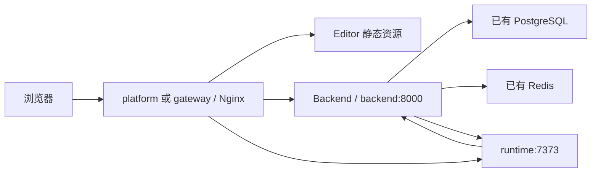

<!-- 文件功能：面向部署人员说明 web-presentation 生产环境 Docker Compose 部署、外部依赖接入、升级、回滚与运维检查流程。 -->
# 生产部署指南

本文档说明如何使用 `deploy/` 目录部署 `web-presentation`。生产环境只拉取 CI/CD 已发布镜像，不在目标机器执行构建。

实际部署只涉及两个业务镜像：

- `llmxpm/web-presentation:latest`：平台镜像。默认 simple 编排用作 `platform` 容器；生产可维护编排被 `backend-migrate`、`backend`、`gateway` 三个容器复用。
- `llmxpm/web-runtime-vue:latest`：Runtime 镜像，被 `runtime` 容器使用。

默认 simple 与生产可维护编排把 PostgreSQL、Redis 作为外部依赖接入；`docker-compose.with-deps.yml` 会在同一个 compose 内创建 PostgreSQL 与 Redis。

## 部署文件

| 文件 | 作用 |
| :--- | :--- |
| `deploy/docker-compose.yml` | 默认 simple 编排，使用外部 PostgreSQL/Redis，启动 `platform` 与 `runtime` |
| `deploy/docker-compose.production.yml` | 生产可维护编排，拆分 Backend 迁移、Backend、Runtime 和 Gateway |
| `deploy/docker-compose.with-deps.yml` | simple 全量单机编排，随应用一起启动 PostgreSQL 与 Redis |
| `deploy/.env.example` | 环境变量示例，部署时复制为 `deploy/.env` 后替换标签、域名、密钥和外部依赖地址 |
| `docker/nginx/web-presentation.conf` | 平台镜像内置的 Gateway Nginx 配置，托管 Editor 并代理 Backend 与 Runtime |

默认 simple 编排中，生产访问入口是 `platform` 容器内的 Nginx，对宿主机暴露 HTTP 端口；`runtime` 默认只在 compose 内网访问。`platform` 容器内通过 `extra_hosts` 把 `backend:8000` 指向本机 Backend，compose 网络中通过别名把 `backend:8000` 暴露给 Runtime 回源。

生产可维护编排中，访问入口仍是单独的 `gateway` 容器；`backend` 和 `runtime` 默认只在 compose 内网访问。

## 前置条件

- 已安装 Docker Engine 与 Docker Compose v2。
- 默认 simple 与生产可维护编排需要已准备可访问的 PostgreSQL 与 Redis；`docker-compose.with-deps.yml` 会随应用启动内置 PostgreSQL 与 Redis。
- 已准备对外域名，例如 `https://presentation.example.com`。
- 部署机器可以拉取 `llmxpm/web-presentation:latest` 与 `llmxpm/web-runtime-vue:latest`。
- 如需要 HTTPS，建议在外层 Nginx、Traefik 或云负载均衡终止 TLS，再转发到默认 simple 编排的 `platform` HTTP 端口，或生产可维护编排的 `gateway` HTTP 端口。

## 准备配置

复制示例环境变量：

```bash
cp deploy/.env.example deploy/.env
```

Windows PowerShell 可使用：

```powershell
Copy-Item .\deploy\.env.example .\deploy\.env
```

至少修改以下变量：

| 变量 | 要求 |
| :--- | :--- |
| `PUBLIC_BASE_URL` | 浏览器访问平台的公网地址，不要以 `/` 结尾 |
| `BACKEND_PUBLIC_BASE_URL` | Backend 对外公开地址，用于生成资源、截图、构建产物和预览入口链接 |
| `RUNTIME_PUBLIC_BASE_URL` | Runtime 对外公开地址，用于预览页加载 Runtime JS/CSS 与截图资源代理 |
| `DATABASE_URL` | 默认 simple 与生产可维护编排使用的已有 PostgreSQL 连接串，数据库和用户需要提前创建 |
| `REDIS_URL` | 默认 simple 与生产可维护编排使用的已有 Redis 连接串 |
| `POSTGRES_PASSWORD` | `docker-compose.with-deps.yml` 内置 PostgreSQL 密码 |
| `REDIS_PASSWORD` | `docker-compose.with-deps.yml` 内置 Redis 密码 |
| `DEFAULT_ADMIN_PASSWORD` | 首次启动创建默认管理员时使用 |
| `AI_SECRET_ENCRYPTION_KEY` | 用于加密用户模型凭证，必须重新生成并长期保存 |
| `CORS_ORIGINS` | JSON 数组字符串，应包含 `PUBLIC_BASE_URL` |

可用 Python 标准库生成 `AI_SECRET_ENCRYPTION_KEY`：

```powershell
python -c "import base64, os; print(base64.urlsafe_b64encode(os.urandom(32)).decode())"
```

如果启用 HTTPS，保持 `SESSION_SECURE=true`。如果只在内网 HTTP 试部署，可以临时改为 `false`。

## 公网 URL 配置

常规部署推荐同域 Gateway 模式：外层反向代理只把整个域名转发到默认 simple 编排的 `platform:80`，或生产可维护编排的 `gateway:80`，再由平台内置 Nginx 处理 `/api`、`/preview`、`/public` 和 `/runtime/`。

```text
PUBLIC_BASE_URL=https://presentation.example.com
BACKEND_PUBLIC_BASE_URL=https://presentation.example.com
RUNTIME_PUBLIC_BASE_URL=https://presentation.example.com/runtime
CORS_ORIGINS=["https://presentation.example.com"]
```

这种模式下，外部反向代理不需要单独处理 `/runtime`，平台 Gateway 会把 `/runtime/` 转发到 `runtime:7373` 并去掉 `/runtime/` 前缀。

如果要把 Backend 或 Runtime 单独暴露成独立域名，可以改成：

```text
PUBLIC_BASE_URL=https://presentation.example.com
BACKEND_PUBLIC_BASE_URL=https://api.presentation.example.com
RUNTIME_PUBLIC_BASE_URL=https://runtime.presentation.example.com
CORS_ORIGINS=["https://presentation.example.com"]
```

拆分域名时，外部反向代理需要分别处理：

- `presentation.example.com` 转发到默认 simple 编排的 `platform:80`，或生产可维护编排的 `gateway:80`，用于 Editor 静态资源。
- `api.presentation.example.com` 转发到 `backend:8000`，用于 `/api`、`/preview`、`/public`、`/build-artifacts`、`/media`。
- `runtime.presentation.example.com` 转发到 `runtime:7373`，路径不要再加 `/runtime` 前缀。

`RUNTIME_BASE_URL=http://runtime:7373` 是 Backend 容器访问 Runtime 的内网地址，不是浏览器访问地址；即使单独配置 `RUNTIME_PUBLIC_BASE_URL`，通常也不需要改它。

## 启动部署

推荐进入 `deploy/` 目录执行，这样 Docker Compose 会自动读取同目录的 `.env`：

默认 simple 编排：

```bash
cd deploy
docker compose config
docker compose pull
docker compose up -d
```

生产可维护编排：

```bash
cd deploy
docker compose -f docker-compose.production.yml config
docker compose -f docker-compose.production.yml pull
docker compose -f docker-compose.production.yml up -d
```

simple + PostgreSQL + Redis 编排：

```bash
cd deploy
docker compose -f docker-compose.with-deps.yml config
docker compose -f docker-compose.with-deps.yml pull
docker compose -f docker-compose.with-deps.yml up -d
```

三种编排实际拉取的业务镜像仍只有：

```text
llmxpm/web-presentation:latest
llmxpm/web-runtime-vue:latest
```

`docker-compose.with-deps.yml` 还会拉取 `postgres:16` 与 `redis:7`。它适合单机或试部署；已有数据库与 Redis 的正式环境优先使用默认 simple 或生产可维护编排。

使用 `docker-compose.with-deps.yml` 时，`POSTGRES_PASSWORD` 与 `REDIS_PASSWORD` 会被拼入容器内连接串；如密码包含 `@`、`/`、`:` 等 URL 特殊字符，需要先进行 URL 编码，或改用只包含字母、数字、短横线和下划线的密码。

`latest` 只适合跟随稳定 Release 自动升级。如果某次部署需要严格锁定版本或准备可精确回滚，可以把 compose 中的 image 手动改成发布标签，例如 `llmxpm/web-presentation:v1.0.0` 和 `llmxpm/web-runtime-vue:sha-xxxxxxxxxxxx`。

默认 simple 与 simple + PostgreSQL + Redis 编排由 `platform` 容器入口脚本在启动时执行一次 `alembic upgrade head`，随后同时启动 Backend 与 Nginx。生产可维护编排仍由 `backend-migrate` 容器在 `backend` 启动前执行迁移。

## 验证服务

查看容器状态，默认 simple 编排使用：

```bash
cd deploy
docker compose ps
```

生产可维护或 simple + PostgreSQL + Redis 编排需要追加对应 `-f` 参数。

检查入口健康状态：

```bash
curl -fsS http://127.0.0.1:80/healthz
```

Windows PowerShell 中如果 `curl` 被映射为 `Invoke-WebRequest`，可改用 `curl.exe`。

如需看日志：

```bash
cd deploy
docker compose logs -f platform runtime
```

生产可维护编排使用：

```bash
docker compose -f docker-compose.production.yml logs -f backend runtime gateway
```

simple + PostgreSQL + Redis 编排使用：

```bash
docker compose -f docker-compose.with-deps.yml logs -f platform runtime postgres redis
```

浏览器访问 `PUBLIC_BASE_URL` 后，使用 `deploy/.env` 中的默认管理员账号登录。

## 访问链路



关键路径：

- `/` 由 Gateway 返回 Editor 静态资源。
- `/api`、`/public`、`/build-artifacts`、`/preview`、`/media` 代理到 Backend。
- `/runtime/` 代理到 Runtime，并去掉 `/runtime/` 前缀。
- Backend 通过 `RUNTIME_BASE_URL=http://runtime:7373` 访问 Runtime。
- Runtime 通过 `RUNTIME_BACKEND_API_BASE_URL=http://backend:8000` 回源 Backend。
- 默认 simple 编排中，`backend:8000` 在 `platform` 容器内指向本机 Backend，对 `runtime` 则是 `platform` 的网络别名；生产可维护编排中，它是独立 `backend` 容器。

## 数据与备份

默认 simple 与生产可维护编排只管理 `backend-data` volume，用于本地资源、截图和构建产物。

`docker-compose.with-deps.yml` 还会管理 `postgres-data` 与 `redis-data` volume。该模式下升级前需要同时备份 PostgreSQL 数据卷和 `backend-data`。

PostgreSQL 与 Redis 使用已有基础设施时，应使用对应基础设施的备份机制。升级前至少备份 PostgreSQL 和 `backend-data`。

本地资源模式下，`ASSET_STORAGE_DRIVER=local` 会把文件写入 `backend-data`。如果需要对象存储，设置 `ASSET_STORAGE_DRIVER=s3` 并补齐 `S3_ENDPOINT_URL`、`S3_ACCESS_KEY`、`S3_SECRET_KEY`、`S3_BUCKET` 等变量。

不要在生产环境执行带 `-v` 的 `docker compose down -v`，否则会删除 compose 管理的 `backend-data`，以及 simple + PostgreSQL + Redis 编排中的数据库和 Redis 数据卷。

## 升级与回滚

升级流程：

1. 备份数据库和本地文件 volume。
2. 在 `deploy/` 目录执行对应 compose 文件的 `docker compose pull` 拉取最新稳定镜像。
3. 在 `deploy/` 目录执行对应 compose 文件的 `docker compose up -d`。
4. 默认 simple 编排观察 `platform` 与 `runtime` 日志；生产可维护编排观察 `backend-migrate`、`backend`、`runtime` 和 `gateway` 日志。

回滚时需要把对应 compose 文件中的 image 改为上一个可用版本标签，再执行对应 compose 文件的 `docker compose pull && docker compose up -d`。数据库迁移如已执行不可逆变更，需要按对应版本的迁移说明处理。

## 常见问题

### 入口健康但页面接口失败

检查 `PUBLIC_BASE_URL`、`BACKEND_PUBLIC_BASE_URL`、`CORS_ORIGINS` 和外层反向代理是否一致。跨域配置应使用 JSON 数组字符串，例如：

```text
CORS_ORIGINS=["https://presentation.example.com"]
```

### 数据库迁移失败

默认 simple 编排先看 `platform` 日志，生产可维护编排看 `backend-migrate` 日志。使用外部数据库时，先检查 `DATABASE_URL` 是否能从容器网络访问，确认数据库、用户和权限已提前创建。`backend-migrate` 和 simple 入口脚本都只负责执行应用 schema 迁移，不创建外部 PostgreSQL 实例。

### Runtime 预览不可用

先确认 Runtime 容器健康，再检查 `RUNTIME_PREVIEW_JWKS_URL`、`RUNTIME_BACKEND_API_BASE_URL` 和 `RUNTIME_PUBLIC_BASE_URL`。平台部署模式下 `RUNTIME_STANDALONE_PREVIEW_ENABLED` 应保持 `false`。

### AI 设置保存后无法解密

`AI_SECRET_ENCRYPTION_KEY` 是加密用户模型凭证的长期密钥。更换该值会导致已有密文无法解密，生产环境必须妥善备份。
