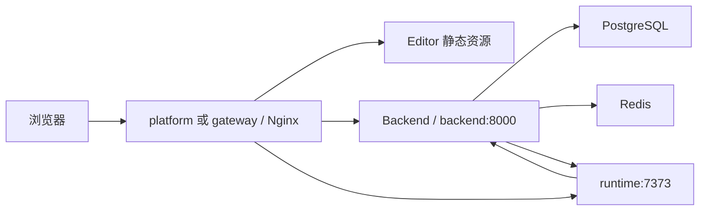

<!-- 文件功能：面向部署人员说明 web-presentation Docker Compose 部署、外部依赖接入、升级、回滚与运维检查流程。 -->
# 生产部署指南

本文档说明如何使用 `deploy/` 目录部署 `web-presentation`。目标机器只拉取 CI/CD 已发布镜像，不在服务器上构建源码。

实际部署只涉及两个业务镜像：

- `llmxpm/web-presentation:latest`：平台镜像，包含 Backend、Editor 静态资源和 Gateway Nginx。
- `llmxpm/web-runtime-vue:latest`：Runtime 镜像，负责预览、截图、诊断和构建。

## 部署文件

| 文件 | 作用 |
| :--- | :--- |
| `deploy/docker-compose.yml` | 外部 PostgreSQL/Redis 简化版，启动 `platform` 与 `runtime`，环境变量直接写在 compose 内 |
| `deploy/docker-compose.with-deps.yml` | 内置 PostgreSQL/Redis 简化版，启动 `postgres`、`redis`、`platform` 与 `runtime`，环境变量直接写在 compose 内 |
| `deploy/docker-compose.production.yml` | production env 版，拆分 `backend-migrate`、`backend`、`runtime` 与 `gateway`，通过 `env_file: .env` 读取生产环境变量 |
| `deploy/.env.example` | 仅供 production env 版复制为 `deploy/.env` 使用 |
| `docker/nginx/web-presentation.conf` | 平台镜像内置 Gateway 配置，托管 Editor 并代理 Backend 与 Runtime |

简化版中，`platform` 容器同时运行 Backend 与 Gateway。`runtime` 默认只在 compose 内网访问。`platform` 容器内通过 `extra_hosts` 把 `backend:8000` 指向本机 Backend，compose 网络中通过别名把 `backend:8000` 暴露给 Runtime 回源。

production env 版中，访问入口是单独的 `gateway` 容器；`backend` 和 `runtime` 默认只在 compose 内网访问。

## 前置条件

- 已安装 Docker Engine 与 Docker Compose v2。
- 外部依赖简化版和 production env 版需要已准备可访问的 PostgreSQL 与 Redis。
- 内置依赖简化版会随应用启动 PostgreSQL 与 Redis，适合单机试部署或小规模自托管。
- 部署机器可以拉取 `llmxpm/web-presentation:latest` 与 `llmxpm/web-runtime-vue:latest`。
- 如需要 HTTPS，建议在外层 Nginx、Traefik 或云负载均衡终止 TLS，再转发到 compose 暴露的 HTTP 端口。

## 配置方式

两个简化版不读取 `.env`。直接打开对应 compose 文件，按文件顶部注释修改连接串、访问地址、默认管理员密码和 `AI_SECRET_ENCRYPTION_KEY`。

production env 版需要先复制环境变量模板：

```bash
cp deploy/.env.example deploy/.env
```

Windows PowerShell 可使用：

```powershell
Copy-Item .\deploy\.env.example .\deploy\.env
```

production env 版至少修改：

| 变量 | 要求 |
| :--- | :--- |
| `BACKEND_PUBLIC_BASE_URL` | Backend 对外公开地址，用于生成资源、截图、构建产物和预览入口链接 |
| `RUNTIME_PUBLIC_BASE_URL` | Runtime 对外公开地址；同域 Gateway 模式通常为平台入口追加 `/runtime` |
| `RUNTIME_SERVER_BASE_PATH` | Runtime Vite 资源挂载路径，应与 `RUNTIME_PUBLIC_BASE_URL` 的 URL path 一致；例如 `/runtime/` 或 `/` |
| `CORS_ORIGINS` | JSON 数组字符串，应包含浏览器访问平台的公网地址 |
| `DATABASE_URL` | 已有 PostgreSQL 连接串，数据库和用户需要提前创建 |
| `REDIS_URL` | 已有 Redis 连接串 |
| `DEFAULT_ADMIN_PASSWORD` | 首次启动创建默认管理员时使用 |
| `AI_SECRET_ENCRYPTION_KEY` | Fernet 密钥，用于加密用户模型凭证；必须重新生成并长期保存 |

可用 Python 标准库生成 `AI_SECRET_ENCRYPTION_KEY`：

```powershell
python -c "import base64, os; print(base64.urlsafe_b64encode(os.urandom(32)).decode())"
```

`AI_SECRET_ENCRYPTION_KEY` 不是 API Key，也不是普通密码。它必须是 32 字节随机值的 URL-safe base64 编码，通常长度为 44 个字符并以 `=` 结尾。部署后不要随意更换；更换该值会导致已保存的用户模型凭证无法解密。

简化版默认使用 `http://127.0.0.1:8080` 和 `SESSION_SECURE=false` 的应用默认值。正式 HTTPS 部署时，应把 `BACKEND_PUBLIC_BASE_URL`、`RUNTIME_PUBLIC_BASE_URL`、`CORS_ORIGINS` 改为真实域名，并在 Backend 环境变量中补充 `SESSION_SECURE=true`；production env 版已在 `.env.example` 中默认启用。

## 公网 URL 配置

常规部署推荐同域 Gateway 模式：外层反向代理只把整个域名转发到简化版的 `platform:80`，或 production env 版的 `gateway:80`，再由平台内置 Nginx 处理 `/api`、`/preview`、`/public` 和 `/runtime/`。

```text
BACKEND_PUBLIC_BASE_URL=https://presentation.example.com
RUNTIME_PUBLIC_BASE_URL=https://presentation.example.com/runtime
RUNTIME_SERVER_BASE_PATH=/runtime/
CORS_ORIGINS=["https://presentation.example.com"]
```

这种模式下，外部反向代理不需要单独处理 `/runtime`，平台 Gateway 会把 `/runtime/` 转发到 `runtime:7373` 并保留 `/runtime/` 前缀，Runtime Vite 会按 `RUNTIME_SERVER_BASE_PATH=/runtime/` 解析资源路径。

如果要把 Backend 或 Runtime 单独暴露成独立域名，可以改成：

```text
BACKEND_PUBLIC_BASE_URL=https://api.presentation.example.com
RUNTIME_PUBLIC_BASE_URL=https://runtime.presentation.example.com
RUNTIME_SERVER_BASE_PATH=/
CORS_ORIGINS=["https://presentation.example.com"]
```

拆分域名时，外部反向代理需要分别处理：

- `presentation.example.com` 转发到简化版 `platform:80`，或 production env 版 `gateway:80`，用于 Editor 静态资源。
- `api.presentation.example.com` 转发到 `backend:8000`，用于 `/api`、`/preview`、`/public`、`/build-artifacts`、`/media`。
- `runtime.presentation.example.com` 转发到 `runtime:7373`，路径不要再加 `/runtime` 前缀。

`RUNTIME_BASE_URL=http://runtime:7373` 是 Backend 容器访问 Runtime 的内网地址，不是浏览器访问地址；即使单独配置 `RUNTIME_PUBLIC_BASE_URL`，通常也不需要改它。

`RUNTIME_SERVER_BASE_PATH` 本质上就是 `RUNTIME_PUBLIC_BASE_URL` 的 URL path 部分，并规范化为以 `/` 开头和结尾。比如 `https://presentation.example.com/runtime` 对应 `/runtime/`，`https://runtime.example.com` 对应 `/`，`https://runtime.example.com/app-runtime` 对应 `/app-runtime/`。

## 启动部署

推荐进入 `deploy/` 目录执行。

内置 PostgreSQL/Redis 简化版：

```bash
cd deploy
docker compose -f docker-compose.with-deps.yml config
docker compose -f docker-compose.with-deps.yml pull
docker compose -f docker-compose.with-deps.yml up -d
```

外部 PostgreSQL/Redis 简化版：

```bash
cd deploy
docker compose config
docker compose pull
docker compose up -d
```

production env 版：

```bash
cd deploy
docker compose -f docker-compose.production.yml config
docker compose -f docker-compose.production.yml pull
docker compose -f docker-compose.production.yml up -d
```

三种编排实际拉取的业务镜像仍只有：

```text
llmxpm/web-presentation:latest
llmxpm/web-runtime-vue:latest
```

`docker-compose.with-deps.yml` 还会拉取 `postgres:16` 与 `redis:7`。该文件中的 `POSTGRES_PASSWORD`、`REDIS_PASSWORD` 以及 `platform.environment` 中的 `DATABASE_URL`、`REDIS_URL` 要保持一致；如密码包含 `@`、`/`、`:` 等 URL 特殊字符，需要先进行 URL 编码，或改用只包含字母、数字、短横线和下划线的密码。

`latest` 只适合跟随稳定 Release 自动升级。如果某次部署需要严格锁定版本或准备可精确回滚，可以把 compose 中的 image 手动改成发布标签，例如 `llmxpm/web-presentation:v1.0.0` 和 `llmxpm/web-runtime-vue:sha-xxxxxxxxxxxx`。

两个简化版由 `platform` 容器入口脚本在启动时执行一次 `alembic upgrade head`，随后同时启动 Backend 与 Nginx。production env 版由 `backend-migrate` 容器在 `backend` 启动前执行迁移。

## 验证服务

查看容器状态：

```bash
cd deploy
docker compose -f docker-compose.with-deps.yml ps
```

外部依赖简化版可省略 `-f` 参数；production env 版把 `-f` 改为 `docker-compose.production.yml`。

检查入口健康状态：

```bash
curl -fsS http://127.0.0.1:8080/healthz
```

production env 版默认暴露宿主机 `80` 端口：

```bash
curl -fsS http://127.0.0.1:80/healthz
```

Windows PowerShell 中如果 `curl` 被映射为 `Invoke-WebRequest`，可改用 `curl.exe`。

如需看日志：

```bash
cd deploy
docker compose -f docker-compose.with-deps.yml logs -f platform runtime postgres redis
```

外部依赖简化版使用：

```bash
docker compose logs -f platform runtime
```

production env 版使用：

```bash
docker compose -f docker-compose.production.yml logs -f backend runtime gateway
```

应用侧日志默认使用 JSON Lines 输出到容器标准输出，便于 `docker compose logs` 之后接入 Loki、ELK 或云日志采集。`gateway` 负责生成或透传 `X-Request-ID`，`backend` 会在响应头返回同一个请求 ID，并在访问日志中只记录 path，不记录 query。`runtime` 是独立镜像且长期运行 Vite dev server，平台预览、构建和诊断相关日志由 Runtime 插件输出。

常用日志环境变量：

```text
LOG_LEVEL=INFO
LOG_FORMAT=json
ACCESS_LOG_ENABLED=true
CLIENT_ERROR_LOG_ENABLED=true
CLIENT_ERROR_LOG_MAX_BYTES=16384
RUNTIME_LOG_LEVEL=info
RUNTIME_LOG_FORMAT=json
RUNTIME_ACCESS_LOG_ENABLED=true
```

PostgreSQL 与 Redis 保持官方镜像原生日志格式；它们作为依赖服务查看，不纳入应用 JSON 日志契约。`/healthz` 健康检查默认不输出 Gateway 访问日志。

浏览器访问 compose 中配置的 `BACKEND_PUBLIC_BASE_URL` 对应平台入口后，使用默认管理员账号登录。

## 访问链路



关键路径：

- `/` 由 Gateway 返回 Editor 静态资源。
- `/api`、`/public`、`/build-artifacts`、`/preview`、`/media` 代理到 Backend。
- `/runtime/` 代理到 Runtime，并保留 `/runtime/` 前缀。
- Backend 通过 `RUNTIME_BASE_URL=http://runtime:7373` 访问 Runtime。
- Runtime 通过 `RUNTIME_BACKEND_API_BASE_URL=http://backend:8000` 回源 Backend。
- 简化版中，`backend:8000` 在 `platform` 容器内指向本机 Backend，对 `runtime` 则是 `platform` 的网络别名；production env 版中，它是独立 `backend` 容器。

## 数据与备份

外部依赖简化版和 production env 版只管理 `backend-data` volume，用于本地资源、截图和构建产物。

`docker-compose.with-deps.yml` 还会管理 `postgres-data` 与 `redis-data` volume。该模式下升级前需要同时备份 PostgreSQL 数据卷和 `backend-data`。

PostgreSQL 与 Redis 使用已有基础设施时，应使用对应基础设施的备份机制。升级前至少备份 PostgreSQL 和 `backend-data`。

本地资源模式下，`ASSET_STORAGE_DRIVER=local` 会把文件写入 `backend-data`。如果需要对象存储，设置 `ASSET_STORAGE_DRIVER=s3` 并补齐 `S3_ENDPOINT_URL`、`S3_ACCESS_KEY`、`S3_SECRET_KEY`、`S3_BUCKET` 等变量。

不要在生产环境执行带 `-v` 的 `docker compose down -v`，否则会删除 compose 管理的数据卷。

## 升级与回滚

升级流程：

1. 备份数据库和本地文件 volume。
2. 在 `deploy/` 目录执行对应 compose 文件的 `docker compose pull` 拉取最新稳定镜像。
3. 在 `deploy/` 目录执行对应 compose 文件的 `docker compose up -d`。
4. 简化版观察 `platform` 与 `runtime` 日志；production env 版观察 `backend-migrate`、`backend`、`runtime` 和 `gateway` 日志。

回滚时需要把对应 compose 文件中的 image 改为上一个可用版本标签，再执行对应 compose 文件的 `docker compose pull && docker compose up -d`。数据库迁移如已执行不可逆变更，需要按对应版本的迁移说明处理。

## 常见问题

### 入口健康但页面接口失败

检查 `BACKEND_PUBLIC_BASE_URL`、`RUNTIME_PUBLIC_BASE_URL`、`CORS_ORIGINS` 和外层反向代理是否一致。跨域配置应使用 JSON 数组字符串，例如：

```text
CORS_ORIGINS=["https://presentation.example.com"]
```

### 数据库迁移失败

简化版先看 `platform` 日志，production env 版看 `backend-migrate` 日志。使用外部数据库时，先检查 `DATABASE_URL` 是否能从容器网络访问，确认数据库、用户和权限已提前创建。`backend-migrate` 和 simple 入口脚本都只负责执行应用 schema 迁移，不创建外部 PostgreSQL 实例。

### Runtime 预览不可用

先确认 Runtime 容器健康，再检查 `RUNTIME_PREVIEW_JWKS_URL`、`RUNTIME_BACKEND_API_BASE_URL` 和 `RUNTIME_PUBLIC_BASE_URL`。平台部署模式下 `RUNTIME_STANDALONE_PREVIEW_ENABLED` 应保持 `false`。

如果浏览器控制台出现 `Failed to load module script` 且模块响应类型为 `text/html`，通常是同域 `/runtime` 部署没有让 Runtime Vite 资源带上 `/runtime/` 前缀。检查 `RUNTIME_SERVER_BASE_PATH=/runtime/` 是否已传给 Runtime 容器，并确认外层反向代理把整站流量转发到平台 Gateway，而不是只把 `/runtime` 单独转发出去。

### AI 设置保存后无法解密

`AI_SECRET_ENCRYPTION_KEY` 是加密用户模型凭证的长期 Fernet 密钥。它必须是 32 字节随机值的 URL-safe base64 编码。更换该值会导致已有密文无法解密，生产环境必须妥善备份。
