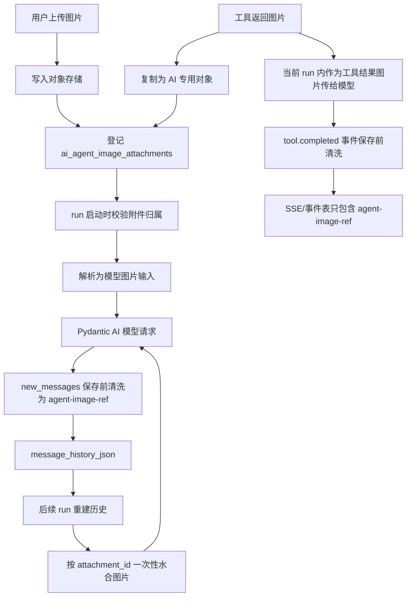

<!-- 文件功能：说明 AI Agent 视觉图片的上传、工具输出、对象存储、模型水合、历史持久化和排障约束。 -->
# AI Agent 图片处理机制

最后更新：2026-06-20

## 1. 目标与边界

AI Agent 图片链路同时覆盖用户上传图片和工具返回图片。当前设计目标是：

- 连续会话中多次 run 重建历史时，图片内容保持一致。
- S3 场景下，同一图片在短时间连续会话窗口内尽量复用相同的模型输入 URL 字符串。
- `message_history_json`、SSE 事件、工具调用展示数据中不写入图片 bytes、base64 data URL 或 S3 presigned URL。
- local 存储场景不把 base64 持久化到 JSONB，模型请求前临时读取对象 bytes 并构造 `BinaryContent`。
- 工具返回的图片必须先复制成 AI 专用对象，再登记为图片附件，避免业务对象被后续刷新覆盖。

核心实现位置：

| 模块 | 职责 |
| :--- | :--- |
| `backend/app/models/ai_agent_attachment.py` | `ai_agent_image_attachments` ORM 模型 |
| `backend/app/services/agent_image_attachment_service.py` | 图片上传、工具图片登记、模型输入解析、预览读取、归档 |
| `backend/app/services/agent_image_transport_resolver.py` | 在 URL 与 bytes/base64 传输方式之间选择 |
| `backend/app/ai/image_refs.py` | `agent-image-ref` 构造、规整和历史清洗 |
| `backend/app/ai/image_history_hydration.py` | run 入模前把历史图片引用水合为模型图片内容 |
| `backend/app/ai/message_history.py` | 跨 run 重建模型历史，并控制是否水合图片 |
| `backend/app/ai/pydantic_event_projection.py` | 工具事件和新消息历史保存前清洗图片载荷 |
| `backend/app/ai/tools/page/get_page_screenshot.py` | 页面截图工具的 AI 专用图片复制与返回 |

## 2. 统一数据模型

所有 Agent 视觉图片都记录在 `ai_agent_image_attachments` 中，用户上传和工具输出共用同一套权限、预览和水合逻辑。

关键字段：

| 字段 | 含义 |
| :--- | :--- |
| `user_id/workspace_id/session_id/run_id` | 限定图片所属用户、工作空间、会话和可选 run |
| `source_kind` | `user_upload` 或 `tool_output` |
| `tool_name/tool_call_id/source_payload_json` | 工具输出图片的来源追踪信息 |
| `storage_key` | 图片对象存储 key |
| `content_type/file_size/sha256/original_name` | 图片元信息与完整性校验信息 |
| `model_url` | S3 场景下缓存的模型输入 presigned URL，敏感字段 |
| `model_url_expires_at` | `model_url` 预期过期时间 |
| `model_url_last_used_at` | 最近一次模型水合或复用时间 |
| `owned_object` | 是否由 AI 图片链路拥有对象；清理时只能删除 `true` 的对象 |
| `promoted_asset_id` | 图片提升为资源库资产后的关联 ID |
| `status` | `active` 或 `archived` |

持久化到模型历史中的图片只使用轻量引用：

```json
{
  "kind": "agent-image-ref",
  "attachment_id": 8,
  "source_kind": "tool_output",
  "tool_name": "get_page_screenshot",
  "sha256": "eeca0c7b...",
  "content_type": "image/png",
  "original_name": "PG20260620003.png"
}
```

`agent-image-ref` 是历史 JSON、事件 payload 和前端展示之间的唯一图片引用形态。它不包含对象 bytes、base64、对象存储 key 或 presigned URL。

## 3. 总体链路



## 4. 用户上传图片

上传入口：

```text
POST /api/ai/sessions/{session_id}/attachments/images
```

处理步骤：

1. Backend 先解析当前 `workspace/project/page/component` scope，并确认当前 agent 可用。
2. `AgentImageAttachmentService.upload_image_attachment` 校验文件名、MIME、大小和非空内容。
3. 图片写入对象存储，key 形如：

```text
ai-agent-attachments/{user_id}/{session_id}/{sha256}.{ext}
```

4. 写入 `ai_agent_image_attachments`，`source_kind=user_upload`，`owned_object=true`。
5. Editor 得到 `AgentImageAttachmentItem`，其中 `url` 是后端预览入口，不是模型 URL。
6. run 启动时，`image_attachment_ids` 会被校验为当前用户、工作空间和会话内的 active 附件。

用户上传图片可以被删除、归档或提升为资源库资产。提升资产不会改变模型历史中的 `agent-image-ref`，历史仍按原附件读取。

## 5. 工具返回图片

工具返回图片不能直接把业务对象 URL 或 bytes 写进工具结果历史。所有 `AgentToolResult.images` 的图片都应登记为视觉图片附件，再进入模型上下文和 UI 展示。

页面截图工具是当前主要场景：

1. 截图服务刷新或读取页面截图，业务截图 key 通常类似 `page-screenshots/{page.code}.png`。
2. `get_page_screenshot` 读取当前截图 bytes。
3. 调用 `AgentImageAttachmentService.register_tool_image` 复制为 AI 专用对象，key 形如：

```text
ai-agent-tool-images/{user_id}/{session_id}/{run_id}/{sha256}.png
```

4. 附件记录写入 `source_kind=tool_output`、`tool_name=get_page_screenshot`、`tool_call_id` 和 `source_payload_json`。
5. 工具结果返回：
   - 给模型的当前工具结果可以包含内存图片对象。
   - 给事件、历史和 UI 的 payload 必须是 `agent-image-ref` 与预览 URL。

这个复制步骤很重要。业务截图可能会被后续页面刷新覆盖，AI 专用对象不会随业务截图覆盖而变化，因此历史工具图片可以稳定还原为当时那张截图。

清理规则：只删除 `owned_object=true` 的 AI 专用对象，不删除 `page-screenshots/*`、资源库对象或其它业务对象。

## 6. 模型输入解析与 URL 复用

配置项：

| 配置 | 默认值 | 说明 |
| :--- | :--- | :--- |
| `AI_IMAGE_TRANSPORT_MODE` | `auto` | `auto`、`url` 或 `base64` |
| `AI_IMAGE_ATTACHMENT_MAX_BYTES` | `10485760` | 单张上传图片最大字节数 |
| `AI_IMAGE_MODEL_URL_REUSE_WINDOW_SECONDS` | `7200` | S3 模型 URL 连续会话复用窗口 |
| `AI_IMAGE_MODEL_URL_TTL_SECONDS` | `21600` | 生成 S3 presigned URL 时使用的 TTL |
| `AI_IMAGE_MODEL_URL_EXPIRY_SAFETY_SECONDS` | `300` | 接近过期时提前刷新 URL |
| `AI_IMAGE_HISTORY_MAX_HYDRATED_IMAGES` | `10` | local/base64 历史水合图片数量上限 |
| `AI_IMAGE_HISTORY_MAX_HYDRATED_BYTES` | `31457280` | local/base64 历史水合总字节上限 |

### S3 场景

当对象存储 driver 是 `s3`，且 `AI_IMAGE_TRANSPORT_MODE` 不是 `base64` 时，`resolve_attachment_for_model` 优先走 `model_url`：

1. 如果已有 `model_url`，且未接近过期，并且 `now - model_url_last_used_at <= AI_IMAGE_MODEL_URL_REUSE_WINDOW_SECONDS`，复用原 URL 字符串。
2. 复用成功后更新 `model_url_last_used_at`，让连续会话自然延长稳定窗口。
3. 如果 URL 缺失、接近过期或超过空闲窗口，则重新生成 presigned URL 并写回附件表。
4. 如果生成的 URL 不是模型可访问的公网 HTTPS URL：
   - `url` 模式直接报 `AI_IMAGE_URL_UNAVAILABLE`。
   - `auto` 模式回退到 bytes/base64 传输。

`model_url` 是 bearer URL，只允许保存在后端附件表中。不要返回给 Editor，不要写入 SSE 事件，不要写入 `message_history_json`。

### local 场景

local 或不可公网访问的对象存储不缓存 `model_url`。水合时临时读取对象 bytes，并构造 Pydantic AI `BinaryContent`。

需要注意：

- `BinaryContent` 只允许驻留在本轮模型请求内存中。
- 保存历史、事件和工具结果展示前必须替换成 `agent-image-ref`。
- local 历史图片会增加模型请求体大小，因此用数量和总字节上限保护。
- 超过限制时返回明确错误，提示用户新建会话或减少历史图片。

## 7. 历史持久化与水合

持久化原则：

- `message_history_json` 只保存 Pydantic AI `new_messages()` 的增量。
- 保存前必须调用 `sanitize_message_history_image_refs`。
- `BinaryContent.data`、`data:image/*;base64` 和 presigned URL 不得写入 JSONB。
- 工具事件 payload 也必须清洗，避免 `tool.completed` 因内存图片对象不可 JSON 序列化而导致 run 失败。

run 启动时：

1. `rebuild_agent_message_history` 按 session 内 run 顺序拼接历史增量。
2. 默认 `hydrate_images=true`，调用 `hydrate_agent_image_refs` 收集历史中的 `attachment_id`。
3. 每个附件按当前存储环境解析为 `ImageUrl` 或 `BinaryContent`。
4. 水合后的结构只用于本次模型请求，原始 `message_json` 仍保持轻量引用。

同一 run 内：

- run 启动或 continue 时会构造本次 Pydantic AI 的入模历史。
- Pydantic AI 流式过程中沿用内存中的消息上下文，不需要每个工具事件重复查库水合。
- 工具返回新图片时，可以立即作为当前工具结果图片进入模型；事件和历史保存前再清洗为 `agent-image-ref`。

非入模场景：

- 上下文状态估算、诊断摘要等不需要真实图片时，应使用 `hydrate_images=false`，把图片引用替换为占位文本，避免读对象或生成 URL。

## 8. API 与 UI 预览

当前图片预览入口：

```text
GET /api/ai/attachments/images/{attachment_id}/content
GET /api/ai/sessions/{session_id}/attachments/images/{attachment_id}/content
```

推荐 UI 使用第一个统一入口。它会按当前登录用户校验附件可访问性，并返回原始图片内容。

附件响应中应包含：

- `id`
- `session_id`
- `source_kind`
- `original_name`
- `content_type`
- `file_size`
- `sha256`
- `url`
- `preview_available`
- `promoted_asset_id`
- `status`

Editor 刷新 runtime snapshot 时需要恢复 pending 图片；历史消息中的用户上传图片和工具输出图片都通过附件 `url` 渲染缩略图。不可预览时显示稳定占位，不尝试使用 `model_url`。

## 9. 必须保持的约束

开发或重构图片链路时，必须守住以下不变量：

- `message_history_json` 不包含 base64、data URL、presigned URL 或原始 bytes。
- 工具事件 `tool.completed/tool.error` 的 `data.result` 不包含 `BinaryContent`、`ImageUrl` 原始对象或敏感 URL。
- S3 `model_url` 只保存在附件表中，不返回前端。
- 工具图片必须登记为 `source_kind=tool_output`，并复制到 `ai-agent-tool-images/*`。
- 页面截图工具不能把 `page-screenshots/{page.code}.png` 作为历史图片的唯一来源。
- 删除对象时必须检查 `owned_object=true`。
- 权限校验至少包含 `user_id`、`workspace_id`、`session_id`，跨会话不能读取附件。
- local/base64 水合必须受数量和总字节限制保护。

## 10. 测试建议

后端单测优先覆盖：

- 图片历史保存前替换为 `agent-image-ref`。
- 原始 `BinaryContent/ImageUrl` 对象在事件 payload 保存前被替换。
- JSON 中不含 base64、`data:image` 或 presigned URL。
- 2 小时窗口内重复水合复用同一个 S3 `model_url`。
- 超过空闲窗口后刷新 S3 `model_url`。

后端集成测试优先覆盖：

- local 用户上传图片 run 后，`message_history_json` 只含引用。
- 页面截图工具返回图片后，AI 专用对象 key 不等于 `page-screenshots/{page.code}.png`。
- 页面截图刷新后，历史工具图片仍水合到原截图内容。
- 连续多次 run 使用同一个 S3 URL，长间隔模拟后 URL 可变。

前端测试优先覆盖：

- pending 图片刷新后恢复。
- 历史消息中用户图片和工具图片都能展示缩略图。
- 图片不可预览时显示稳定占位。

常用测试入口：

```powershell
uv run --project backend pytest backend/tests/unit/test_agent_image_refs.py
uv run --project backend pytest backend/tests/unit/test_get_page_screenshot_tool.py
uv run --project backend pytest backend/tests/integration/test_ai_agent_images.py
uv run --project backend pytest backend/tests/integration/test_ai_pydantic_runner_smoke.py
pnpm --dir editor test
```

## 11. 排障检查点

优先使用只读诊断 CLI：

```powershell
uv run --project backend python -m app.scripts.diagnose_ai_run --run-id <run_id> --format summary
uv run --project backend python -m app.scripts.diagnose_ai_run --session-id <session_id> --format json --output .tmp/ai-session-diagnostics.json
```

如果出现“截图任务成功，但 run 失败”：

1. 检查 `page_screenshot_jobs` 是否 `succeeded`。
2. 检查 `ai_agent_image_attachments` 是否存在对应 `source_kind=tool_output`、`tool_name=get_page_screenshot` 的记录。
3. 检查 `storage_key` 是否是 `ai-agent-tool-images/*`，并验证对象可读和 sha256 匹配。
4. 检查 `ai_agent_run_events` 是否缺少截图工具的 `tool.completed`。
5. 如果截图成功但缺少 `tool.completed`，重点排查工具事件 payload 是否仍包含原始 `BinaryContent/ImageUrl` 或 base64。
6. 如果后续 run 图片内容不一致，检查工具图片是否错误引用了会被覆盖的业务截图对象。
7. 如果 S3 URL 没有复用，检查 `model_url_last_used_at`、`model_url_expires_at`、复用窗口和安全过期窗口。

修复历史坏数据时，不要扩展诊断 CLI 做写操作。应另写限定 `run_id/session_id/user_id` 范围的一次性维护脚本。
