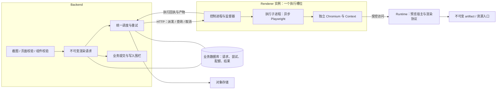

# 远程渲染执行服务架构设计

> 状态：核心运行路径已落地（见 §16）；真实多实例联调、数据转换副本演练、性能基线与 `web-presentation-agent-kit` 契约同步仍属发布窗口验收范围。本文件定义完整改造后的架构、接口、数据模型、部署方式和验收条件；全部内容作为同一交付范围。
>
> 交付方式：在一个维护窗口内完成数据转换和整套系统切换。研发工作可以拆分，发布结果只有一套实现。

## 1. 架构总览

平台采用 **Backend 渲染控制面 + 独立 Renderer 执行服务 + Runtime 预览宿主**。

- **Backend**：授权、固定输入、持久化渲染请求、全局调度、执行重试、结果存储和业务提交。
- **Renderer**：接收一次执行尝试，在隔离浏览器进程中完成截图或诊断，回收资源并提供结果。
- **Runtime**：构建和托管固定版本的预览内容，提供统一的页面、组件与视觉资源就绪协议。

截图与页面诊断统一进入该执行链路；组件远程渲染诊断协议保留在 Renderer，内容助手业务入口本迭代不调用。所有环境均通过内部 HTTP API 使用 Renderer；开发和 lite 部署一个同机服务，生产部署多个独立实例。区别只在地址、资源额度与副本数。

Renderer 内使用 Python 异步 Playwright 启动自身镜像中的 Chromium。Backend 不安装 Playwright 或 Chromium，不持有 Browser、Context、Page，不执行任何浏览器脚本。



架构需要满足五个结果：Backend 扩容不放大 Chromium 数量；任何执行都能被限时回收；重试不重复提交业务结果；渲染环境可验证；任务在重启和失联后有明确的恢复路径。

## 2. 单一实现与职责边界

### 2.1 确定的技术选择

| 事项 | 最终设计 |
| :--- | :--- |
| Backend 到 Renderer | 版本化内部 HTTP 协议；执行接管、查询、取消和结果读取分离 |
| 浏览器接入 | Renderer 内 `chromium.launch()`；无远程 WS/CDP Provider |
| 执行 API | `playwright.async_api`；对象只在所属子进程和事件循环使用 |
| 执行隔离 | 一个 Renderer 实例一个活动槽位；每 attempt 新建执行子进程、Chromium 和 Context |
| 扩容单位 | Renderer 实例；同一宿主机可运行多个受资源限制的实例 |
| 等待与调度 | Backend 数据库中的统一渲染请求队列 |
| 重试决策 | Backend RenderCoordinator；领域 Worker、HTTP 客户端和 Renderer 不重复决定渲染重试 |
| 产物持久化 | Backend 校验并写入对象存储；Renderer 只保留有界临时产物 |
| 执行方式 | 开发、lite、生产使用同一服务协议与镜像 |
| 发布方式 | 全量交付、维护窗口切换、整套版本验收 |

只有一个浏览器实现，不设置执行器模式、Provider 注册表、本地降级开关、浏览器复用开关或新旧实现路由。

### 2.2 组件职责

| 组件 | 负责 | 边界 |
| :--- | :--- | :--- |
| 领域服务 | 权限、业务任务、输入目标、消费结果、页面/组件提交 | 不管理浏览器、不在渲染失败后自行叠加执行次数 |
| RenderRequestService | 创建/查询/取消渲染请求、请求幂等、输入快照 | 不持有长事务等待执行 |
| RenderCoordinator | 公平调度、配额占用、attempt 派发、重试、状态核对、结果落库 | 不解释布局 warning 为业务通过或失败 |
| Renderer 控制进程 | 身份校验、回执、单槽互斥、监督子进程、取消与清理 | 不连接业务数据库，不写页面，不续跑 AI |
| Renderer 执行子进程 | 浏览器启动、预览访问、就绪等待、场景执行、诊断和 PNG | 不继承控制面长期凭证，不拥有跨 attempt 状态 |
| Runtime | 预览编译、不可变输入加载、就绪桥、组件场景切换 | 不决定渲染队列、资源配额或业务任务终态 |
| 对象存储 | 保存已校验产物与不可变资源 | 不作为任务状态判断依据 |

统一渲染请求是业务任务的一个执行阶段。业务 Job 管完整业务流程，RenderRequest 管渲染阶段，RenderAttempt 管一次物理执行；三者有明确引用，不各自维护一份“页面是否成功”的结论。

### 2.3 代码组织

```text
packages/render-contracts/              纯契约 Python 包、JSON Schema、错误与协议版本
renderer/
  app/api/                            内部 API、身份认证、回执
  app/control/                        监督器、子进程、取消、清理、临时产物
  app/engine/                         页面截图、页面布局、组件场景、就绪逻辑
  app/security/                       访问策略、凭证作用域、日志脱敏
  tests/                              契约、真实浏览器、进程故障测试
  pyproject.toml / uv.lock             独立依赖与锁定版本
backend/app/services/rendering/        请求服务、客户端、调度器、结果提交
backend/app/models/                   渲染请求、尝试、Worker 与调度状态
backend/app/repositories/             条件认领、配额占用、状态核对
runtime/                              预览宿主与渲染协议
```

契约包不依赖 Backend、ORM、Runtime 或 Playwright。Renderer 不导入 `backend/app`。布局与组件诊断脚本由 Renderer 执行引擎统一维护，Runtime 仅维护宿主协议；不得复制多份脚本。

Python 使用 `uv` 和独立虚拟环境；前端使用 `pnpm`。Renderer 固定使用 Linux 容器，开发机器通过容器或开发服务器调用相同服务。

## 3. 业务入口与输入快照

### 3.1 三类操作

| 操作 | 行为 | 输出 |
| :--- | :--- | :--- |
| `page.capture` | 固定画布、等待视觉资源、捕获静态 PNG | 图片、尺寸、内容摘要、渲染环境摘要 |
| `page.diagnose` | 固定画布、等待就绪、运行布局分析 | 文本布局、分组、溢出、空间关系、空白区域与 warning |
| `component.diagnose` | 在宿主中执行 default 与指定 presets（协议保留；内容助手业务入口本迭代不调用） | 各场景运行错误、布局事实和诊断 |

所有操作遵循同一身份、输入、deadline、取消和错误契约。请求不携带 Python callable、任意 evaluate 脚本、任意目标 URL 或 Chromium 启动参数。

页面与组件校验必须明确返回“检查完成”或“执行不可用”。必需的渲染校验不可用时阻止相应写入并按基础设施故障处理；布局 warning 仅表达内容质量，不替代执行失败。

### 3.2 RenderSnapshot

Backend 在授权后生成不可变快照，包含：

- 页面或组件源码与版本、递归依赖组件、路由与预览场景。
- 展示配置、主题、样式和字体声明。
- 实际引用资源的内容摘要与不可变访问引用。
- Runtime 构建标识、画布尺寸和操作输入。
- workspace、逻辑业务 owner、输入摘要及有效期。

运行过程中不再次读取“当前页面配置”。页面、主题、组件或资源发生变化时，正在执行的请求继续使用原快照，业务提交时判断是否仍然有效。

参与渲染的外部图片、字体等资源在快照准备阶段经过受控资源服务固化。无法固定内容的资源返回 `RENDER_INPUT_NOT_REPRODUCIBLE`，不能依靠执行时自由访问外链生成可缓存结果。

动态时间、随机值和外部请求不被默认为确定性。平台记录输入与环境身份以便追溯；视觉回归使用声明为确定性的夹具，不承诺任意用户代码输出相同 PNG。

### 3.3 artifact 生命周期

快照 manifest、源码与资源引用持久化到 Backend 可共享读取的对象存储或持久化目录，作为不可变输入的事实源。所有部署使用真实 Redis 分发 Runtime artifact 的读取缓存；缓存缺失时从持久化快照重建，不能因 Redis 重启丢失已接纳请求的输入。取消渲染链路对进程内 `memory://` artifact 的依赖。

RenderRequest 持有 artifact 引用。排队、执行、重试和结果处理期间持续保活；请求终态、全部 attempts 完成回收，且结果已消费或消费保留期到期后解除引用。无人消费的终态必须由清理器收敛，不能永久挂住输入。清理器同时检查引用和宽限期，不能仅凭最初 TTL 删除在途输入。

Runtime 编译与浏览器执行分别占用各自资源。编译结束后释放编译槽，再等待 Renderer，避免两个资源池相互占用和死锁。

## 4. 数据模型与所有权

### 4.1 Backend 持久化模型

| 模型 | 关键字段 | 职责 |
| :--- | :--- | :--- |
| `render_requests` | request ID、owner、workspace、operation、snapshot/profile digest、状态、deadline、attempt budget、取消版本、结果引用 | 渲染阶段唯一状态源与持久化队列 |
| `render_attempts` | attempt ID、request ID、序号、Worker/epoch、slot generation、派发状态、清理状态、时间与错误摘要 | 一次物理执行、回执核对与容量占用 |
| `render_workers` | Worker ID、epoch、受信地址、环境摘要、心跳、就绪与隔离状态 | 执行节点与实际槽位 |
| `render_scheduler_state` | 调度游标、类别轮次、workspace 公平性状态、全局配额 | 多 Backend 下的统一调度 |
| `render_results` | request/attempt、输入与环境摘要、诊断或对象引用、消费时间 | 有界结果与业务消费记录 |

密钥、预览访问令牌、完整签名 URL 和原始浏览器异常链不进入这些普通记录。

Worker 记录以 `(worker_id, epoch)` 区分实例生命期，不能覆盖仍有占用的旧 epoch。数据库唯一约束保证同一请求和同一 Worker/epoch 各自最多一个未释放 attempt；attempt 序号和 slot generation 单调递增。当前可派发 epoch 与历史占用分别记录。

数据库负责持久化与并发控制，不承担浏览器等待。PostgreSQL 使用短事务与行锁；SQLite 使用受控串行写事务，默认一个渲染槽位。

### 4.2 请求幂等与写入围栏

请求唯一键由 `逻辑 owner + 业务阶段 + operation + input_digest + render_digest` 构成，其中 render_digest 包含 profile、视口和操作参数。领域 Worker 重启、重新认领或重复调用时取回同一 RenderRequest，不能重新获得渲染预算。用户明确发起新的业务操作使用新的 owner 身份，不能通过重发旧请求延长其期限。

一次渲染请求最多一个未确认释放的 attempt。创建新 attempt 前必须确认上一 attempt 结束或完成基础设施隔离。

业务租约代次与渲染调度代次分别管理：

- RenderCoordinator 持有请求处理租约和调度 generation，控制派发、结果落库及配额释放。
- 领域 Worker 持有业务租约和写入围栏，控制页面、组件、截图指针与 Job 终态。
- 新业务执行者可以接续同一逻辑请求；输入身份不变，提交时使用自己当前有效的业务围栏。
- AI 持续传播 `AgentRunWriteFence`；截图等任务采用递增认领代次，避免只比较 worker ID 导致重新认领后误接收迟到写入。

所有终态、配额释放和结果消费使用条件更新，重复消息不能重复释放资源或重复提交业务结果。

### 4.3 状态机

```text
RenderRequest:
  queued → executing → succeeded
              ├──────→ retry_wait → queued
              ├──────→ failed
              ├──────→ cancelled
              └──────→ expired

RenderAttempt:
  reserved → dispatched → accepted → running → cleaning → terminal
                 └──────────── 状态不明 ───────────────→ unknown
                                                        └→ 核对 / 隔离 → terminal
```

`cancel_requested` 是请求上的控制事实；运行中的请求只有在执行资源清理或隔离完成后才确认取消完成。超过执行期限但资源尚未核实的任务仍显示“正在回收”，不能提前标记为资源已释放。

`unknown` 必须进入后台核对，继续占用资源额度；它不是可自动过期删除的记录。

尚无活动 attempt 的 queued/retry_wait 请求可直接取消或过期；未派发预留及明确未接管的拒绝可直接结束 attempt 并释放占位。所有其他终态路径都必须经过资源核对。

## 5. 全局调度与容量控制

### 5.1 唯一调度入口

所有渲染需求先写 `render_requests`，RenderCoordinator 是唯一派发者。Renderer 不保留等待队列，空闲时接管一个 attempt，忙时明确拒绝。

多个 Backend 可以运行 Coordinator；每次派发在数据库内原子完成：

1. 锁定调度状态，选择满足预算、权限状态和输入有效期的请求。
2. 按类别轮转及 workspace 轮转选择候选；检查全局、workspace 和待派发数量上限。
3. 锁定空闲 Worker/epoch 的槽位，递增 slot generation，创建 reserved attempt。
4. 更新调度游标与占用，提交事务。
5. 条件更新为 dispatched 后发送请求；该更新失败的执行者不得继续发送。

事务内不做 HTTP、编译、资源下载或浏览器工作。禁止无锁 `count` 后再插入占位，也禁止 Backend 进程各自计算一份“全局并发”。

### 5.2 调度策略

- 页面/组件交互诊断与后台截图采用全局 3:1 加权轮转，类别由业务入口确定。
- 同类别内按 workspace 轮转，同 workspace 按入队顺序处理；达到等待提升阈值的请求优先获得下一可分配槽位。
- 单请求受总 deadline 限制；组件场景在一个 attempt 内顺序执行，不把场景拆成无界并发。
- 配置全局队列上限和单 workspace 队列上限，满载时立即返回可识别的资源等待错误。
- 权重描述派发次数，不宣称为 CPU 时间比例。执行任务不抢占，交互尾延迟通过足够容量与执行时间上限控制。

公平性游标和配额在共享存储中更新，不依赖单个 Backend 的内存队列。

### 5.3 资源占用与节点隔离

一个 Renderer 实例只有一个活动槽位，任何时刻最多一个执行子进程组。集群占用包括 reserved、dispatched、accepted、running、cleaning、unknown，不能只统计健康节点上的 running。

- 未进入 dispatched 的过期预留可以条件释放。
- 已派发任务必须取得终态清理回执，或确认其执行实例被终止，才能释放。
- 心跳失联、客户端超时和票据到期均不构成进程停止证明。
- Worker 新 epoch 注册不能自动抹掉旧 epoch 占用；部署控制器确认旧实例及子进程终止后才解除隔离。
- 无法取得终止证明时保留隔离并告警，管理员只能通过有审计记录的终止核对流程处理。
- 数据库不可用时停止新增派发；已接管执行只在原 deadline 内运行。

实例地址通过部署配置注册并校验服务身份，Backend 不接受普通请求提供的 Worker 地址。Coordinator 查询指定 Worker/epoch，不把执行状态请求随机发送到任意副本。

允许释放额度的基础设施隔离必须包含旧容器或进程组已终止的证据；仅切断网络、摘除流量或标记不健康不能返还容量。

## 6. Renderer 内部协议

### 6.1 身份与版本

协议路径为 `/internal/render/v1`，只开放在服务网络。跨主机链路使用 TLS 和服务身份认证，认证密钥支持轮换；浏览器网络不能访问控制 API。

协议包定义请求、回执、结果、错误及 JSON Schema。每个发布包声明唯一的控制协议版本、Runtime 渲染协议版本和结果 Schema 版本；不匹配直接拒绝。

### 6.2 端点

| 端点 | 行为 |
| :--- | :--- |
| `GET /internal/render/v1/capabilities` | Worker ID、epoch、环境摘要、协议版本、限制、当前槽位状态 |
| `POST /internal/render/v1/executions` | 接管 attempt；202 返回稳定回执；无槽位返回 429 且明确未接管 |
| `GET /internal/render/v1/executions/{attempt_id}` | 返回执行阶段、清理状态、终态或结果描述符 |
| `PUT /internal/render/v1/executions/{attempt_id}/cancellation` | 幂等取消；记录先于 POST 到达的取消标记 |
| `GET /internal/render/v1/executions/{attempt_id}/artifacts/{name}` | 流式读取有界产物，包含长度、类型与 SHA-256 |
| `PUT /internal/render/v1/executions/{attempt_id}/result-consumption` | Backend 确认结果持久化，提前释放临时产物 |
| `GET /livez`、`GET /readyz` | 控制进程存活及执行环境健康；忙碌通过槽位状态表达 |

内部查询 HTTP 200 只表示查询成功，业务必须读取执行状态。Worker 无 Renderer 业务重试接口，无任意脚本执行接口，无面向 Editor 的公开入口。

### 6.3 执行请求

| 字段 | 语义 |
| :--- | :--- |
| `contract_version / operation` | 契约版本与三种明确操作 |
| `request_id / attempt_id` | 逻辑渲染请求与一次物理执行身份 |
| `request_digest` | 规范化语义输入摘要；不包含短期凭证 |
| `workspace_id / trace_id` | 来自 Backend 已授权上下文 |
| `snapshot_ref / input_digest` | 不可变 artifact 身份与内容摘要 |
| `render_profile_digest` | 要求的完整执行环境 |
| `viewport / operation_options` | 画布和允许的截图/场景参数 |
| `deadline_at / remaining_budget_ms` | 不可延长的剩余预算 |
| `admission_ticket` | 签名绑定请求摘要、workspace、Worker/epoch、slot generation、接收期限与停止期限 |
| `preview_access` | 只用于该 artifact 的短期读取授权 |

Worker 在启动执行前校验票据、空闲状态、输入/环境摘要、场景数量与输出限额。过期、取消、低于已接管 generation 或来自其他 epoch 的票据不得启动浏览器。

### 6.4 回执、重复请求与乱序

- 相同 attempt ID 与 digest 返回已有回执；相同 ID 不同 digest 返回 409。
- 已拒绝、已取消和已终结的 attempt 不会因重复 POST 再次启动；需要新的执行必须由 Coordinator 创建新 attempt。
- 控制进程在当前 epoch 中维护回执和取消标记，至少保留至票据失效及结果取回宽限结束。
- 终态产物默认保留 10 分钟，消费确认后可提前删除；幂等标记保留至票据不可能再被接受。
- 原始回执未知返回 404，已回收结果返回 410；两者都不能直接解释为“从未执行”。
- Worker 重启生成新 epoch；旧请求只能由 Backend 核对后收敛，不能在新实例重放。
- 清理成功是终态回执的必要条件。结果生成但清理未完成时仍占用槽位，不能向调度器谎报完成。

产物目录使用服务端生成的文件名，接口中的 name 来自结果描述符允许集合；不把用户路径拼入文件系统。

### 6.5 执行结果

执行回执包含 request/attempt ID、Worker/epoch、slot generation、request digest、执行状态、资源释放状态、各阶段时间和安全错误摘要。

终态成功结果必须包含：

- 实际 input/profile/render digest，Backend 逐项核对，不能只信任返回的 request ID。
- 与 operation 对应且通过 Schema 校验的诊断或产物描述符；产物描述符包含 name、类型、字节数、像素尺寸和 SHA-256。
- 内容诊断的 severity、code、场景、证据和 truncated 标记；诊断成功可以包含内容错误，不代表页面校验通过。
- 执行结束及清理完成时间；`resource_state=released` 是发布执行终态的前提。

截图遇到阻断性内容异常时返回 `RENDER_CONTENT_ERROR`；诊断操作能够完成分析时，把内容异常放入诊断结果。执行失败、取消和过期不返回一个空的成功结果。

## 7. 执行、取消、重试与结果提交

### 7.1 完整执行流程

1. 领域服务校验权限，固定输入，创建或取得同一 RenderRequest。
2. Coordinator 获得调度资格，保存 attempt 和派发意图，再发送执行请求。
3. Renderer 控制进程接管，在受限环境中启动执行子进程、Chromium 和 Context。
4. 执行子进程加载受保护预览，核对 Runtime 身份，完成就绪、诊断或截图。
5. 监督器关闭 Context、浏览器和执行子进程，确认进程组结束，再发布终态回执。
6. Coordinator 读取产物，验证 request/attempt、digest、尺寸、类型及长度，持久化对象和结构化结果。
7. Coordinator 核对请求尚未取消或超过 deadline，在同一短事务中保存结果引用、提交 RenderRequest 终态并释放已证实清理完成的槽位；随后确认 Worker 产物已消费。事务完成但确认丢失时可幂等补发，不能重新执行渲染。
8. 领域服务取得结果，在同一事务中复核权限、取消、版本、输入身份与当前业务写入围栏，再更新业务指针和 Job 终态。
9. 过期或被撤销的结果只保留审计信息，不更新页面/组件/截图；未引用产物按保留策略回收。

渲染成功、结果持久化和业务提交是三个独立事实。只有最后一步能决定业务成功；AI external Batch 仍由 Backend 协调并只续跑一次。

### 7.2 deadline

默认渲染阶段总预算为 120 秒，覆盖排队、全部 attempts、退避、执行及结果取回；清理宽限为 5 秒。整个业务任务可以有更严格的总 deadline，取二者较小值。

跨进程传递 UTC deadline 与剩余时长，接收方按较小值转换为本地单调时钟预算。时钟偏差超出允许范围的节点不接任务。每个阶段的上限都受剩余预算约束，不能逐步骤重新计时。

独立监督器控制硬期限，不依赖执行子进程的唯一事件循环。停止顺序为：标记停止并禁止后续步骤 → 请求关闭 Context/浏览器 → 清理宽限耗尽后终止整个执行进程组。

不能对正在调用 Playwright 的 asyncio Task 直接执行 `cancel()`，也不能让 `wait_for()` 隐式取消底层调用。执行任务使用受保护等待，由独立控制流程关闭资源；官方明确说明取消进行中的 Playwright 调用存在未定义行为。[Playwright asyncio 取消说明](https://playwright.dev/python/docs/library#cancelling-asyncio-tasks)

节点暂停或失联时，定时器不是停止证明。相关容量转入隔离，由基础设施终止核对收敛。

### 7.3 单一重试责任

RenderCoordinator 按错误类别、剩余时间和请求预算决定重试，默认最多 3 次可能已被接管的执行尝试。

- HTTP 重发只能使用同一 attempt ID，不得自动生成新任务。
- 请求响应丢失时先查原 Worker/epoch；执行状态未明确之前不并发启动替代 attempt。
- 明确未接管的容量拒绝进入有限期等待；可能已接管的派发保守计入尝试预算。
- 浏览器断线、进程崩溃不会在 Renderer 内重放操作。
- 业务 Worker 恢复时重新关联同一 RenderRequest，不能在外层再次包一层渲染重试。
- 重试使用指数退避和随机抖动，超过 deadline 或次数后形成确定终态。

### 7.4 取消和服务退出

取消先持久化请求控制版本，再向已派发 attempt 发取消。Worker 可以在 POST 到达前接收取消标记，防止迟到派发重新启动任务。

HTTP/SSE 断开不取消有持久化业务 owner 的任务。用户显式取消、权限撤销或业务输入失效时，由 Backend 决定取消；无后续消费方的交互诊断也通过同一路径停止。

Backend 退出先停止认领与派发，保持在途状态核对与心跳到退出上限；接替实例从持久化请求恢复。Renderer 退出先停止接管，限时完成或终止当前执行。子进程必须随实例退出清理，不能留下脱离监督器的 Chromium。

## 8. Runtime 渲染协议与网络

### 8.1 强制就绪协议

Runtime 提供唯一的 `render-ready.v1` 宿主协议，包含：

- artifact ID、输入摘要、Runtime 构建标识与协议版本。
- 预览初始化成功/失败与内容挂载状态。
- 字体和视觉资源的加载完成、失败、未完成摘要。
- 组件场景列表、场景切换请求 ID 与对应完成回执。
- 可诊断的内容异常，区别于网络或宿主初始化失败。

页面和组件都通过宿主协议等待；缺少协议、版本错误或状态无法确认时执行失败。禁止用 `#app` 是否有子节点、固定 sleep、缺少函数即成功或 `networkidle` 替代协议。

Renderer 为截图与布局分析应用相同的固定视口、DSF、语言、时区、颜色与动画策略。截图使用 PNG 和禁用动画模式，字体/资源未就绪不能输出“成功”图片。

### 8.2 网络路径

| 通信 | 身份与边界 |
| :--- | :--- |
| Backend → Renderer | 私有执行 API，服务身份 |
| Chromium → Runtime 预览文档 | 浏览器可达的导航基址，artifact 范围授权 |
| Chromium → Runtime JS/CSS 与平台资源 | 独立资源基址与受限读取授权，保持部署路径前缀 |
| Runtime → Backend artifact/模块/JWKS | Runtime 服务身份，仅保存在服务端 |
| Backend → Renderer 结果 | 原 Worker/epoch 地址，控制面身份 |
| Backend → 对象存储 | 持久化及读写授权，浏览器不持有存储管理凭证 |

Backend 通过唯一的 RenderTargetResolver 从受信配置生成目标。导航、Runtime 静态资源、平台资源三个基址分别配置；不从 Backend 的 loopback 地址推断远端浏览器地址。

预览凭证只附加到准确匹配的 origin/path，重定向后重新核对。Context 全局请求头会影响页面发出的各类请求，因此不能用于向任意资源传播服务凭证。[BrowserContext 请求头](https://playwright.dev/python/docs/api/class-browsercontext#browser-context-set-extra-http-headers)

### 8.3 隔离与资源边界

Renderer 容器使用非 root 执行浏览器、启用 Chromium sandbox，配置 CPU、内存、PID、临时磁盘限额。执行子进程使用独立网络命名空间及受限文件视图，通过专用出站入口访问 Runtime/资源网关，不能通过同容器 loopback 绕回控制 API。

阻断云元数据、数据库、Redis、控制 API、宿主机管理接口与未授权外链。DNS、重定向和 WebSocket 均受网络侧策略约束；Playwright route 拦截不作为唯一安全边界。

执行子进程使用独立临时目录、环境变量白名单和受控文件描述符，不继承控制面长期密钥。每 attempt 关闭全部浏览器状态，不进行跨请求浏览器复用。

BrowserContext 只提供浏览器状态隔离，不能当作完整的恶意代码沙箱。容器及浏览器沙箱共同形成执行边界，官方测试镜像不能未经加固直接视为生产安全环境。[Playwright Docker](https://playwright.dev/python/docs/docker)

## 9. 环境身份、结果与缓存

### 9.1 RenderProfile

发布流程生成不可变的 RenderProfile，至少记录：

- Playwright 精确版本、Chromium build、headless 模式和启动参数。
- Renderer 镜像 digest、OS/架构、字体内容摘要与 fontconfig 配置。
- Runtime 构建与宿主协议版本、布局结果 Schema、组件场景协议。
- locale、timezone、color scheme、DSF、动画与运动策略。
- 执行引擎和诊断脚本版本。

所有运行实例匹配当前发布包要求的 profile。Worker 启动探针核对本地清单；执行时再检查 Runtime 宿主实际报告的版本；结果返回实际环境摘要。任何不匹配都拒绝执行或拒绝结果。

不把日志级别和并发上限等非渲染配置混入画面指纹。升级渲染相关版本必须更新 profile 并重新通过固定夹具。

### 9.2 输入与产物身份

```text
input_digest  = hash(源码 + 依赖 + 主题/样式 + 不可变资源 + 展示配置)
render_digest = hash(RenderProfile + viewport + operation_options)
request_key   = hash(owner + 业务阶段 + operation + input_digest + render_digest)
cache_key     = hash(缓存 Schema + input_digest + render_digest)
```

PNG 对象键包含 workspace、request/attempt 与内容摘要，写入后不可覆盖。图片 hash 用于完整性校验及寻址，不能证明不同环境视觉等价。

公共截图指针只引用已通过业务复核的结果。页面、主题、资源或环境身份变化会使缓存失效；后台限流重建，不能返回失效图片并宣称它匹配当前状态。

### 9.3 有界结果与消费

默认限制：物理画布按 `width × height × DSF²` 计算，不超过 16MP，物理单边不超过 8192 像素；PNG 不超过 32MiB；诊断 JSON 不超过 1MiB；组件场景总数不超过 16，包含 default。

控制台、异常、网络事件与诊断集合都有数量和长度上限。需要截断时返回明确的 `truncated` 信息；影响判断完整性时返回失败，不能静默给出“无问题”。

Renderer 临时产物总额度受实例磁盘上限约束，空间不足拒绝接管。Backend 持久化结果后发送消费确认；Worker 清理 PNG 等大对象但继续保留有效幂等标记。无人消费的结果按确定保留期回收，Backend 仍保存请求终态和安全摘要。

## 10. 错误模型与调用方行为

### 10.1 统一结构

渲染错误结构为 `code / category / stage / retryable / message / trace_id`。message 为可展示的脱敏摘要；原始诊断证据按访问权限保存在内部。

| code | 类别 | 行为 |
| :--- | :--- | :--- |
| `RENDER_QUEUE_FULL` | capacity | 拒绝新请求，给出 Retry-After |
| `RENDER_WORKER_BUSY` | capacity | 明确未接管，Coordinator 有界重排 |
| `RENDER_SERVICE_UNAVAILABLE` | infrastructure | 无健康匹配节点；在请求预算内等待/重试 |
| `RENDER_CONTRACT_MISMATCH` | configuration | 协议不匹配，隔离节点 |
| `RENDER_PROFILE_MISMATCH` | configuration | 环境不匹配，不接收结果 |
| `RENDER_INPUT_EXPIRED` | input | 快照或授权不可用；同内容可重新授权，否则终止请求 |
| `RENDER_INPUT_NOT_REPRODUCIBLE` | input | 资源无法固定，准备阶段失败 |
| `RENDER_CONTENT_ERROR` | content | 阻断截图的确定性内容异常，不重试同一输入 |
| `RENDER_ASSET_NOT_READY` | resource | 返回资源事实，按临时/永久原因判断重试 |
| `RENDER_BROWSER_LOST` | infrastructure | 浏览器或执行进程中断，清理/隔离后判断重试 |
| `RENDER_DEADLINE_EXCEEDED` | timeout | 总预算耗尽，进入结束与回收流程 |
| `RENDER_RESULT_LOST` | infrastructure | 结果丢失，不提交不完整结果 |
| `RENDER_OUTPUT_LIMIT_EXCEEDED` | resource | 输出超出契约限制，不盲目重试 |
| `RENDER_CANCELLED` | cancellation | 清理后取消终态 |
| `RENDER_INTERNAL_ERROR` | internal | 未预期异常，有界重试并告警 |

确定性页面/组件运行异常和布局 warning 属于已完成诊断的内容结果，与执行基础设施错误分开。不能仅靠异常字符串或 HTTP ≥ 500 判断能否重试。

### 10.2 统一更新调用方

- 截图接口、页面诊断、组件诊断直接使用新的错误契约。
- 页面/组件校验区分内容失败与执行不可用；执行不可用不能映射为“源码有错”或“检查通过”。
- AI 工具遇到基础设施问题等待受控执行结果，不引导模型无依据地重写页面。
- Editor 展示可理解的失败原因、重试状态和 trace ID，不暴露 Renderer 地址、密钥或内部堆栈。
- API Schema、AI 错误分类、Editor 类型与调用方测试在同一交付中更新。
- 渲染相关 External API 若改变错误结构，同步更新契约与 `web-presentation-agent-kit` 的消费者；发布采用匹配版本组合。

不保留旧 `PLAYWRIGHT_*`、`PAGE_SCREENSHOT_CAPTURE_FAILED` 或诊断不可用旧码的运行时映射层。权限、业务版本过期等独立领域错误继续属于各自领域，不与渲染错误混合。

## 11. 配置、部署与运行管理

### 11.1 配置

| 所属 | 配置 | 语义 |
| :--- | :--- | :--- |
| Backend | `RENDER_WORKERS_CONFIG` | 受信 Worker 地址及身份配置 |
| Backend | `RENDER_SERVICE_CREDENTIAL_FILE` | 服务访问凭证 |
| Backend | `RENDER_PROFILE_MANIFEST` | 当前发布要求的环境清单 |
| Backend | `RENDER_GLOBAL_CONCURRENCY` | 全局活动/未确认释放执行上限 |
| Backend | `RENDER_WORKSPACE_CONCURRENCY` | 单 workspace 上限 |
| Backend | `RENDER_QUEUE_SIZE / RENDER_WORKSPACE_QUEUE_SIZE` | 全局和 workspace 待处理请求上限 |
| Backend | `RENDER_REQUEST_TIMEOUT_SECONDS` | 渲染阶段总预算，默认 120 秒 |
| Backend | `RENDER_MAX_ATTEMPTS` | 执行尝试上限，默认 3 |
| Backend | `RENDER_RUNTIME_NAVIGATION_BASE_URL` | 浏览器访问预览文档的基址 |
| Backend | `RENDER_RUNTIME_ASSET_BASE_URL` | 浏览器访问 Runtime 静态资源的基址 |
| Backend | `RENDER_PLATFORM_ASSET_BASE_URL` | 浏览器访问平台资源的基址 |
| Renderer | `RENDER_WORKER_ID` | 实例身份；epoch 每次启动生成 |
| Renderer | `RENDER_PROFILE_MANIFEST` | 实际构建清单 |
| Renderer | `RENDER_CLEANUP_GRACE_SECONDS` | 清理宽限，默认 5 秒 |
| Renderer | `RENDER_RESULT_TTL_SECONDS` | 终态产物保留期，默认 600 秒 |
| 部署 | CPU、内存、PID、磁盘、出站策略 | 实例硬限制，纳入部署验收 |

非法静态配置启动失败。Renderer 暂时离线时 Backend 的普通业务仍可用，渲染请求在队列上限和 deadline 内等待，健康状态明确反映渲染能力不可用。

### 11.2 镜像与部署

新增独立 Renderer 镜像，构建时安装锁定的 Python Playwright、对应 Chromium、字体和系统库。Backend 镜像删除浏览器相关安装与依赖。

开发、SQLite/lite、常规和 production compose 均包含 Renderer 服务及共享 artifact 所需依赖。lite 配置一个实例和一个全局执行额度；生产按资源预算增加实例，Backend HTTP Worker 数量不改变渲染容量。

每次发布输出 Backend、Renderer、Runtime、Editor 的镜像 revision、契约版本、profile digest 和数据库迁移版本清单。部署探针必须真实打开受保护预览、加载字体与图片、生成 PNG 和诊断。

### 11.3 可观测性

指标至少包含：

- 请求等待、调度、浏览器启动、导航、视觉资源等待、执行、清理、传输、业务消费耗时。
- 按状态的请求和槽位数、类别等待 P50/P95、重试、超时、隔离及恢复数量。
- Worker/浏览器崩溃、OOM、强制回收、profile 错误、结果丢失与过期提交阻止次数。
- CPU、内存、PID、临时磁盘、artifact 引用与对象回收积压。

日志关联 request、attempt、owner、workspace、Worker/epoch 与 profile；高基数字段进入日志，不直接作为 metrics label。token、签名 URL、Authorization、页面敏感内容和异常链统一脱敏。

/livez 检查控制进程，/readyz 检查执行环境与依赖状态；真实渲染探针使用专用夹具、受控频率和容量。busy 不触发容器重启。

## 12. 一次性交付范围

以下工作包全部完成后才进入发布窗口，不单独上线某个中间状态。

| 工作包 | 必须交付的结果 |
| :--- | :--- |
| 契约与模型 | render-contracts、请求/尝试/结果/配额模型、状态机、唯一键和迁移脚本 |
| Backend 控制面 | 输入快照、统一调度、公平性、重试、状态核对、写入围栏和结果消费 |
| Renderer | 单槽服务、异步引擎、三类操作、进程监督、取消、清理、幂等回执 |
| Runtime | 强制渲染宿主协议、实际版本握手、视觉资源状态与组件场景回执 |
| 输入与产物 | 资源固化、共享 artifact、环境指纹、不可变对象键、引用与清理 |
| 调用方 | 截图/页面/组件服务、API 错误、AI 工具、Editor 展示与相关客户端 |
| 部署与运维 | Renderer 镜像、全部 compose、配置、服务身份、网络隔离、监控和恢复手册 |
| 完整验证 | 真浏览器、远程网络、故障、多实例、公平性、数据转换、整套发布演练 |
| 项目文档 | 根 README/AGENTS、Backend 队列与排障、环境变量、部署、Runtime 自身说明 |

### 12.1 删除与替换清单

完成交付时应直接删除：

- `backend/app/services/playwright_browser_pool.py`。
- `backend/app/services/playwright_browser_worker.py`。
- `backend/app/services/playwright_task_queue.py` 及旧导入别名。
- Backend 中的同步 Playwright、Browser 回调、浏览器生命周期和断线重放代码。
- 原 Pool/Worker 专用测试；其有效业务断言迁入新的引擎、调度与集成测试。
- `PLAYWRIGHT_BROWSER_POOL_SIZE`、`PLAYWRIGHT_TASK_CONCURRENCY`、`PLAYWRIGHT_TASK_QUEUE_*`、`PLAYWRIGHT_BROWSER_REUSE_ENABLED`、`PLAYWRIGHT_BROWSER_RECYCLE_*`。
- `PAGE_SCREENSHOT_BROWSER_EXECUTABLE_PATH`、旧截图浏览器地址配置和分散的页面等待超时配置。
- Backend Dockerfile 中的 `playwright install`、`PLAYWRIGHT_BROWSERS_PATH` 与 Chromium 系统依赖。
- Runtime 的推断式 ready 检查，以及将缺少视觉资源握手当作成功的分支。

`browser_capture_service.py`、页面/组件诊断服务重写为业务入口；不保留相同签名包裹旧 Browser 实现。布局脚本、场景协议和结果归一化迁至明确的目标模块，相关调用一次更新。

旧配置变量存在时部署校验明确报错并列出替代项，避免被静默忽略。不存在弃用期、双读双写或旧协议转发服务。

### 12.2 完成定义

Backend 和调用方中不再存在旧运行入口、配置读取、浏览器运行依赖或错误转换分支；历史迁移脚本、审计记录与说明中的名称不算运行时残留。浏览器依赖只存在于 Renderer 执行服务和对应测试环境。

Backend、Renderer、Runtime、Editor、部署模板及受影响客户端全部通过同一发布包验证。不能以“截图已经成功”替代组件诊断、全局调度或故障恢复完成。

## 13. 数据转换与整套发布

### 13.1 离线转换

提供可校验、可恢复的一次性迁移命令，并在数据库副本演练：

- 创建新的渲染请求、attempt、配额及结果模型，补足领域认领 generation。
- 将历史截图对象保留为历史资料；清除无法证明新输入/profile 身份的当前有效缓存指针，写入“待生成”状态。
- 页面、组件、项目、权限、源码、资产原件和历史业务记录保持完整，不将旧渲染元数据伪造为新 profile。
- 对未完成的截图及持久化 AI 外部任务核对取消状态和输入版本；有效任务用新快照建立唯一请求，过期任务形成明确终态。
- 已消费的 AI 结果不重新生成工具调用，不重复恢复已完成 Batch。
- 普通非持久化 Run 按服务停机语义结束；迁移不承诺重建丢失的模型执行栈。
- 转换结束输出行数、关联完整性、旧指针处理、待恢复任务和不可转换项报告；存在未解释数据异常则不开放服务。

转换脚本属于发布工具，不进入线上请求处理。线上只读取新模型和新缓存身份。

### 13.2 发布步骤

1. 构建并验证完整发布包，在隔离环境通过全部验收；备齐数据库、对象清单和配置备份。
2. 开启维护窗口，停止新写入、领域认领与浏览器派发；限时完成在途任务，超限任务受控结束并保存状态。
3. 确认旧 Backend/浏览器执行进程全部停止，备份停写后的数据库，再执行离线转换。
4. 部署匹配的 Backend、Renderer、Runtime、Editor 和依赖配置，保持用户写入关闭。
5. 执行完整预览、截图、页面诊断、组件诊断和持久化任务恢复探针，核对版本、字体、配额和结果指针。
6. 全部门禁通过后开放流量；按新队列限额补建待生成截图，所有任务都使用新链路。

不运行新旧双轨，不做按用户/项目切换执行器的灰度，也不保留旧环境 profile 服务线上请求。

### 13.3 失败恢复

维护窗口内验收失败时保持停写，恢复切换前的完整数据库、配置和匹配版本组件，再开放旧系统；必须先终止新执行实例，不能同时运行两套任务执行者。

开放写入后发生问题，先停止受影响写入并保全新增数据，优先修复当前架构。若必须回到历史版本，应通过独立的数据恢复/逆向转换演练形成可核验方案，不能直接恢复旧备份丢弃切换后的业务写入。

这属于整套发布的恢复措施，不要求线上代码支持两种数据结构或两种执行协议。

## 14. 测试与验收

### 14.1 必须覆盖的验证

| 类别 | 关键场景 |
| :--- | :--- |
| 契约 | 未知版本、未知操作、错误 Schema、同 ID 不同 digest、环境不匹配、输出上限 |
| 三类执行 | 页面 PNG、布局分析、组件 default/presets、字体/图片、异常与 warning |
| 网络与身份 | 跨容器地址、路径前缀、签名资源、凭证作用域、重定向、非法目标 |
| 重复与乱序 | 接管后响应丢失、取消先到、迟到 POST、结果重复读取、410、epoch/generation 重放 |
| 超时与进程 | 无限 JS、字体永不就绪、Context 关闭卡住、子进程退出、OOM、监督器/容器崩溃 |
| 分布式恢复 | Backend 重启、多个 Coordinator 竞争、Worker 失联、节点暂停、旧 epoch 尚未释放 |
| 业务一致性 | 页面/主题/资源变化、权限撤销、租约代次转移、旧结果迟到、AI 只续跑一次 |
| 全局调度 | 多 Backend 不扩大容量、类别和 workspace 轮转、配额、公平性、队列上限、退避 |
| 数据与发布 | 副本数据转换、未完成 Job 恢复、旧缓存清理、匹配版本发布、维护窗口恢复 |
| 安全与清理 | 出站网络限制、密钥不泄漏、进程退出、临时目录、artifact 引用和未引用对象回收 |

mock 用于契约和分支；远程网络、硬回收、资源隔离与进程恢复必须使用真实 Renderer 和 Chromium 验证。

### 14.2 发布门禁

- 过期输入、失效业务租约、取消与权限撤销场景中，不得提交新的业务结果。
- 任意故障与多实例组合下，实际执行数不超过核定容量；未知执行有隔离证据。
- 可控进程故障在 deadline 加清理宽限内结束；失联节点不能以计时器到期伪报为已回收。
- 对同一渲染请求，HTTP 重复、业务重新认领和协调器重启不重置重试预算。
- 固定夹具精确验证版本、状态和内容判断；坐标、换行和视觉差异按明确阈值验收。
- 固定资源预算与混合负载下，每类操作至少采集 200 次，报告 P50/P95、吞吐、内存和最长等待；交互 P95 相对改造前基线退化不得超过 20%。
- 持续多租户负载下，各类别与未超配额 workspace 均有进展，故障恢复不会产生重试风暴。
- 数据转换完成报告无未解释异常；现有业务数据、AI 任务关联和产物引用完整。
- 所有运行路径只使用新执行协议，Backend 镜像内不存在浏览器运行依赖。

### 14.3 测试入口与记录

交付时建立并验证以下入口：

```powershell
pnpm run test:backend:unit
pnpm run test:backend:api
pnpm run test:backend:integration
pnpm run test:contracts
pnpm run test:editor:gate
pnpm run test:runtime:gate
pnpm run test:renderer
pnpm run test:render-e2e
```

`test:renderer` 和 `test:render-e2e` 属于本次交付需新增的入口，不是当前已有命令。真实故障测试和数据转换测试使用隔离环境，不连接用户当前业务数据。

公共契约变更必须运行 `uv run --project backend python scripts/contracts/test-gateway-openapi.py`；发布后通过 `scripts/contracts/check-gateway-openapi.py` 从外部 Gateway 验证契约 JSON。

记录完整版本清单、profile、运行命令、用例结果、失败证据、资源与时延基线。文档中的门禁是交付条件，不能以规划评审代替通过记录。

## 15. 依据与文档验证状态

本文的服务边界、统一队列、数据模型和一次性交付方案是架构设计决定；Playwright 行为参考官方说明：

- [Playwright Python Library：异步 API、线程边界与取消](https://playwright.dev/python/docs/library)
- [Playwright Browser：Browser 与 Context 生命周期](https://playwright.dev/python/docs/api/class-browser)
- [Playwright BrowserContext：请求头作用范围](https://playwright.dev/python/docs/api/class-browsercontext#browser-context-set-extra-http-headers)
- [Playwright Python Docker：浏览器依赖与沙箱](https://playwright.dev/python/docs/docker)

## 16. 实施落地摘要（2026-09）

本次代码交付已按本设计落地核心运行路径：

- 新增 `packages/render-contracts/`：协议版本、错误码、执行请求/回执/结果 Schema、接入票据与 JSON Schema。
- Backend 新增 `render_requests` / `render_attempts` / `render_workers` / `render_scheduler_state` / `render_results` 模型与迁移 `20260910_0100`。
- Backend 新增 `backend/app/services/rendering/`：请求服务、仓储、Renderer 客户端、协调器、快照与领域门面。
- 新增独立 `renderer/` 服务：单槽控制 API、异步 Playwright 引擎、`render-ready.v1` 等待、幂等回执与取消。
- Runtime 新增 `runtime/src/core/utils/render-ready.ts` 强制宿主协议；`main.ts` 与组件预览挂载时写入协议状态。
- 删除 Backend 进程内 Playwright 池、Worker、队列与相关运行时依赖；截图/页面诊断改为远程渲染业务入口。组件远程渲染诊断协议保留在 Renderer/契约层，内容助手组件校验本迭代只覆盖契约 + Runtime 编译。
- 配置与部署模板改为 `RENDER_*` 变量；旧 `PLAYWRIGHT_*` / `PAGE_SCREENSHOT_BROWSER_EXECUTABLE_PATH` 启动即报错。
- 新增测试入口：`pnpm run test:renderer`、`pnpm run test:render-e2e`。

尚未在本仓自动完成的部分（仍属发布窗口验收范围）：真实多实例联调、数据转换副本演练、性能基线采集与 `web-presentation-agent-kit` 契约同步发布。
