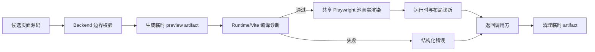
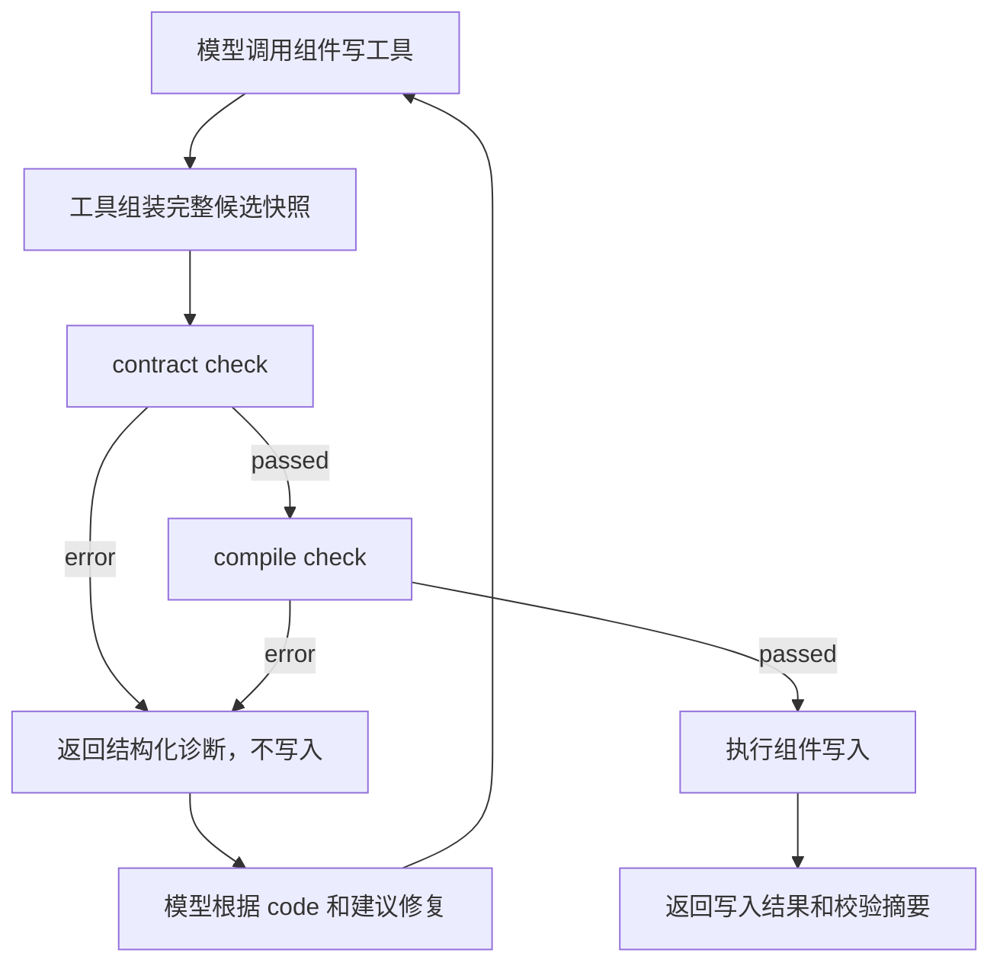

# 面向智能体的组件 Check 体系设计

> 当前实现说明（2026-08-26）：组件自动校验只执行 contract 与 Runtime compile，不再执行浏览器真实渲染、preset 场景或布局检查。组件预览页面仍可由用户手动查看；本文第 5 节及其中引用的 render 协议保留为历史设计参考，不属于当前自动校验链路。

## 1. 文档目的

本文基于当前页面 check、组件预览和 AI 组件工具链，设计一套主要服务于智能体的组件反馈机制。

目标不是在 Editor 再建设一套面向用户的“检查”产品。用户已经可以通过组件预览查看效果和错误；本方案重点解决智能体创建或修改组件后，如何自动获得足够准确、可操作的反馈，并继续修复，直到候选组件能够通过契约和 Runtime 编译检查。

本文同时记录设计边界与实施状态。当前智能体闭环以 contract + compile 为准；组件浏览器渲染检查暂不作为写入门禁或独立校验结果。

### 1.1 当前实施状态

截至 2026-08-10，已经落地：

- 正式 `ComponentValidationResult` Pydantic 结果契约，以及 contract/compile/render 阶段状态；组件结果中的 render 阶段固定为 `skipped`。
- `ComponentValidationService` 编排、候选 hash、基础设施 unavailable/retryable 分类和 artifact 清理。
- 页面/内容/原子组件各自的版本化临时 validation profile，不读取 AI 当前焦点项目尺寸和基础字号。
- Runtime 组件预览页面仍支持默认态和 presets 手动预览；这些能力不参与自动校验。
- `validate_entity(component.check)` 独立只读调用，以及新建组件、源码 edits、`previewSchema`/组件类型更新的自动写入前 check。
- 源码与 schema/type 写入在耗时检查后的基线复核，防止检查期间草稿变化。

尚未落地：

- candidate hash 的短期结果缓存和持久化校验任务。
- 组件浏览器真实渲染、preset 场景和布局检查的重新启用方案。
- 面向具体项目页面配置的 contextual component check；当前仍由页面 check 承担最终集成验证。
- 多基础字号 compatibility profiles、内容组件尺寸控制响应差值和 preset 残留状态等低置信度规则。
- Editor 专用 check 交互；这不属于当前目标。

## 2. 范围与结论

### 2.1 本次覆盖范围

组件智能体的以下三类写操作必须自动 check：

1. 新建组件：同时检查候选源码、组件类型和 `previewSchema`。
2. 修改组件源码：基于当前组件元数据和候选源码检查。
3. 修改组件 `previewSchema`：基于当前源码和候选 schema 检查。

同时，组件 check 应继续作为 `validate_entity(component.check)` 的只读能力对模型开放，使智能体可以像检查页面一样，在不发生写入的情况下单独检查当前组件或一份完整候选。

当前自动 check 需要回答两个问题：

- 代码能不能跑起来：契约、依赖、Vue/Vite 编译是否通过。
- 候选是否满足平台写入边界：组件类型、previewSchema、依赖和 Runtime Kit 引用是否符合契约。

这里的渲染环境不属于组件数据。页面尺寸、项目基础字号和项目视觉配置只能作为本次 check 的临时上下文，不能写入组件或 `previewSchema`，也不能默认继承 AI 会话当前焦点项目。

### 2.2 明确不纳入主线

- 不新增 Editor “检查”按钮、检查面板或保存门禁。
- 不改变用户现有的保存、预览和查看报错流程。
- 不把发布校验、组件列表健康状态、检查任务持久化作为本轮必需项。
- 不对每次用户键盘输入执行 Runtime check。
- 不用截图像素差作为通用正确性标准。

### 2.3 核心结论

当前组件自动 check 只执行候选源码的 Runtime/Vite 编译和 Backend 契约校验，由三类 AI 写工具和 `validate_entity(component.check)` 复用同一个校验内核。组件预览仍由用户通过预览页面自行确认，不作为自动写入门禁。

## 3. 当前体系梳理

### 3.1 页面 check 可复用的链路

页面 check 当前已经形成以下链路：



对应职责主要位于：

| 能力 | 当前实现 | 可复用点 |
| --- | --- | --- |
| 候选源码与 edits | `CodeCheckService` | 生成待检查候选，不先写业务数据 |
| 完整模块图 | `PreviewService` / `ComponentPreviewService` | 注入项目配置、组件依赖和 Runtime Kit |
| 编译诊断 | `RuntimeDiagnosticsClient` | 使用隔离工作区执行 Vite build |
| 浏览器诊断 | `PageRenderDiagnosticsService` | 共享 Playwright 池、资源等待和错误采集模式 |
| 临时资源回收 | check 编排层 | 结束后清理 artifact，TTL 兜底 |

当前组件自动校验不调用浏览器；Runtime 组件预览仍独立负责用户手动查看。若未来重新启用真实渲染，才需要复用页面检查的构建器和浏览器进程池。

### 3.2 组件已经具备的校验

Backend 当前已有同步契约校验：

- 只支持 Vue 组件文件。
- `import_name`、名称和组件类型等基础字段校验。
- `previewSchema` 根节点必须是 JSON 对象。
- slot/preset 中的组件引用必须满足版本化 Runtime Kit 或工作空间组件约束。
- 内容组件必须声明尺寸控制字段。
- 组件依赖必须存在，且不能形成循环依赖。
- 发布时维护依赖、资源和 fingerprint 索引。

`CodeCheckService.check_component_code` 当前还支持：

- 检查已有组件当前源码、完整候选源码或结构化 edits。
- 检查尚未创建的临时组件候选。
- 使用候选 `preview_schema` 覆盖当前值。
- 创建组件预览 artifact，并执行 Runtime/Vite 编译诊断。
- 返回 canonical diff，结束后清理临时 artifact。

Runtime 组件预览页仍能够供用户手动：

- 根据 `previewSchema` 构造默认 props、slots、mocks 和 presets。
- 实际加载组件和相关依赖。
- 通过预览页面查看组件启动结果。
- 接收状态更新并切换预览场景；这些状态切换不再被自动校验服务调用。

### 3.3 AI 写操作当前缺口

| AI 操作 | 当前状态 | 缺口 |
| --- | --- | --- |
| 新建组件 | 写入前自动 contract + compile check | 不执行浏览器渲染和布局诊断 |
| 修改组件源码 | `apply_component_edits` 写入前自动 contract + compile check | 不执行浏览器渲染和布局诊断 |
| 修改 `previewSchema` | 写入前自动 contract + compile check | 不执行浏览器渲染和布局诊断 |
| 独立 `validate_entity(component.check)` | 可由模型主动调用 | 只返回 contract + compile 结果 |

组件自动校验以 Vite 编译和 Backend 契约为边界；Vite 编译通过不等同于浏览器视觉效果经过自动验证，视觉效果仍由组件预览和页面检查负责。

## 4. 目标执行模型

### 4.1 三层诊断

| 阶段 | 要回答的问题 | 主要检查 | 执行环境 |
| --- | --- | --- | --- |
| contract | 候选输入是否符合平台契约 | 字段、schema 结构、导入边界、依赖存在性、循环依赖、组件类型约束 | Backend |
| compile | 完整组件图能否构建 | Vue SFC、TypeScript、模块解析、Runtime Kit 与工作空间依赖 | Runtime diagnostics |
| render | 当前是否执行组件真实渲染 | 当前组件自动校验不执行该阶段，结果固定为 skipped | 不调用浏览器 |

当前执行顺序为 `contract → compile`。组件结果保留 `render` 阶段字段以兼容统一结果契约，但固定为 `skipped`。

### 4.2 三类写操作的候选组合

| 写操作 | 源码候选 | `previewSchema` 候选 | 组件其他信息 | 通过后写入 |
| --- | --- | --- | --- | --- |
| 新建组件 | 工具请求中的完整源码 | 工具请求中的完整 schema | 工具请求中的名称、类型、引用名 | 创建组件草稿 |
| 修改源码 | 应用 edits 后的完整源码 | 当前草稿 schema | 当前草稿元数据 | 只保存源码变更 |
| 修改 schema | 当前草稿源码 | 工具请求中的完整候选 schema | 当前草稿元数据 | 只保存 schema 变更 |

检查必须针对最终要写入的完整候选快照，不能分别检查一个源码片段或局部 schema。候选未通过时不写入，现有数据保持不变；模型下一轮可根据诊断重新提交完整创建参数、修订后的 edits 或修订后的 schema。

### 4.3 自动反馈闭环



组件 check 对模型提供两个入口，但只有一个校验实现：

- 自动入口：三类写工具在提交写入前强制执行，保证模型漏掉预检也不会写入坏候选。
- 独立入口：`validate_entity(component.check)` 按模型需要执行只读检查，用于检查当前组件、试验完整候选或在修复过程中确认结果。

独立入口不应成为三类写操作正确性的前置要求。模型已经通过 `validate_entity` 检查过候选后，写工具原则上仍需校验；后续可以依据相同 `candidate_hash`、Runtime 版本和规则版本复用短期结果，避免重复消耗 Runtime 资源。

## 5. 真实渲染检查设计（当前停用）

本节保留历史设计，当前自动校验不会执行其中的浏览器、preset 和布局步骤。

### 5.1 检查场景

一次组件渲染 check 使用显式 `scenarios`：

- `default`：根据 `previewSchema` 默认值生成，必须检查。
- `preset:<key>`：按 preset 合并 props、slots 和 mocks。
- 默认态与 presets 状态经过规范化 JSON hash 去重。
- 首期最多检查默认态加 10 个 preset；超限返回 warning，并在结果中列出未检查数量。
- 任一已执行场景出现运行时 error，则候选整体失败。

首期不自动组合所有 prop 边界值，也不随机 fuzz。只有 `previewSchema` 明确描述的状态，才是智能体能够理解和定向修复的稳定场景。

### 5.2 浏览器执行步骤

组件专用 `ComponentRenderDiagnosticsService` 建议按以下步骤工作：

1. 使用 compile 阶段同一个临时 artifact 打开组件预览宿主页。
2. 等待版本化的预览握手；收到 `component-preview:error` 立即记录 error。
3. 监听 `pageerror`、未处理 Promise rejection、控制台 error 和关键资源失败。
4. 等待字体、图片及 Runtime 已知视觉资源进入稳定状态。
5. 检查 `default`，再通过现有状态更新协议逐个切换 preset。
6. 每次切换等待一次明确的 `render-settled` 信号；若当前协议没有该信号，应先扩展协议，不能依赖固定 sleep。
7. 每个场景读取 DOM 几何事实并执行对应组件类型的布局规则。
8. 汇总结果后关闭页面，并由外层统一清理 artifact。

所有浏览器任务必须接入现有共享 Playwright 池和有界队列，不允许每次 check 自行启动 Chromium。

### 5.3 运行时错误

以下情况应作为阻断 error：

- 预览宿主页未能进入 ready，或明确进入 error。
- 组件 `setup`、render、computed、watch 或事件初始化产生未处理异常。
- 动态 import 或关键组件依赖加载失败。
- 默认态或某个 preset 无法完成稳定渲染。
- 根节点完全不存在，或存在但没有任何可见内容。

普通 console warning 不直接阻断。console error 需要过滤 Runtime 自身已知噪声，并保留来源 URL、场景和消息；无法确定属于候选组件的错误先作为 warning，避免误导模型。

### 5.4 布局规则

布局诊断应提供“事实 + 判定 + 修复方向”，不能只返回“布局有问题”。首期建议覆盖高置信度规则：

| 规则 | 默认级别 | 适用范围 | 需要返回的事实 |
| --- | --- | --- | --- |
| 根节点不可见或有效面积为 0 | error | 全部组件 | 根节点数量、宽高、可见性 |
| 内容完全在预览 frame 外 | error | 全部组件 | 根节点 rect、frame rect、相交面积 |
| 水平或垂直明显溢出 | warning | 内容/原子组件 | 溢出方向、像素值、发生溢出的节点摘要 |
| 内容被 `overflow: hidden` 明显裁切 | warning | 内容/原子组件 | scroll/client 尺寸、裁切祖先 |
| 页面组件超出目标画布 | warning | 页面组件 | 四边超出像素、目标画布尺寸 |
| 内容组件不响应声明的尺寸控制 | warning | 内容组件 | 输入尺寸与实际根节点尺寸 |
| preset 切换后残留旧内容或尺寸不稳定 | warning | 全部组件 | 切换前后节点/尺寸事实；首期可延后 |

布局判断需要区分组件类型：

- 页面组件按项目画布尺寸检查，关注整体越界和画布覆盖。
- 内容组件在 placement frame 中检查，重点验证 `previewSchema` 声明的尺寸控制是否生效。
- 原子组件允许内容自适应，不要求铺满 frame，只检查不可见、完全越界和明显裁切。

布局问题默认使用 warning，只有“没有可见结果”或“完全在容器外”等确定无法使用的情况才是 error。这样模型能获得反馈并主动改进，同时避免启发式布局规则过度阻断有效组件。

### 5.5 页面尺寸与基础字号的处理

组件是工作空间共享资产，不天然属于某个项目，因此页面宽高、`base_font_size`、图标默认描边和项目主题不能成为组件校验输入中的隐含组件属性。同一个候选组件不能因为智能体当前焦点切换到另一个项目，就得到不同的基础校验结论。

现有 `ComponentPreviewOptions.page` 已经能够在创建 preview artifact 时临时注入宽、高、基础字号、图标描边和主题；这正是校验环境的承载位置。建议把它正式定义为执行期 `validation_profile`，只存在于一次 check 的 artifact 中：

```json
{
  "profile_key": "component-content-default.v1",
  "viewport": {"width": 1440, "height": 900},
  "page": {
    "width": 1920,
    "height": 1080,
    "base_font_size": "20px",
    "icon_default_stroke_width": 2,
    "theme_source": "workspace-default"
  },
  "placement": {
    "width_mode": "fixed",
    "width_value": 960,
    "height_mode": "auto",
    "padding": 48
  }
}
```

示例数值是校验 fixture，不是新的组件字段；最终数值应由现有平台默认值和真实组件样本确定。profile 必须有版本号，Backend 与 Runtime 共同维护其含义。

#### 固定校验环境与真实项目环境的边界

- 基础组件 check 使用平台定义的稳定 profile，保证同一候选在相同 profile、主题 fingerprint、Runtime 和规则版本下结果可重复。
- 不读取 AI run 的 `project_id`、当前项目页面尺寸或基础字号作为默认值。
- 不把 `page.width`、`page.height` 或 `base_font_size` 加入组件模型、组件版本或 `previewSchema`。
- 工作空间默认主题可以作为资源和 CSS token 的执行依赖，但诊断结果要记录实际使用的主题 key/fingerprint；主题变化后缓存失效。
- 如果未来需要回答“这个组件放进某个具体项目是否合适”，应增加显式的 contextual check，或由页面 check 在真实项目 artifact 中验证；它不能替代组件的稳定基础 check。

#### 不同组件类型如何使用 profile

| 组件类型 | 校验基准 | 页面尺寸/字号的角色 |
| --- | --- | --- |
| 原子组件 | 自身可见区域和 placement frame | 仅提供 CSS 继承与可用宿主空间，不要求填满页面 |
| 内容组件 | `previewSchema` 默认尺寸 props + placement frame | 用于验证尺寸控制、溢出和裁切，不把 frame 当组件固有尺寸 |
| 页面组件 | profile 提供的完整画布 | 在代表性画布中检查覆盖、越界和运行时结果，但不声明组件只支持该画布 |

基础字号仍属于页面集成环境变量：组件自动 check 不以页面尺寸或字号做浏览器布局判断；组件进入具体页面后，由页面 check 验证真实项目中的集成兼容性。

#### 结果语义

组件结果记录 `validation_profile_version` 和 `profile_key`，用于标识编译 artifact 使用的临时 profile；当前不生成 scenario 或布局反馈。

组件 check 的结论应表述为“候选在已执行的校验 profile 下通过”，不能表述为“在所有页面尺寸和字号下都正确”。当组件进入具体页面后，页面 check 仍负责基于真实项目尺寸、基础字号、主题和页面组合关系发现集成问题。

## 6. 面向模型的结果契约

### 6.0 内部完整结果与模型侧精简结果

`CodeCheckService`、`ComponentValidationService` 和 Runtime 之间继续使用正式的 `ComponentValidationResult`。当前结果包含 contract、compile 诊断和兼容性的 render/skipped 阶段字段；`scenarios` 保留为空。共享格式化层只在 AI 工具返回模型前执行，不改变这些内部结果，也不修改 Runtime 诊断协议。

写入/修改工具只把校验部分转换为短文本，保留对象 ID、版本、`success`、`applied` 和 hash 等业务字段；不会回传原始 `diagnostics`、完整 `layout_analysis`、全量 scenario、源码 diff 或重复的 validation。页面和组件源码写入工具都不向模型返回 `canonical_diff`，避免把已由模型提交的源码变化重复回传；该字段仍可在服务端内部校验链中使用。warning/error 合计最多返回 10 条，超出部分标记省略数量。

`validate_entity` 的页面/组件 check 返回短文本而非结构化完整结果：`detail=false` 保留摘要、code、message 和定位；`detail=true` 仍最多返回 10 条问题，并增加受控 facts。组件 check 不返回 scenario、布局数值或浏览器几何数据。资源差异预览继续使用现有结构化 envelope。

### 6.1 顶层结果

建议新增正式 Pydantic Schema，供三类 AI 写工具共用：

```json
{
  "schema_version": 1,
  "target": {
    "kind": "component",
    "operation": "update_preview_schema",
    "component_id": 42,
    "candidate_hash": "sha256:..."
  },
  "validation_profile_version": "component-profiles.v1",
  "status": "failed",
  "valid": false,
  "retryable": false,
  "summary": "组件 Runtime 编译未通过。",
  "stages": {
    "contract": "passed",
    "compile": "failed",
    "render": "skipped"
  },
  "diagnostics": [],
  "scenarios": [],
  "canonical_diff": null
}
```

上例中的 `canonical_diff` 属于服务端内部完整校验结果字段，不代表页面或组件源码写入工具会向模型回传该字段。

状态固定为：

- `passed`：所有阶段完成，无 warning/error。
- `passed_with_warnings`：没有 error，但存在可改进问题。
- `failed`：候选组件自身存在阻断错误。
- `unavailable`：Runtime 或诊断基础设施不可用，`retryable=true`，不能归因于候选组件。

`valid` 表达候选是否允许写入；`retryable` 告诉智能体是否应原样重试。基础设施不可用时不应让模型修改源码碰运气。

### 6.2 单条诊断

```json
{
  "severity": "warning",
  "stage": "compile",
  "source": "runtime-compile",
  "code": "COMPONENT_COMPILE_FAILED",
  "message": "组件 Runtime 编译未通过。",
  "scenario_key": null,
  "profile_key": "component-content-default.v1",
  "location": null,
  "facts": {
    "log_excerpt": "按 Runtime 诊断结果截断后的编译错误"
  },
  "suggestion": "根据编译错误定位源码、Runtime Kit import path、依赖或 previewSchema 类型问题。"
}
```

给模型的字段需要满足：

- `code` 稳定，模型提示和测试不依赖完整中文文案。
- `scenario_key` 当前组件自动 check 固定为空；历史 render 结果才使用该字段。
- `facts` 仅返回 Runtime 编译诊断可安全提供的事实，帮助模型判断根因。
- `location` 只有 Runtime 能可靠提供文件、行、列时才填写，不能伪造。
- `suggestion` 给出排查方向，不自动声称唯一修复方案。
- 编译日志先规范化和截断，去掉本机绝对路径、重复堆栈和无关 Vite 噪声。

### 6.3 建议诊断码

| source | code | 默认级别 |
| --- | --- | --- |
| `backend-contract` | `COMPONENT_PREVIEW_SCHEMA_INVALID` | error |
| `backend-dependency` | `COMPONENT_DEPENDENCY_INVALID` | error |
| `runtime-compile` | `COMPONENT_COMPILE_FAILED` | error |
| `infrastructure` | `COMPONENT_CHECK_UNAVAILABLE` | 顶层 unavailable |

历史 render/layout 诊断码保留在第 5 节设计参考中，当前组件自动 check 不会产生这些诊断。

## 7. 写工具接入策略

### 7.1 新建组件

新建工具先组装完整的临时组件描述，包括源码、`previewSchema`、组件类型、引用名和依赖上下文，再创建 source preview artifact。

- check failed：不创建草稿，工具返回 `applied=false` 和精简 validation 文本；完整 validation 只保留在 Backend 内部。
- check unavailable：不创建草稿，返回 `retryable=true`，由智能体稍后原样重试。
- passed 或 passed_with_warnings：允许创建；warnings 随成功结果返回，提示模型是否需要继续优化。

新建失败时没有 `component_id`，结果使用请求级 `candidate_hash` 关联同一候选即可。

### 7.2 修改组件源码

沿用现有 `apply_component_edits` 的候选 diff 机制，统一执行 contract + compile check：

1. 读取当前组件快照。
2. 应用结构化 edits，得到完整候选源码；canonical diff 仅作为服务端内部校验信息生成。
3. 使用当前 `previewSchema` 执行 contract + compile check。
4. 通过后，在写事务中复核原始源码 hash/版本，避免检查期间发生并发修改。
5. 写入成功后返回 validation 短文本和 warnings，不向模型回传源码 diff。

失败时不保存 edits，模型根据诊断重新生成 edits；不应把失败候选写成草稿再让模型修复。

### 7.3 修改 `previewSchema`

schema 修改不是普通元数据更新，应从通用组件元数据写工具中拆出明确的候选校验路径，或在检测到 `preview_schema` 字段时进入同一校验编排。

检查使用“当前源码 + 候选 schema”，执行契约和 Runtime 编译检查。浏览器 default/preset 运行与尺寸布局不属于当前自动校验链路，由组件预览和页面 check 负责。

检查通过后仅写 schema，并在事务内复核当前源码和旧 schema 的 candidate 基线；否则可能把针对旧源码验证过的 schema 写到已经变化的组件上。

### 7.4 工具返回封装

三类工具保持一致的业务返回语义；其中 `validation` 是模型侧精简短文本，完整结果只在 Backend 内部保留：

```json
{
  "success": true,
  "applied": false,
  "operation": "create_component",
  "component": null,
  "validation": "检查结论：failed\n摘要：组件未创建：Runtime 编译未通过。\n错误：\n- [COMPONENT_COMPILE_FAILED] 组件 Runtime 编译未通过。\n下一步：如需查看诊断明细，请调用 validate_entity，并设置 detail=true。"
}
```

这里 `success=true` 表示工具按预期完成，`applied=false` 表示业务写入未发生；不要把候选校验失败伪装成工具执行异常。只有权限、参数协议或内部未处理错误才走工具异常路径。

AI 系统提示应明确：

- `validation` 中出现 error/warning 时，根据 code、message、定位和 profile 修改候选；需要更多上下文时，对相同目标和候选调用 `validate_entity(detail=true)`。
- `unavailable` 或提示基础设施不可用时：不要修改候选，稍后原样重试或向用户说明暂不可检查。
- `passed_with_warnings`：写入已经发生；判断 warning 是否影响用户目标，必要时继续修改。

### 7.5 `validate_entity(component.check)` 独立入口

`validate_entity` 中的组件检查应与页面检查保持一致的按需调用能力，并支持以下目标：

| 模式 | 输入 | 用途 |
| --- | --- | --- |
| current | `component_id` | 重新检查当前已保存组件的源码和 schema |
| content | 完整候选源码，可选候选 `preview_schema` | 在修改前试验一份完整源码候选 |
| edits | `component_id` + 结构化 edits，可选候选 `preview_schema` | 预检基于当前源码形成的编辑结果 |
| transient | 创建所需的工作空间、源码、schema、类型等完整候选信息 | 在尚无 `component_id` 时预检新组件 |

调用结果返回与写工具一致的精简校验文本，但额外明确：

- `applied=false` 固定成立，调用不会创建或修改组件。
- 写工具之外，仍可从问题文本读取 code、message、定位和 profile；使用 `detail=true` 时读取受控 facts。内部完整结果仍保留 `candidate_hash`、`validation_profile_version` 和 canonical diff，便于日志与服务端确认具体候选与环境。
- 默认执行 contract、compile 阶段；render 阶段固定为 `skipped`，不允许模型单独请求浏览器渲染检查。
- warning、failed 和 unavailable 的语义与自动入口完全一致。
- 临时 artifact 在调用结束后清理，不能把 artifact ID 当成持久检查记录。

工具说明应告诉模型何时值得单独调用：诊断当前组件、在大幅修改前预检、验证一个候选 schema，或确认修复是否消除了 warning。工具说明也要明确：直接调用三类写工具时无需先调用 `validate_entity`，因为写工具会自动执行同一检查。

## 8. 服务与协议边界

建议新增 `ComponentValidationService` 作为编排层，职责为：

- 接收规范化的完整候选快照，而不是依赖某一种 AI 工具参数。
- 顺序执行 contract 和 compile。
- 统一状态、诊断码、空场景结果和 `candidate_hash`。
- 确保临时 artifact 始终清理。

既有能力保持各自边界：

- Backend 契约与依赖服务继续作为平台规则的单一事实源。
- `ComponentPreviewService` 负责为未保存候选创建完整 artifact。
- `RuntimeDiagnosticsClient` 负责 compile，不决定是否写入。
- Runtime 组件预览继续负责浏览器运行和场景切换，但不属于自动组件 check。
- AI 写工具负责写入前调用、并发复核和把结果反馈给模型。
- Runtime 预览协议继续服务用户预览，不承载 AI 自动校验语义。

不建议为首期新增公开 Editor REST check 接口或持久化 validation job。校验先作为 Backend 内部应用服务供 AI 工具调用；如果未来有其他调用方，再在不改变核心结果 Schema 的前提下暴露接口。

## 9. 分阶段落地计划

### 阶段一：统一 AI 写入前的编译反馈（已完成）

目标是消除当前三类写操作的接入不一致，并先建立稳定返回契约。

- 定义组件候选、校验结果、diagnostic 和 scenario 的 Pydantic Schema。
- 定义首版组件 validation profiles；profile 只进入临时 artifact，不成为组件字段。
- 从现有 `CodeCheckService.check_component_code` 抽取/封装统一组件校验编排入口。
- AI 新建组件在写入前执行 contract + compile。
- AI 修改源码继续自动 check，并改用统一结果契约。
- AI 修改 `previewSchema` 在写入前执行 contract + compile。
- 三类工具统一 `success/applied/validation` 返回语义。
- 将 `validate_entity(component.check)` 迁移到同一结果契约，支持 current、候选源码/edits、候选 schema 和临时新组件检查。
- 更新 `tool_specs.py` 及防漂移测试，明确独立 check 可按需调用、三类写工具会自动 check，无需重复预检。

阶段一完成后，三类操作至少都能向模型反馈候选是否可编译，但尚不能声称实际渲染正常。

### 阶段二：真实渲染与布局反馈（当前停用）

该阶段暂不作为当前组件校验链路的一部分；如未来重新启用，需要先解决多 preset 状态隔离和 Runtime 异步渲染收敛问题。

- 新增 `ComponentRenderDiagnosticsService` 并接入共享 Playwright 池。
- 补充或版本化 Runtime 组件预览协议，提供可靠 `render-settled` 信号。
- 执行 default 和有界 presets，捕获启动错误、运行时错误和资源失败。
- 返回根节点、frame、overflow、clip 和尺寸响应等布局事实。
- 按页面/内容/原子组件实施不同规则。
- scenario 与 diagnostic 返回实际 `profile_key`，明确布局结论的环境边界。
- 将三类 AI 写操作统一升级为 contract + compile + render。
- warnings 随成功写入反馈给模型，确定性 render/layout error 阻止写入。

### 阶段三：稳定性与成本治理（待实施）

- 对相同 candidate hash 和同一 Runtime/规则版本增加短期结果缓存。
- 校验缓存 key 同时包含 validation profile 版本、主题 fingerprint 和 Runtime 版本，环境变化时不得复用旧结果。
- 补充诊断超时、队列容量、场景上限和日志截断指标。
- 区分候选错误与基础设施 unavailable，支持智能体安全重试。
- 根据真实耗时决定是否需要异步 check；首期不直接复用页面 mutation job 状态机。
- 用真实案例调校布局阈值，低置信度规则保持 warning。

## 10. 测试计划

### 10.1 Backend unit/contract

- 新建组件、修改源码、修改 schema 都在写入前调用统一校验服务。
- 任一阶段 failed 时 `applied=false`，数据库不发生变化。
- unavailable 时不写入，结果为 `retryable=true`。
- passed_with_warnings 时允许写入并完整返回 Runtime 编译 warnings。
- edits 的 canonical diff 与实际写入内容一致。
- 检查后候选基线发生变化时拒绝写入，避免 TOCTOU。
- 临时组件、传递依赖、Runtime Kit 边界和循环依赖行为保持正确。
- 三类工具规格、运行时注册、返回示例和自动校验说明一致。
- `validate_entity(component.check)` 与三类写工具对相同候选产生一致的阶段状态、诊断码和 candidate hash。
- 独立 check 不产生组件写入，临时 artifact 始终清理。

### 10.2 Runtime 组件预览

- 组件自动 check 只验证 contract、Runtime compile 和 artifact 清理。
- 组件预览页面的 default/preset 状态切换仍由 Runtime 自身测试覆盖。
- 页面真实渲染诊断继续由页面 check 的测试覆盖，不纳入组件自动 check。
- Runtime 编译超时或基础设施不可用映射为 unavailable，不映射为候选源码错误。
- 组件预览页面的浏览器资源回收由 Runtime 自身测试和预览链路负责，不属于组件自动 check。

### 10.3 AI 工具闭环

- 新建组件第一次编译失败，模型收到诊断后修复并成功创建。
- 源码或 previewSchema 的 Runtime 编译失败时不写入。
- 组件自动 check 不生成 render、preset 或布局诊断；预览状态由 Runtime 预览测试覆盖。
- 基础设施 unavailable 时模型不会无依据改写候选。

建议实施时按改动范围运行 Backend unit/integration、根仓 contracts、Runtime delegated tests，并为三类工具各补一个跨 Backend/Runtime 的集成场景。只有涉及真实浏览器链路时再增加对应 E2E regression。

## 11. 风险与约束

以下浏览器、preset 和布局风险仅适用于第 5 节历史设计；当前组件自动校验不执行这些步骤。

- 若未来重新启用浏览器 check，其成本会高于 compile，必须复用共享池、限制场景数并设置分阶段超时。
- 若未来重新启用布局规则，应将其作为启发式反馈，除空白、零尺寸和完全越界外，首期应以 warning 为主。
- 若未来重新启用 preset 检查，协议需要明确异步 mock 的“渲染稳定”判定，不能只等网络空闲或固定时长。
- 若未来重新启用运行时错误采集，console 中混入的 Runtime 噪声不能直接阻断候选。
- 诊断中可能包含源码片段和本机路径。返回模型前需要脱敏、去重和截断。
- check 与写入之间存在并发窗口。三类操作都要复核候选基线，不能只依赖组件 ID。
- 单一 profile 只能证明候选在该环境下的结果。具体项目中的兼容性仍由带真实页面配置的页面 check 负责。
- 自动 check 是模型反馈能力，不等于证明组件业务语义完全正确；用户仍通过预览判断视觉和内容是否符合预期。

## 12. 推荐最终边界

- AI 写工具对新建组件、源码修改和 `previewSchema` 修改承担自动 check 责任。
- `validate_entity(component.check)` 提供与页面 check 对齐的只读独立调用能力。
- Backend 统一组装候选、执行 contract + compile 校验、决定是否写入并返回结构化结果。
- Runtime 负责完整 artifact 的编译；组件预览执行由用户预览链路独立承担。
- 页面 check 负责真实页面运行错误和布局事实，不把组件自动 check 扩展为浏览器诊断。
- 模型直接消费写工具返回的 validation 短文本形成修复闭环；需要受控明细时调用 `validate_entity(detail=true)`，无需重复执行无诊断目的的独立检查。
- Editor 继续承担用户预览和报错呈现，不新增本方案专用的 check 交互。

最终闭环应是：模型提交完整候选，系统在不污染已有组件的前提下执行契约和 Runtime 编译检查，失败时返回可定位、可修复的事实，通过后再写入；视觉与页面集成问题由组件预览和页面 check 继续承担。
