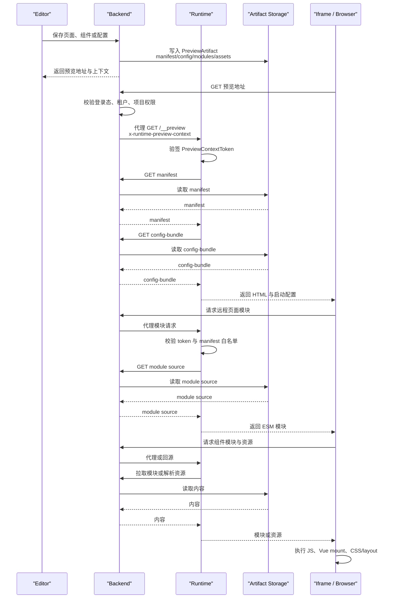
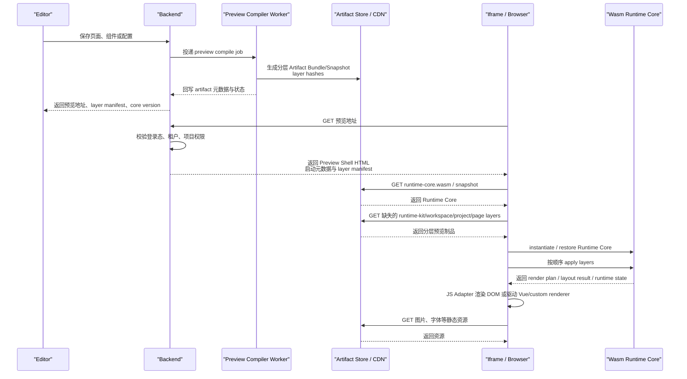
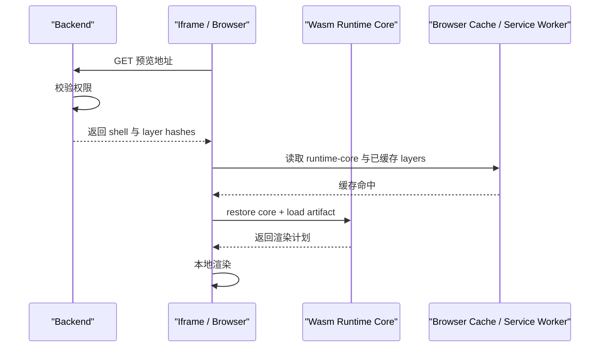

<!-- 文件功能：分析将 Runtime 演进为浏览器侧 Wasm 内核与快照化预览模型的收益、通信链路、服务端资源影响、风险与分阶段落地建议。 -->
# Runtime Wasm 内存快照技术分析报告（2026-05-09）

## 1. 结论摘要

将 Runtime 改造为 Wasm 内存快照方案，真正有价值的方向不是把现有 Vue Runtime 简单翻译成 Wasm，而是把 Runtime 拆成“版本级内核”和“分层 Artifact”两类制品：

- **版本级 Runtime Core Snapshot**：低频变化，随 Runtime 版本发布，可长期缓存在浏览器或 CDN 中。
- **分层 Artifact Bundle/Snapshot**：按 Runtime Kit、Workspace、Project、Page、Session Overlay 拆分，随各自内容变化，以内容哈希标识，可被浏览器、CDN 和对象存储复用。

在这个前提下，Wasm 方案可以明显降低在线预览阶段的 Backend 与 Runtime 服务端资源占用，尤其是减少多跳代理、模块按需回源和 Runtime 在线服务的常驻压力。它不能消除首次拉取 Runtime Core、预览制品和静态资源的 HTTP 成本，但可以把大量“预览过程中的在线请求”转化为“启动前少数静态制品下载 + 页面内 JS/Wasm 调用”。

建议不要直接进入全量 Wasm Runtime 重写。更稳妥的路线是先完成 **preview artifact 预编译、层级拆分、内容寻址、强缓存、启动数据合并**，再以 POC 验证 Wasm Core Snapshot 是否能在高并发预览、复杂页面布局、组件沙箱或多实例快速恢复场景中带来额外收益。

## 2. 当前 Runtime 基线

当前 `web-runtime-vue` 已经演进为面向 SaaS 的只读预览 Runtime。根据 `runtime/README.md` 与 `runtime/docs/integration/runtime-architecture.md`，当前链路有以下特点：

1. Browser 不直接访问 Runtime 内网地址，统一访问 Backend 暴露的预览地址。
2. Backend 负责登录态、租户、项目、工作空间权限校验，并向 Runtime 注入 `PreviewContextToken`。
3. Runtime 通过 JWKS 验签预览上下文，读取 `PreviewArtifact` 的 manifest、配置包、模块源码与资源索引。
4. Runtime 自身保持无状态，不恢复旧的 preview session，也不提供本地文件写入能力。
5. 预览页面通过远程模块和 Runtime Kit manifest 控制导入边界。

这套架构的核心问题不是 Runtime 是否有状态，而是一次预览会经过多类动态请求和多层服务跳转：

- 预览入口：Browser -> Backend -> Runtime。
- 启动数据：Runtime -> Backend -> Artifact Storage。
- 页面模块：Browser -> Backend -> Runtime -> Backend -> Artifact Storage。
- 静态资源：Browser/Runtime -> Backend/CDN/Artifact Storage。

因此，Runtime 虽然无状态，但在线预览路径仍然有较多服务端参与。

## 3. Wasm 快照方案的定义

本文讨论的 Wasm 快照方案不是单纯把 `.vue` 页面编译进 Wasm，而是以下架构组合：

1. **Wasm Runtime Core**
   - 承载稳定的运行时核心能力，例如页面模型解析、布局计算、资源映射、表达式求值、组件元数据校验、可选的沙箱执行。
   - 随 Runtime 版本发布，版本不变时内容不变。
   - 以 `.wasm`、初始化数据和可选内存快照形式下发。

2. **JS Adapter**
   - 负责连接浏览器 DOM、CSSOM、事件系统、Vue 或自定义渲染器。
   - Wasm 不能直接操作 DOM，最终渲染仍需要 JS 适配层参与。

3. **分层 Artifact Bundle/Snapshot**
   - 保存页面、组件、路由、主题、图标、资源索引和预编译结果。
   - 以内容哈希标识，支持浏览器缓存、CDN 缓存和对象存储复用。
   - 作者态保存时可能频繁变化，发布态或重复预览时缓存收益更大。

4. **Preview Shell**
   - Backend 返回的轻量 HTML，包含启动元数据、layer manifest、Runtime core version 和必要的短期授权信息。
   - 不承载重逻辑，不参与后续高频页面内计算。

### 3.1 Artifact 层级拆分模型

Artifact 不宜设计成一个巨大的全量快照。更合理的方式是把稳定能力、共享资源、项目配置和页面内容拆成不同层，每层独立生成 hash、独立缓存、独立失效。

```text
Runtime Core Snapshot
  低频变化：运行时内核、基础 ABI、解析器、布局算法

Runtime Kit Layer
  中低频变化：公开能力清单、基础组件元数据、资源解析规则、主题 token 解析器

Workspace Layer
  中频变化：工作空间组件、图标库、字体、共享资源索引

Project Layer
  中频变化：项目路由、项目主题绑定、项目级资源索引

Page Layer
  高频变化：当前页面源码、页面模型、页面局部资源引用

Session Overlay
  极高频变化：组件调参、预览参数、临时状态，通常只保存在浏览器本地
```

| 层级 | 变化频率 | 缓存价值 | 典型失效原因 |
| :--- | :--- | :--- | :--- |
| Runtime Core Snapshot | Runtime 发版才变 | 最高 | Runtime ABI、核心算法或安全补丁变化 |
| Runtime Kit Layer | Runtime Kit manifest 变化 | 很高 | 公开能力、基础组件或资源规则变化 |
| Workspace Layer | 工作空间资源或组件变化 | 高 | 工作空间组件发布、图标库、字体或共享资源变化 |
| Project Layer | 项目配置变化 | 中 | 路由、主题绑定、项目级资源索引变化 |
| Page Layer | 页面保存变化 | 中到低 | 当前页面源码、局部资源或页面模型变化 |
| Session Overlay | 用户交互变化 | 通常不做长期缓存 | 调参、选中态、预览参数变化 |

组合后的有效运行时可以表达为：

```text
EffectiveRuntime =
  RuntimeCore(core_version)
  + RuntimeKitLayer(runtime_kit_hash)
  + WorkspaceLayer(workspace_hash)
  + ProjectLayer(project_hash)
  + PageLayer(page_hash)
  + SessionOverlay(optional)
```

Backend 不需要返回一个全量快照地址，而可以返回分层清单：

```json
{
  "core_version": "2026.05.09",
  "layers": [
    {"type": "runtime-kit", "hash": "sha256:...", "url": "..."},
    {"type": "workspace", "hash": "sha256:...", "url": "..."},
    {"type": "project", "hash": "sha256:...", "url": "..."},
    {"type": "page", "hash": "sha256:...", "url": "..."}
  ]
}
```

浏览器侧根据 `core_version + layer hashes` 生成组合指纹：

```text
runtime_instance_key =
  hash(core_version, runtime_kit_hash, workspace_hash, project_hash, page_hash)
```

当用户只修改当前页面时，通常只需要下载新的 `Page Layer`，Runtime Core、Runtime Kit、Workspace 和 Project 层都可以复用缓存。

### 3.2 多快照组合方式

多个快照组合成 Runtime，建议优先采用“单 Wasm 内核 + 多层数据快照”的方式，而不是一开始就让多个 Wasm 实例互相调用。

#### 方式一：单 Wasm 内核 + 多层数据快照

```text
runtime-core.wasm
base-memory.snapshot
runtime-kit.layer
workspace.layer
project.layer
page.layer
session.patch
```

启动流程：

```text
1. instantiate runtime-core.wasm
2. restore base memory snapshot
3. apply runtime-kit layer
4. apply workspace layer
5. apply project layer
6. apply page layer
7. apply session overlay
8. call wasm.start()
9. JS Adapter 根据 Wasm 输出渲染 DOM、Vue 或 custom renderer
```

这里的多个“快照”本质上是多段结构化数据层，最终由一个稳定 Wasm Core 加载、校验、注册、组合。每层应保存稳定句柄和结构化表，而不是保存不可迁移的内存指针。例如组件引用应表达为：

```json
{
  "component_ref": {
    "layer": "workspace",
    "name": "SalesChart",
    "version": "3",
    "export": "default"
  }
}
```

Runtime Core 在加载各层后建立统一 registry：

```text
registry.components
registry.assets
registry.routes
registry.themeTokens
registry.pageEntries
```

这个方式最适合作为第一版，因为它有一个明确的 ABI 和内存所有者，缓存粒度也足够细。

#### 方式二：多个 Wasm 模块，各自独立实例

```text
runtime-core.wasm
theme-engine.wasm
layout-engine.wasm
component-sandbox.wasm
chart-model.wasm
```

这种方式适合把主题解析、布局、图表模型或沙箱计算拆成独立算法模块。优点是模块边界清楚、可独立升级；缺点是跨模块传输对象、字符串和树结构时容易产生序列化和拷贝成本。它更适合作为局部能力扩展，不适合作为第一版整体 Runtime 组合模型。

#### 方式三：多个 Wasm 模块共享同一块 Memory

```text
shared memory
  [core region]
  [runtime-kit region]
  [workspace region]
  [project region]
  [page region]
```

多个 Wasm 模块 import 同一个 `WebAssembly.Memory`，通过约定的 ABI 交换句柄。这个方式理论性能最好，但地址规划、allocator、版本兼容、内存污染和崩溃隔离都更复杂。它适合长期优化，不建议作为第一阶段目标。

综合判断，第一阶段应采用：

```text
一个稳定 Wasm Core
多个可缓存 Artifact Layer
一个薄 JS Adapter
```

核心不是“多个 Wasm 快照互相拼接”，而是 **一个 Wasm Runtime 读取多个分层快照或增量层，恢复出当前预览上下文**。

## 4. 一次预览的通信链路对比

### 4.1 当前 Runtime 链路



当前链路的优势是实现直接、复用 Vue/Vite 生态、调试便利。主要成本在于：

- 请求数量随页面模块、组件模块和资源数量上升。
- Backend 与 Runtime 在预览过程中持续参与代理、鉴权、白名单校验和回源。
- Runtime 在线服务需要常驻 Node/Vite 相关能力，扩容时需要考虑并发请求、内存和模块缓存。

### 4.2 Wasm 快照链路：首次缓存未命中



首次缓存未命中时，Wasm 方案仍然需要 HTTP 下载 Runtime Core、Artifact Bundle 和静态资源。它的变化是：

- 不再让 Runtime 在线服务参与每个模块请求。
- Backend 只处理预览入口鉴权和启动元数据。
- 预览制品以静态资源方式分发，适合对象存储、CDN、浏览器缓存。
- 页面内高频计算走 JS/Wasm 调用，而不是跨服务 HTTP。

### 4.3 Wasm 快照链路：缓存命中



缓存命中时，Wasm 方案的在线服务端压力会显著下降。这里的关键不是 Wasm 调用本身，而是 **Runtime Core 和 Artifact 都有稳定的内容地址并可缓存**。

## 5. 通信成本差异

页面调用 Wasm 与跨服务 HTTP 的成本差异很大，但它们解决的问题不同。

| 通信类型 | 常见量级 | 主要成本 | 适合场景 |
| :--- | :--- | :--- | :--- |
| JS 调 Wasm 标量函数 | 纳秒到微秒级 | 调用边界、少量类型转换 | 纯计算、状态机推进 |
| JS/Wasm 传递字符串或大对象 | 微秒到毫秒级 | 编码、拷贝、内存视图管理 | 批量布局、批量校验、模型解析 |
| localhost HTTP | 毫秒级 | 协议栈、请求调度、序列化 | 本地服务通信 |
| 内网 HTTP | 几毫秒到几十毫秒 | 网络、代理、TLS、服务端处理 | 服务间 API |
| 公网 HTTP | 几十到数百毫秒 | RTT、TLS、代理、缓存命中率 | 用户入口、静态资源分发 |

因此，Wasm 对高频细粒度调用非常有优势，例如：

- 批量布局计算。
- 页面模型校验。
- 复杂资源映射。
- 组件 schema 解析。
- 可回滚的本地执行状态推进。

但 Wasm 不能自动替代以下 HTTP：

- 用户登录态和权限校验。
- 首次下载 Runtime Core。
- 首次下载 Artifact Bundle。
- 图片、字体等外部资源。
- 保存、发布、构建、持久化等控制面操作。

结论是：**Wasm 可以把已下载到浏览器内的数据和逻辑转为低成本页内调用，不能消除必须跨端获取的数据。**

## 6. 服务端资源占用影响

### 6.1 会下降的部分

如果 Artifact 静态化和缓存策略完整落地，Wasm 方案可以明显降低以下服务端压力：

1. **Runtime 在线服务常驻成本**
   - 当前 Runtime 需要承载预览入口、远程模块解析、白名单校验、配置注入和模块代理。
   - Wasm 方案下 Runtime 在线服务可弱化为 Preview Shell 或被 Backend/静态网关替代，重逻辑下沉到浏览器。

2. **Backend 预览相关 QPS**
   - 当前模块、配置和资源请求可能经过 Backend 代理。
   - Wasm 方案下 Backend 主要处理入口鉴权、制品元数据和权限签发，动态模块请求可减少。

3. **服务端 CPU**
   - 当前 Runtime 在线请求中可能涉及 token 校验、manifest 校验、模块解析、源码转换或代理处理。
   - Wasm 方案把页面模型解析、布局计算和部分校验放到浏览器执行。

4. **服务端内存**
   - 当前 Node/Vite 相关运行时、模块缓存和插件上下文需要常驻。
   - Wasm 方案可以减少在线 Runtime 实例规模，甚至把在线 Runtime 从请求路径中移除。

5. **多实例扩容压力**
   - 当前每个 Runtime 实例都要处理在线请求和内部回源。
   - Wasm 方案更接近静态制品分发，扩容重点转向 CDN、对象存储和少量鉴权服务。

### 6.2 会增加或转移的部分

Wasm 方案不是无成本优化，它会把压力转移到其他环节：

1. **Preview Compiler Worker**
   - 保存后需要生成 Artifact Bundle/Snapshot。
   - 如果每次保存都生成完整快照，保存链路会变重，需要异步任务、增量编译和最新可用版本策略。

2. **对象存储与 CDN**
   - 快照和预编译制品会占用更多存储。
   - 首次访问时可能下载更大的 bundle。

3. **浏览器端 CPU 与内存**
   - Wasm 初始化、内存恢复、artifact 解码和本地渲染会消耗用户设备资源。
   - 低配设备、移动端或受限浏览器环境可能成为瓶颈。

4. **版本治理**
   - Runtime Core、Artifact schema、Runtime Kit manifest、JS Adapter 和 Backend 协议必须严格绑定。
   - 版本漂移会导致缓存不可用或恢复失败。

粗略判断：

| 指标 | 影响判断 |
| :--- | :--- |
| Runtime 在线服务资源 | 有机会下降 60% 到 90%，极端情况下可退出在线预览路径 |
| Backend 预览相关 QPS | 如果模块请求静态化，可能下降一个数量级 |
| 总服务端成本 | 不一定同比下降，构建 worker、对象存储和 CDN 成本会上升 |
| 首次预览延迟 | 不一定下降，取决于 Wasm Core 与 Artifact 体积 |
| 二次预览延迟 | 缓存命中时收益最大，接近本地启动 |

## 7. 技术收益

### 7.1 在线预览从服务端执行转向本地执行

当前 Runtime 是无状态服务，但它仍在在线请求路径中承担大量中转和校验工作。Wasm 方案可以让 Runtime Core 进入浏览器，在线服务端只保留鉴权和制品分发。

### 7.2 更适合高并发预览

大量用户同时打开同一个发布版本、同一份组件预览或同一个稳定草稿版本时，Runtime Core 和 Artifact 可以被 CDN 与浏览器缓存复用。服务端不需要为每次预览重复执行模块代理和配置拉取。

### 7.3 更强的本地状态恢复能力

Wasm linear memory 快照适合本地状态 clone、rollback 和恢复，尤其适合：

- 组件调参的回退。
- 页面布局版本对比。
- 多主题快速切换。
- 沙箱计算失败后的状态恢复。

### 7.4 更清晰的运行时协议边界

如果页面模型、资源映射、组件 schema 和渲染计划都被规范化为 Artifact schema，Backend、Editor、Compiler 和 Runtime Core 的边界会更稳定。

## 8. 新问题与风险

### 8.1 Wasm 无法直接替代 Vue/DOM Runtime

Wasm 不能直接操作浏览器 DOM。即使 Runtime Core 放到 Wasm 中，真实渲染仍需要 JS Adapter 调用 DOM、CSSOM 或 Vue/custom renderer。

如果继续保留 Vue 组件运行方式，Wasm 更适合做模型解析、布局计算、资源解析和沙箱逻辑，而不是替代 Vue runtime-dom。

### 8.2 快照边界难以包含完整页面状态

Wasm memory 可以保存 Wasm 内部状态，但不能天然保存：

- DOM 节点。
- CSSOM。
- JS heap 中的 Vue reactive graph。
- 浏览器资源句柄。
- 事件监听器。
- 网络请求状态。

因此，快照应定位为 Runtime Core 状态或 Artifact 执行状态，不应承诺完整恢复浏览器页面现场。

### 8.3 Artifact 快照可能频繁变化

版本级 Runtime Core 可以长期不变，但 Artifact 级快照会随着用户保存而变化。作者态预览中，如果用户频繁保存，缓存命中率可能不高。

需要区分：

- **Runtime Core Snapshot**：随 Runtime 版本变化，低频。
- **Draft Artifact Snapshot**：随保存变化，高频。
- **Release Artifact Snapshot**：随发布版本变化，低频。

### 8.4 分层快照会引入组合一致性问题

Artifact 分层后，需要处理层之间的依赖和一致性：

- Page Layer 引用的组件必须存在于指定 Workspace Layer。
- Project Layer 的路由入口必须能解析到 Page Layer 或发布态页面索引。
- Runtime Kit Layer 的 manifest 版本必须被 Runtime Core ABI 支持。
- 资源、主题 token 和组件导出不能保存裸内存地址，应保存稳定句柄。
- 任意层缺失、过期或 hash 不匹配时，Runtime 必须给出可诊断错误并支持回退。

因此，layer manifest 不只是下载清单，还需要表达 schema version、base hash、依赖层、导出符号和兼容范围。

### 8.5 安全边界需要重做

快照和 artifact 中不能包含长期敏感凭证。需要明确：

- PreviewContextToken 是否只用于入口。
- Artifact 是否需要签名。
- Runtime Core 是否校验 artifact schema 与 hash。
- 租户和项目上下文是否进入 artifact 元数据。
- 快照是否允许跨租户复用。
- 过期 artifact 如何清理。

### 8.6 调试和可观测性下降

当前 Vue/Vite 链路可以直接使用浏览器 DevTools、source map 和常规前端测试。Wasm 引入后，需要补充：

- Wasm 调用耗时指标。
- Artifact 解码耗时。
- Runtime Core 初始化耗时。
- 快照恢复失败原因。
- Core version 与 artifact schema 兼容性日志。
- JS Adapter 渲染错误定位。

### 8.7 包体和首屏性能风险

如果 Runtime Core 或 Artifact Snapshot 过大，首次预览可能变慢。必须控制：

- Runtime Core 拆分。
- Artifact 增量化。
- 图片、字体和大资源外置。
- Brotli/gzip 压缩。
- 流式加载或分块加载。

### 8.8 生态兼容风险

当前平台基于 Vue、Vite、Runtime Kit manifest 和普通前端资源体系。Wasm 方案如果过深替代，会影响：

- Vue SFC 编译产物形态。
- 组件库导入方式。
- 现有 Runtime Kit 能力公开边界。
- PDF 导出、图表、Mermaid、KaTeX、ECharts 等浏览器库的接入方式。

## 9. 难度评估

| 改造范围 | 预计难度 | 预计周期 | 说明 |
| :--- | :--- | :--- | :--- |
| 性能埋点与链路测量 | 低 | 1 到 2 周 | 先确认当前瓶颈在请求数、回源、编译、渲染还是资源加载 |
| Artifact 内容寻址与强缓存 | 中 | 2 到 5 周 | 不依赖 Wasm，收益确定，是前置基础 |
| Artifact 层级拆分 | 中到高 | 1 到 2 个月 | 需要定义 layer manifest、依赖图、hash 策略和组合校验 |
| Preview Bundle 预编译 | 中到高 | 1 到 2 个月 | 把源码快照转为浏览器可直接消费的预览制品 |
| Wasm Core POC | 中 | 2 到 4 周 | 选布局、schema 校验或资源解析作为试点 |
| Wasm Core 生产化 | 高 | 2 到 4 个月 | 需要 ABI、版本、监控、回退和安全策略 |
| 全量 Wasm Runtime 重构 | 很高 | 6 到 12 个月以上 | 基本等于重写预览运行时、调试链路和制品协议 |

## 10. 推荐演进路线

### 阶段一：先降低现有链路通信成本

目标是不引入 Wasm，也能减少在线预览请求和服务端压力。

1. 合并启动数据，把 `manifest + config-bundle + entry metadata` 在预览 shell 中一次性注入或通过单接口拉取。
2. 对 modules、assets、config 使用内容哈希，开启强缓存和 ETag。
3. 将远程源码模块预编译为浏览器可直接执行的 ESM bundle，减少在线转换。
4. 按 Runtime Kit、Workspace、Project、Page 拆分 artifact 层，让不同变化频率的内容独立缓存和失效。
5. 区分 draft preview bundle 与 release bundle。
6. 增加预览链路指标：
   - 入口 TTFB。
   - manifest/config 拉取耗时。
   - 模块请求数量与总耗时。
   - artifact 回源次数。
   - layer 缓存命中率与缺失层下载耗时。
   - Vue mount 耗时。
   - 静态资源加载耗时。

### 阶段二：把 Runtime 在线职责变薄

目标是让 Runtime 从在线中转服务变成稳定壳层或制品消费者。

1. Backend 只签发入口上下文、core version 和 layer manifest。
2. Runtime Shell 长缓存，预览内容全部通过分层 Artifact Bundle 加载。
3. 模块白名单校验前移到编译阶段和 artifact 生成阶段。
4. Runtime 在线服务不再回源拉源码模块。
5. 支持 Service Worker 缓存 Runtime Shell、Runtime Kit Layer、Workspace Layer、Project Layer 和 Page Layer。
6. 引入 layer manifest，明确每层的 hash、schema version、依赖层和失效策略。

### 阶段三：Wasm Core POC

选择一个边界清晰、收益可测的能力做 POC，不建议直接替换整套 Runtime。

候选能力：

1. 页面模型与组件 schema 校验。
2. 资源索引解析和 URL 映射。
3. 批量布局计算。
4. 主题 token 解析。
5. 可回滚的组件调参状态机。
6. Layer Loader：验证多层 artifact 的加载、校验、registry 注册和组合指纹生成。

验收指标：

- 与 JS 版本相比，页内计算耗时是否下降。
- 与当前 HTTP 请求相比，是否减少服务端参与。
- Wasm Core 包体是否可接受。
- 快照恢复是否稳定。
- 只修改 Page Layer 时，Runtime Kit、Workspace 和 Project 层是否稳定复用缓存。
- 调试成本是否可控。

### 阶段四：Wasm Runtime Core 生产化

只有在阶段三数据明确成立后，再考虑生产化：

1. 定义 Core ABI 和 Artifact schema。
2. 定义 layer ABI、layer manifest、layer dependency graph 和 registry 注册协议。
3. Runtime Core 版本、Artifact schema 版本、Runtime Kit manifest 版本三者绑定。
4. 定义快照签名、hash 校验和缓存失效策略。
5. 建立 JS Adapter 错误边界和降级路径。
6. 保留非 Wasm fallback，避免浏览器或设备兼容问题阻断预览。

## 11. 架构取舍建议

### 11.1 不建议做的事

1. 不建议直接把 Vue runtime-dom、DOM 操作和浏览器生态库整体迁入 Wasm。
2. 不建议把 PreviewContextToken、服务级令牌或用户敏感信息写入长期快照。
3. 不建议每次保存都同步生成大型 Wasm 快照并阻塞 Editor。
4. 不建议把 Wasm 调用设计成细粒度 RPC，例如每个节点、每个样式属性跨一次 JS/Wasm 边界。
5. 不建议在没有链路指标前判断 Wasm 一定能降低首屏延迟。

### 11.2 建议坚持的原则

1. **先制品化，再 Wasm 化**：先把预览内容变成稳定可缓存的 Artifact Bundle。
2. **先分层，再快照**：按变化频率拆分 Runtime Kit、Workspace、Project、Page 和 Session Overlay。
3. **版本级快照与 artifact 级快照分离**：Runtime Core 低频变化，Artifact 随内容变化。
4. **批量跨边界调用**：JS/Wasm 交互应传入完整 page model，返回完整 render plan 或 layout tree。
5. **可回退**：Wasm Core 失败时应能回退到 JS/Vue 预览路径。
6. **无敏感状态**：快照只保存可缓存、可验证、可过期的状态。

## 12. 最小 POC 方案

建议 POC 不从完整页面渲染开始，而从“页面模型校验 + 资源映射 + 批量布局”开始。

### 12.1 输入

- Runtime Kit manifest 摘要。
- Layer manifest 与各层 hash。
- Workspace Layer、Project Layer、Page Layer 的最小样例。
- 页面或组件 preview model。
- 主题 token。
- 资源索引。

### 12.2 输出

- 校验错误列表。
- 资源解析结果。
- 页面布局树或 render plan。
- Wasm Core 内部状态 hash。
- Runtime registry 摘要。
- 组合指纹 `runtime_instance_key`。

### 12.3 对照组

- 当前 JS 实现或现有 Runtime 逻辑。
- 当前 HTTP 回源链路。
- 未分层的单体 Artifact Bundle。

### 12.4 指标

- 首次加载 Wasm Core 耗时。
- 缓存命中时恢复耗时。
- 各层缓存命中率。
- 单层变更时的下载字节数。
- Layer apply 耗时。
- Registry 构建耗时。
- 单页模型解析耗时。
- 批量布局耗时。
- JS/Wasm 数据拷贝耗时。
- Runtime/Backend 请求减少量。
- 浏览器内存峰值。

## 13. 总体判断

Wasm 方案对于降低服务端在线资源占用是有潜力的，尤其当目标是大规模并发预览、重复访问发布版本、减少 Backend/Runtime 代理请求时，收益会比较明显。

但它的关键前提不是“Runtime 当前是否无状态”，而是：

1. Runtime Core 是否能成为低频变化、长期缓存的浏览器本地内核。
2. Preview Artifact 是否能按变化频率拆成 Runtime Kit、Workspace、Project、Page 等可组合层。
3. 每个 Artifact Layer 是否能成为内容寻址、可缓存、可预编译的制品。
4. 当前动态模块和配置请求是否能从在线 HTTP RPC 转为静态制品加载。
5. JS/Wasm 边界是否能保持批量、低频、结构化。

如果只把 Runtime 壳层换成 Wasm，但仍然沿用当前 manifest/config/modules 多次回源链路，收益有限。如果同时推进分层 artifact bundle、内容寻址、强缓存和浏览器本地 Runtime Core，服务端在线预览压力可以显著下降，代价是引入新的编译制品体系、layer 依赖治理、版本治理和调试复杂度。

因此，推荐将 Wasm 快照作为中长期架构选项，而不是当前阶段的第一步。短期应优先完成预览制品化和缓存体系，这些改造无论最终是否采用 Wasm 都能直接降低通信与服务端资源成本。

## 14. 参考资料

- `runtime/README.md`
- `runtime/docs/integration/runtime-architecture.md`
- `docs/save-preview-architecture-plan-2026-04-20.md`
- [WebAssembly Core Specification](https://webassembly.github.io/spec/core/)
- [MDN WebAssembly.Module](https://developer.mozilla.org/en-US/docs/WebAssembly/Reference/JavaScript_interface/Module)
- [MDN WebAssembly.Memory.grow](https://developer.mozilla.org/en-US/docs/WebAssembly/Reference/JavaScript_interface/Memory/grow)
