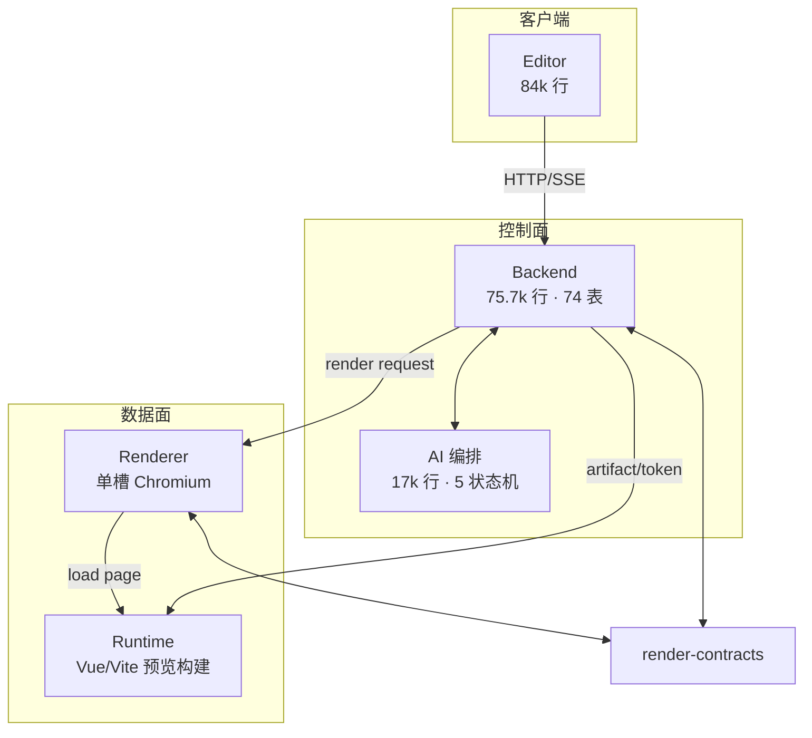

<!-- 文件功能：web-presentation 现状批判性架构评估报告（只读证据快照，不记录历史变更）。 -->
# web-presentation 批判性架构评估报告

**评估基准**：仓库现状快照（只看当前代码/文档/测试/部署，不回溯变更史）  
**评估视角**：架构批判——找结构性风险、纸面契约、复杂度失控点与质量门禁错位  
**结论先行**：这是一套**边界意识很强、但执行纪律不均**的平台架构。模块拆分、安全隔离和工具规格单源是真功夫；AI 任务编排、跨端契约同步和 PR 门禁则存在系统性“写了规范、没有机械保证”的问题。当前最大风险不在功能缺失，而在**同一件事被多套状态机追踪、契约靠人肉对齐、架构级测试被挡在合并门外**。

---

## 1. 量化基线

| 维度 | 现状 |
|---|---|
| Backend | `backend/app` ≈ 75.7k 行 Python；44 个路由文件 / ≈313 端点；74 张 ORM 表 |
| AI 子系统 | `backend/app/ai` ≈ 17k 行 / 59+ 文件；19 张 `ai_*` 表；1 个内容助手、12 个工具 |
| Editor | 437 文件 / ≈84k 行；158 个 `.vue`；25 views；28 api 客户端；`types/api.ts` 170 个手写 interface |
| Runtime | 355 文件 / ≈60k 行；runtime-kit 清单 23 项 exports |
| Renderer | 22 个 py / ≈4.3k 行；单槽 Chromium |
| render-contracts | 5 个 Python 模块 + 3 个 JSON Schema（后者零消费） |
| 测试 | backend 164 个测试文件（unit 79 / api 25 / integration 39）；editor 132；runtime 76；renderer **1**；根契约 32 文件 |
| 部署 | 4 套 compose；CI 3 个 workflow（quality 10 jobs） |

---

## 2. 总体架构判断

**控制面 / 数据面切分是清晰的**，且 Backend 不装 Playwright、Renderer 不连业务库，这两个硬边界在代码里是真的。问题集中在控制面内部（AI 编排）和“跨端契约的机械保证”上。

---

## 3. 真正值得肯定的架构资产

这些不是客套，是评估中反复验证过的硬优点：

1. **Runtime Kit 版本化公开面**：`runtime-module_policy.py` 在加载时强制 `.vN` 命名与去重；manifest 有内容级测试。这是全仓最有“协议感”的地方之一。
2. **`tool_specs.py` 单一事实源**：工具 key、分组、风险级、披露组、操作指南从同一文件派生，且有防漂移断言（`test_ai_agent_config.py:194-212`）对比 specs / catalog / runtime tools / guides。
3. **Renderer 安全与取消语义达到生产级**：凭证 fail-closed（`config.py:75-107`）；浏览器路由拦截控制 API（`executor.py:326`）；导航黑名单挡云元数据与链路本地（`executor.py:577`）；admission ticket 绑定 `slot_generation` 严格相等。
4. **iframe 预览协议防护扎实**：`RuntimePreviewFrame.vue:137-152` 校验 source + origin + artifactId + 协议版本。
5. **时间处理统一**：`UTCDateTime` TypeDecorator 全量覆盖，`utc_now()` 约定明确。
6. **AI 工具面刻意收敛**：只公开 `agent-coordinator` 一个助手、12 个工具、无永久删除；HITL requirement 有持久化表和诊断 CLI。

---

## 4. 严重问题（按危害排序）

### 4.1 AI 任务编排：双记账 + 多套队列，复杂度已失控

> **状态（2026-09-25）**：续跑双轨已收敛。页面 Batch 僵尸续跑与 `PageMutationContinuationWriteFence` 已删除；模型续跑只保留 `ai-external-task-coordinator` → `AiAgentExternalBatch`。页面/图片 Job 终态同事务写穿 `AiAgentExternalTask`，`synchronize_external_task_states` 降为对账兜底。下述「两套续跑路径」已不成立；领域 Job 仍作执行租约，统一 Task 是续跑控制面。跨表不变量下沉、统一 job runtime、上帝文件拆分仍在待办。

**证据（历史快照）**
- `page_mutation_enqueue.py:108-114`：同一次页面写入同时创建 `AiPageMutationJob/Batch` **和** `AiAgentExternalTask`——同一工作单元两套状态机、两套租约、两套续跑路径。
- 状态机五套互相咬合：run（`waiting_external`）、tool、requirement（`resolving`）、external batch（`ready/resuming/waiting_tasks`）、task（`waiting_provider` 看 `next_poll_at` 而非租约）。
- 至少 4 套自研队列 + 4 套业务 job，全部手写 claim/lease/heartbeat/recover：
  - `page_mutation_queue.py` 1384 行
  - `external_task_queue.py` 775 行
  - `image_generation_queue.py` 626 行
  - `component_mutation_queue.py` 257 行
  - 外加 `mutation_job_service.py` 831、`page_screenshot_job_service.py` 747、`project_artifact_builder.py` 816、`asset_render_hint_backfill_job_service.py` 546
- 跨表不变量（如“`resolving` requirement 必须对应持有有效租约的 `resuming` batch”）只写在 AGENTS.md 文字里，靠 `audit_external_state_consistency` 运行时审计补偿，**没有 DB 约束或类型保证**。
- Run 管理双轨：普通 Run 进程内执行（退出即 `AI_RUN_PROCESS_STOPPED`，不承诺重启恢复）；external job 走持久化队列。两套生命周期语义不同，却在同一个 Agent 会话里交织。

**判断**  
这是**过度设计与欠设计同时存在**：状态迁移表、写围栏、租约代数、审计函数、诊断 CLI 一层层叠上去，却没有统一 job runtime，也没有把不变量沉到存储层。继续在 `platform_runtime.py`（1854 行 / ~57 方法）和 `session_facade_pydantic.py`（1687 行 / 36 方法）上堆功能，会进入不可测区。

**影响**  
任何页面写、图片生成、组件变更的 bug 都可能落在“双记账不一致 / 围栏失效 / 租约过期后半写入”的交叉区，而这些恰好是测试覆盖最薄的地方。

---

### 4.2 跨端契约：纸面机制，实战靠肉眼和子串 grep

**证据**
- **无任何 OpenAPI / 类型 codegen**。`editor/src/types/api.ts` 手写 1551 行、170 个 interface，与 Backend Pydantic schema 逐字段人工镜像。
- 根仓契约测试约 106 处 `toContain` / `readFileSync` 源码字符串匹配；语义漂移照样绿。
- **死契约测试实锤**：`tests/contracts/runtime-backend/runtime-kit-manifest.test.ts:21,30` 遍历 `manifest.capabilities`，真实 manifest 顶层字段是 `exports`——循环体**永不执行、恒过**。声称守卫 Runtime Kit 不泄漏 internal 的测试是假的。
- **render-contracts JSON Schema 是死双源**：`schemas/{error,execution-request,execution-result}.v1.json` 全仓零代码引用（仅 `$id` 自引用）；AGENTS.md 要求的“对拍/往返测试”不存在。Python DTO 是真单源，JSON Schema 是空头支票。
- **previewSchema 三份手写**：`editor/src/types/component-preview.ts`、`runtime/src/core/shared/runtime-preview.ts`、`backend/app/core/component_preview_schema.py`，无对拍。
- HTTP 状态映射在 `backend/services/rendering/errors.py` 自建第二事实源，契约包不知道自己的错误码如何对外表达。

**判断**  
“单一事实源 + 防漂移测试”在 `tool_specs` 上是真的，在跨端契约上是口号。契约纪律严重不均。

---

### 4.3 重复事实源：Backend 私藏 7 份已漂移的布局脚本副本

**证据**
- `backend/app/services/page_render_{empty_area,layout_summary,overflow,overlap,spatial_shared,text_measurement,wrapped_items}_script.py` 与 `renderer/wp_renderer/engine/` 同名文件**体积全部不一致**（如 empty_area：21036B vs 20585B）。
- 全仓检索确认 backend 侧**零 import**；诊断已改走 `RenderDomainFacade` 远程渲染。
- `layout_scripts.py` 自称单一事实源，但 backend 副本仍躺在 services 目录里。

**判断**  
约 65KB 死代码 + 已漂移副本，是给未来维护者挖的陷阱：改 backend 副本无效，改 renderer 副本不知 backend 还有一份旧的。直接违反 AGENTS.md“不得复制多份”。

---

### 4.4 质量门禁错位：架构级防漂移测试不在 PR 阻塞层

**证据**
- `reusable-quality.yml:36-39`：PR 只跑 `test:backend:unit` + `test:backend:api`；`test:backend:integration` 仅 `inputs.full` 时执行。
- 工具目录防漂移核心测试 `test_unified_tool_specs_should_match_runtime_and_guides` 在 integration 目录——**可合入 main 后才被发现**。
- 文档链接测试只验相对链接存在，对“README 仍宣称隔离子运行 / AGENTS 声称 JSON Schema 对拍”零感知。
- 无覆盖率门禁；renderer 仅 1 个测试文件承载取消/期限/租约/票据全部语义。
- AI E2E 全程 `AI_TEST_MODE: mock`，真实 LLM 协议转换无 CI 证据。
- 多用户越权：`test_multi_user_access.py` 仅 3 个测试；E2E `auth.spec.ts` 只有登录 happy-path。

**判断**  
门禁半形式主义：runtime-state-parity、gateway-openapi、镜像启动检查是真门禁；但**架构契约验证被 marker 分层挡在 PR 之外**，形成“规范写在 AGENTS.md、验证放在非阻塞层”的结构性错位。

---

### 4.5 分层名存实亡：`ai ↔ services` 双向耦合

**证据**
- `services/` 15+ 文件 import `app.ai`；`ai/` 30+ 文件 import `app.services`。
- 仓储层仅 14 文件 / 1315 行，而 `ai/` 有 24 个文件直查 ORM；队列层全是裸 SQL 表达式。
- 路由层 10 个文件直接 import ORM 模型（`testing_readiness.py`、`public_assets.py`、`internal_runtime.py` 等）。
- 上帝文件：`platform_runtime.py` 1854、`session_facade_pydantic.py` 1687、`agents.py` 1094/28 端点；services 侧三个 1300+ 行文件。

**判断**  
目录分层是骨架，依赖方向没有被强制。repository 是局部装饰，不是边界。谁是业务层没有答案——实际是两层互为对方的内部实现。

---

## 5. 模块专项

### 5.1 Editor：上帝视图 + 三轨状态

- `AssetsView.vue` **1791 行**（~30 个平铺 `ref`）；`PageDetailView` 1422；`PagesView` 1410；`AccountAiSettingsView` 1313。
- AI 侧边栏同域逻辑约 **4300 行**（Panel 1080 + run-state 985 + Body 934 + lifecycle 625 + …），测试被迫拆 `part1~part4`——组件失控的典型症状。
- 状态三轨并存：Pinia（auth / agent-session）、composable 局部 ref（可视化编辑会话）、provide/inject（agent-sidebar）。
- API 层 14 个域客户端手写 axios，无统一错误模型。

**优点**：iframe 协议校验、DESIGN.md Token 体系、ui 组件复用意识。

### 5.2 Runtime：Kit 约束半截 + 测试文案化

- 版本化白名单只在 Backend 写入路径强制；Runtime 构建端 `runtime-build-worker.ts` 整树 alias，`internal/` 可被打包——**没有第二道闸**。
- Backend 下发的 `runtime_kit_exports` 白名单在 runtime 侧**零消费**（死配置）。
- `public/` 下 8 个未带 `.vN` 文件 + 未入清单的 `useAsset.v1.ts`，与 manifest 不对账。
- manifest 1525 行 JSON 与 487 行测试互相绑定，改 prop 默认值要同步改 4 行断言——**测试在固化文案而非协议**。

### 5.3 Renderer：设计最干净的模块，但单点

- 单槽 `if self.busy: return 429`，吞吐 = 1 attempt/worker。
- 安全与取消语义是全仓标杆。
- 本体测试过薄（1 文件 / 23 函数覆盖全部租约/票据/取消语义）。

### 5.4 数据模型

- 外键 170 处、`ondelete` 仅 41 处——级联一半 FK 一半应用层归档。
- JSON 列滥用：`message_history_json`、`pending_requirement_json`、`result_json`/`result_summary_json` 双列；结构化状态失去约束与查询能力。
- `tool_call_id` 与 `deferred_tool_call_id` 双 ID 是双记账在 schema 层的固化。

### 5.5 部署与安全

| 项 | 现状 | 风险 |
|---|---|---|
| 拓扑 | prod 单 backend / 单 runtime / renderer 单槽 | 无 HA，截图/构建/会话运行态单点 |
| 网络隔离 | renderer 与 backend 同 bridge；靠 Playwright route 拦控制 API | 容器级隔离未实现，被窄化 |
| 密钥 | `AI_SECRET_ENCRYPTION_KEY` environment 内联；`.env.example:97` 含真实格式 Fernet 密钥；`DEFAULT_ADMIN_PASSWORD=Admin123456` | 弱默认 + 示例密钥入库风险 |
| 备份 | 仅 SQLite demo 脚本；PostgreSQL 生产备份只有文档 | 生产恢复能力缺口 |
| 可观测 | JSON Lines + 可选 metrics（默认关） | 无 Prometheus/告警；gateway `access_log off` |

---

## 6. 文档 vs 代码漂移

| 文档主张 | 代码事实 |
|---|---|
| README：复杂任务可委派“隔离子运行” | 已取消自委派/子运行；测试断言 `delegate_task_to_self` 不存在 |
| AGENTS：render-contracts 双源 + 对拍测试 | JSON Schema 零消费，无对拍测试 |
| AGENTS：布局脚本单一事实源 | backend 7 份漂移死副本 |
| 根契约测试守卫 Runtime Kit | `capabilities` 字段不存在，测试空转 |
| docs 目录 = user \| developer \| assets | `docs/temp` 13 个游离文件 |

**模式**：文档写得越“规范”，越容易超过代码执行力。用户文档与开发者文档已分叉。

---

## 7. 问题优先级矩阵

| 优先级 | 问题 | 为什么现在就要动 |
|:---:|---|---|
| P0 | AI 双记账 + 多队列无统一 runtime | 数据一致性风险，改动成本随时间指数上升（续跑双轨已于 2026-09-25 收敛；统一 job runtime 仍待做） |
| P0 | 架构级测试不在 PR 门禁 | 漂移会持续合法化 |
| P0 | 死契约测试 / 死 JSON Schema / 死脚本副本 | 误导维护者，制造假安全感 |
| P1 | `ai ↔ services` 双向耦合 + 上帝文件 | 可维护性与可测性持续恶化 |
| P1 | 跨端类型无 codegen、previewSchema 三份 | 每次接口变更都是人肉全链路 |
| P1 | Runtime Kit 约束单侧执行 + 死配置 | 公开面泄漏风险 |
| P2 | Editor 巨型 SFC + 三轨状态 | 交付效率问题，非正确性问题 |
| P2 | 部署单点 / 弱默认密钥 / 备份缺口 | 生产运维风险 |
| P2 | 文档过度承诺 | 信任成本 |

---

## 8. 改造方向（批判之后给出口）

不给“全面重构”的空话，给可落地的收敛路径：

1. **统一 job runtime（P0）**  
   把 4 套队列的 claim/lease/heartbeat/recover 收成一个可复用执行器。续跑侧已统一为 `AiAgentExternalBatch`，页面/图片 Job 终态写穿统一 Task；剩余工作是领域执行租约与统一 Task 的字段收敛（对齐 `AiComponentMutationTask` payload 模型），以及把跨表不变量用 DB 约束 / 状态机库保证，而不是审计函数。

2. **把架构测试推进 PR 阻塞层（P0）**  
   `test_unified_tool_specs_*`、render-contracts 往返对拍、runtime-kit `exports` 真断言、多租户越权矩阵——这四类必须进 `test:backend:unit` 或独立 gate job，不能只在 `full`。

3. **立刻删除三类死物（P0，成本极低）**  
   - backend 7 份 `page_render_*_script.py` 副本  
   - 无人加载的 `schemas/*.v1.json`（或补上真正的对拍测试）  
   - `manifest.capabilities` 空转测试（改成 `exports`）

4. **跨端契约机械化（P1）**  
   从 `/openapi.json` 生成 `editor/src/types/api.ts`；previewSchema 抽单一 JSON/TS 源再三端引用。契约测试从 `toContain` 升级为 schema 往返。

5. **Runtime Kit 第二道闸（P1）**  
   构建端按 manifest 白名单解析 `@runtime-kit`，拒绝 `internal/` 与未版本化路径；删掉或真正消费 `runtime_kit_exports` 死配置。

6. **拆上帝对象（P1-P2）**  
   `platform_runtime.py` 按“持久化 / 事件投影 / SSE / 锁”拆；`AssetsView` 按资源域拆；AI 侧边栏按 timeline / run-state / tool-confirm / input 拆。

7. **生产加固（P2）**  
   renderer 独立 internal 网络；密钥全部 secrets；去掉 `.env.example` 真实密钥格式；补 PostgreSQL 备份脚本与告警。

---

## 9. 一句话结论

> **web-presentation 的架构图纸是合格的平台级设计，但施工现场存在三处结构性隐患：AI 任务编排把同一件事记了两遍账、跨端契约没有机械防漂移、最关键的一致性测试被挡在 PR 之外。**  
> 优先不是加功能，而是：**减状态机、删死物、把已有测试搬进阻塞层**。做完这三件事，这套架构才配得上它文档里写的纪律。

---

## 附录：关键证据索引

| 主张 | 位置 |
|---|---|
| 页面写双记账 | `backend/app/ai/page_mutation_enqueue.py:108-114` |
| 五套状态机 | `backend/app/ai/task_states.py:8-43` |
| 死契约测试 | `tests/contracts/runtime-backend/runtime-kit-manifest.test.ts:21,30` |
| JSON Schema 零引用 | `packages/render-contracts/schemas/*.v1.json` |
| backend 布局脚本死副本 | `backend/app/services/page_render_*_script.py` |
| integration 不在 PR | `.github/workflows/reusable-quality.yml:36-39` |
| Renderer 控制 API 拦截 | `renderer/wp_renderer/engine/executor.py:326,512` |
| 工具防漂移测试 | `backend/tests/integration/test_ai_agent_config.py:194-212` |
| 弱默认密钥 | `.env.example:70,97`；`deploy/compose/compose.yml:27-28` |
