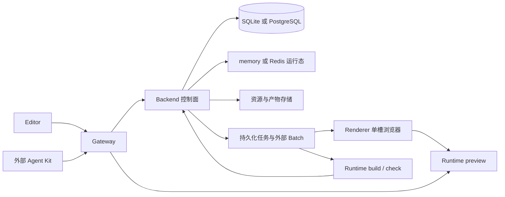

> **归档说明（2026-09-30）**：本文保留 09-29 静态基线与随后实施注记。当前结论已由 [09-30 架构评估](../architecture-assessment-2026-09-30.md) 接替；正文中的未执行、缺口及完成状态只代表原记录时间。

# 架构评估（2026-09-29）

> **状态：现行基线评估，静态复核完成，测试机验收未执行。**
> **2026-09-30 实施注记：** AR-02 契约、AR-03 指标、AR-04 探针（首批）以及 AR-01 执行隔离、AR-05 兼容矩阵/Run 边界、AR-06 备份恢复入口（第二批）的代码与本地验证已完成。下文保留 2026-09-29 基线发现，不能再把这些基线缺口当作当前未修改代码的描述；最新状态、覆盖边界与结果见[计划 §6](../plans/architecture-improvement-plan-2026-09-29.md#6-实施进度与本地证据2026-09-30-第二批)。测试机门（M01–M08）仍开放。
> 代码基线：`7bff842b306503e894b4cde5b24b8f2a8319421b`，分支 `arch-eval`；开始审查时工作区无未提交改动。
> 执行入口：[新一轮改进与验证计划](../plans/architecture-improvement-plan-2026-09-29.md)。历史材料见[归档索引](../archive/README.md)。

## 1. 结论

**保留现有模块边界，停止把“任务模型数量多”作为继续统一重写的理由。下一步重点是使契约、观测和交付验收真正约束运行行为。**

Backend 控制面、Runtime 编译与预览、Renderer 浏览器执行、纯渲染契约包的职责划分已经成立。共享认领、租约恢复、写围栏、Runtime 角色预算和 API 生成管线都有代码基础。旧评估仍写着“全局扫杀 Run”“渲染额度先读后写无互斥”“无 OpenAPI codegen”，这些不能继续作为当前事实。

不过，旧计划的部分“完成”只代表入口或框架存在：API 生成物尚未成为 Editor 实际使用的类型源，previewSchema JSON Schema 尚未进入生产结构校验路径，队列指标对渲染状态映射错误。**这三项是本次静态审查确认的具体缺口，应先修复，再用指标和门禁支撑后续验收。**

构建凭证与编译子进程共享容器权限、镜像探针不覆盖真实截图链路、容量与多副本演练缺证据、系统恢复没有完整操作闭环，仍限制部署承诺。这里既有实现缺口，也有尚未验收的能力，不能混为“全部未实现”或“全部已完成”。

本轮没有证据支持认定已发生生产故障或已证实可利用的逃逸，不新增这种含义的 P0。下文 P1 表示特定交付承诺前必须处理的事项，P2 表示维护与治理工作。

## 2. 范围与证据口径

2026-09-29 评估阶段读取代码、测试源码、锁定依赖声明、Dockerfile、Compose、CI 配置、历史文档与 Git 历史，检查关键调用链和文档链接。该静态评估阶段没有执行应用测试、构建、迁移、压测、浏览器操作、容器启动、服务重启或外部环境探测，也没有安装依赖。后续代码阶段已按锁文件安装本地依赖并完成计划 §6 的针对性验证；两阶段证据分开记录。

| 状态 | 含义 |
| :--- | :--- |
| 静态确认 | 当前代码或配置直接支持；不等于运行通过 |
| 静态缺口 | 当前实现未满足自身契约或目标，有明确代码依据 |
| 待验收 | 实现存在或方案已记录，需要测试机结果决定是否成立 |
| 历史证据 | 旧文档记录的测试、registry、体积、分支保护结果；本轮未复测 |

本报告不是逐文件安全审计。GitHub 规则、镜像标签是否可拉取、历史性能数字和已部署版本不能从当前工作树推断；本轮均不重新背书。独立 `web-presentation-agent-kit` 仓库未纳入代码审查，跨仓契约列入下一轮。

## 3. 当前架构与应保留的边界

图表示逻辑职责，不表示已经验收的多副本或网络隔离拓扑。

| 能力面 | 本轮确认 | 保留理由与限制 |
| :--- | :--- | :--- |
| 包与进程边界 | Backend 依赖无 Playwright；Renderer 用 `wp_renderer`；契约包独立 | 浏览器故障与控制面分离；容器权限隔离仍另行评估 |
| 任务基础设施 | `claim_rows_by_cas`、列词汇、共享恢复、Batch 写围栏存在 | 继续复用共享原语；领域 Job、Batch、Attempt 有不同职责，不强并为一张表 |
| 页面与组件恢复 | Worker 循环内调用过期恢复 | 不再保留“仅启动时恢复”的旧判断；故障注入仍未验收 |
| 普通 AI Run | 启动恢复按 hostname/pid 过滤；Editor 识别 `AI_RUN_PROCESS_STOPPED` | 产品仍承诺中断后不自动恢复普通 Run；与持久化 external job 区分 |
| 渲染额度 | 调度准入锁后同事务计数与保留 Attempt | 已有原子化实现；双协调器和首次初始化争用仍需实测 |
| Runtime | preview/build/check/all 角色、调度预算、版本指纹检查存在 | 角色隔离与版本拒绝不等于零停机升级保证 |
| 工具与权限 | 工具规格集中，通用写入保留工作空间授权检查 | 保持单一规格派生和服务端授权；不能以目录存在替代越权行为验证 |
| 双库 | 方言层、共享 CAS、真实 PG CI job 与 memory/Redis 对拍 job 存在 | SQLite Lite 继续是一等公民；容量数字仍待实测 |
| 跨端契约 | OpenAPI 导出、TS 生成、previewSchema JSON、错误码单源、Kit 导入闸门存在 | 错误码和导入闸门可保留；类型与结构约束仍有 AR-02 缺口 |
| 交付 | Release 定义 Runtime/Renderer/platform/lite 镜像，含启动探针 | 发布定义不是当前 registry 可用性或最终镜像完整业务链路的证据 |

依据：[租约服务](../../../backend/app/services/durable_job_lease_service.py)、[列词汇](../../../backend/app/services/job_runtime_vocabulary.py)、[写围栏](../../../backend/app/ai/run_write_fence.py)、[Run 恢复](../../../backend/app/ai/run_recovery.py)、[渲染协调器](../../../backend/app/services/rendering/coordinator.py)、[质量流水线](../../../.github/workflows/reusable-quality.yml)、[发布流水线](../../../.github/workflows/platform-release.yml)。

## 4. 现行问题

### AR-01 · 构建身份与执行权限缺少操作系统边界（P1）

**静态缺口。** `createRuntimeBuildChildEnv()` 只删除两项构建 Worker 凭证环境变量。`compose.runtime-roles.yml` 仍把全局 `build_worker_credential` 挂入 runtime-build；Runtime Dockerfile 未声明 `USER`，启动编译子进程没有形成单独的文件系统或用户权限边界。

因此，删环境变量不能证明子进程无法读取已挂载的 secret。当前静态审查确认的是信任边界不足，**没有证明用户 SFC 可直接执行任意 Node 代码，也没有进行逃逸实验**。其威胁条件应写清：编译器、插件或输入处理路径被利用后，执行进程可能取得 Worker 级身份。

出口：W01 定义可信领取器与执行子进程的最小权限边界；M02 在测试机验证凭证不可读、不能领取其他任务和取消后进程回收。Lite 的同容器风险接受不能自动替代生产角色隔离。依据：[子进程环境](../../../runtime/src/core/plugins/runtime-build-worker.ts)、[Runtime 镜像](../../../runtime/Dockerfile)、[角色编排](../../../deploy/compose/compose.runtime-roles.yml)。

### AR-02 · 契约机械化没有形成完整的约束链（P1）

**静态缺口，旧 WS-E 需部分重开。**

1. **API 类型仍有双源。** `editor/src/types/api.ts` 仍保留手写接口，业务源码未导入 `api.generated.ts`。`editor-api-types-drift.test.ts` 只对 8 组类型做字段名子集比较，未找到手写接口时直接跳过；不比较字段类型、必填性和枚举。质量流水线没有重新导出当前 Backend OpenAPI 并对生成物做差异检查。只修改 Backend 而两份已提交 TS 均不变时，这个门禁无法发现漂移。
2. **previewSchema 文档源尚未成为运行校验源。** `component_preview_schema.py` 虽提供 JSON Schema 读取辅助函数，生产解析路径仍是 JSON 对象检查加 slot 引用边界检查，没有调用该结构 Schema。比如 `{"props":"invalid"}` 不符合 JSON Schema 的 `props: object`，但从解析函数分支看不会因该字段类型被拒绝；这是静态推导例子，本轮未执行复现。TS 对拍主要检查额外维护的 `x-typescript-interfaces` 字段名列表，不能证明类型、嵌套形状与生产行为一致。
3. **双入口对拍范围有限。** Top 操作路径测试含前缀兜底匹配，响应同源断言聚焦页面读取和项目预览；不是全部 Top 操作的方法、错误码、权限和异步语义行为矩阵。

出口：W02 让生成物进入真实消费链，CI 对当前 Backend 重生成；结构校验实际消费 Schema，保留业务导入规则；对未覆盖操作逐项补精确方法/路径和行为测试。不要以增加更多字段名正则代替这一闭环。

依据：[API 漂移门禁](../../../tests/contracts/editor-api-types-drift.test.ts)、[手写 API 类型](../../../editor/src/types/api.ts)、[生产 Schema 解析](../../../backend/app/core/component_preview_schema.py)、[结构 Schema](../../../backend/app/core/component_preview_schema.v1.json)、[TS 对拍](../../../tests/contracts/preview-schema-parity.test.ts)、[双入口测试](../../../backend/tests/contracts/test_dual_entry_contract_matrix.py)。

### AR-03 · 队列指标会漏报渲染积压，汇总口径不适合直接做容量门槛（P1）

**静态缺口，旧 WS-G2 部分重开。** `snapshot_job_queue_metrics()` 把 `RenderRequest` 交给默认 `pending/running` 的统计函数，而模型与仓储实际使用 `queued/retry_wait/executing`。正常排队、重试等待和执行中的渲染请求不会被这两个计数覆盖；租约在 Attempt 层，Request 层无该列。

此外，ExternalBatch 的 `ready/resuming` 与过期续跑租约未纳入；组件任务通过 ExternalTask 记录，未按 kind 分项；图片 `waiting_provider` 没有轮询逾期视图。`totals` 直接相加领域 Job 和外部 Task，可能把同一业务操作的不同投影重复计数。现有单测只覆盖空库与键存在，不能检测这些问题。

出口：W03 区分业务任务数、执行占用、批次续跑与供应商等待，按真实状态和租约拥有者统计。M03 容量采集必须在 W03 完成后进行。现有接口可用于粗略观察，不能直接作为 D2 验收数字。

依据：[指标实现](../../../backend/app/services/job_queue_metrics.py)、[RenderRequest](../../../backend/app/models/render_request.py)、[渲染仓储](../../../backend/app/services/rendering/repository.py)、[ExternalBatch/Task](../../../backend/app/models/ai_external_task.py)、[当前指标单测](../../../backend/tests/unit/test_job_queue_metrics.py)。

### AR-04 · 交付探针与真实执行链路之间仍有空档（P1）

**静态缺口 + 待验收。** 镜像启动脚本的 Renderer 分支直接调用 Playwright 并额外传入 `--no-sandbox`，没有通过 Renderer 控制 API 完成请求、产物回传与清理；Lite 分支只检查 Gateway/Backend/Runtime 健康 URL。真实 executor 的启动参数应通过自己的路径验证；不能由参数差异直接推断 Chromium 一定启动失败。

当前 `Dockerfile.lite` 仅安装 Backend Python 包，未复制 `wp_renderer`，入口脚本不启动 Renderer；HEAD 的 sqlite-lite Compose 仍定义独立 Renderer。这与旧调研记录的已发布单容器浏览器形态属于不同时间点。**本轮不使用旧 tag、层体积、401/200 记录来判定今天的交付状态。**

Release 已定义 Renderer 发布项，不再说“没有发布流水线”；但是否成功发布、两个 registry 权限、模板完整可拉取性尚未验证。`check-image` action 实际加载 amd64 镜像，多架构构建定义不等于 arm64 真实截图通过。

出口：W04 完成真实业务探针和发布清单；M01/M06 验证最终镜像、两种架构与 registry。旧 Lite 合并方案保留为候选，不标记为已实施或本轮新批准。

依据：[镜像探针](../../../scripts/contracts/check-image-startup.py)、[check-image action](../../../.github/actions/check-image/action.yml)、[Lite Dockerfile](../../../deploy/docker/Dockerfile.lite)、[Lite 入口](../../../deploy/docker/entrypoints/start_lite.sh)、[Lite 编排](../../../deploy/compose/compose.sqlite-lite.yml)、[Renderer 执行器](../../../renderer/wp_renderer/engine/executor.py)。

### AR-05 · 多副本、重启恢复与版本兼容仍缺联合验收（P1）

**待验收，不再认定为旧实现缺陷未修。** Run owner 过滤、额度准入锁、构建 attempt 围栏、角色预算、版本指纹拒绝与摘除 Worker 检查都有实现。需要验证它们在同一部署中同时成立。

Run owner 包含 hostname/pid/uuid，但恢复判定解析后只用 hostname/pid。容器重新创建导致 hostname 改变、PID 重用以及不同 PID namespace 下同名主机，都是下一轮应覆盖的条件；不能把“按 owner 过滤”升级为无条件的跨副本生命周期保证。异主机残留仍依赖空闲收敛和用户取消，验收需量化可见终态时间。

Runtime 版本指纹不符时拒绝请求只说明失配能被识别。Backend/Runtime/Renderer/DB revision/Kit 的支持组合、迁移窗口和回滚次序仍需明确；[升级回滚文档](../../developer/deployment/upgrade-rollback.md)目前主要要求一起回滚到兼容版本，不能替代 N/N-1 矩阵与实测。

出口：W05 明确支持矩阵与降级策略；M04/M05 验证跨副本和版本组合。继续保持多副本未验收、Lite 禁止共享 SQLite 卷多副本的边界。

### AR-06 · 系统恢复尚未形成可执行、可证明的交付能力（P1）

**静态缺口 + 待验收。** `deploy/scripts/` 只有 SQLite Demo 备份/恢复脚本，仓库部署脚本未提供 PG `pg_dump/pg_restore` 操作闭环。备份文档列出了数据和密钥，但还需要备份一致性、恢复顺序、版本绑定、RPO/RTO 和演练记录。

恢复对象是 DB、资源/产物存储、AI 加密密钥、RSA keyring、服务凭据与对应版本的组合。恢复空数据库、健康返回 200 或容器能起，均不能证明页面资源、AI 凭据解密和构建产物可用。

出口：W06 编写限定测试环境的备份恢复入口与恢复清单；M07 在隔离数据副本演练，记录实际 RPO/RTO，不预填成功。依据：[备份恢复文档](../../developer/deployment/backup-restore.md)、[部署脚本](../../../deploy/scripts)。

### AR-07 · 拆分已改善改动范围，仍未消除领域耦合与大模块（P2）

**静态确认的维护成本。** F1/F2 拆分已存在，不能再按旧的两千行门面安排同一次重构。当前按物理行统计（含注释/空行，排除生成物）：

| 文件 | 行数 | 后续边界 |
| :--- | ---: | :--- |
| `backend/app/ai/platform_runtime.py` | 1236 | 持久化门面仍较大，按下一次修改域拆分 |
| `backend/app/ai/session_facade_pydantic.py` | 847 | 已拆出 helpers/stream；保持对外入口 |
| `backend/app/ai/page_mutation_queue.py` | 849 | 执行、租约与恢复接口应清晰 |
| `backend/app/ai/external_task_queue.py` | 881 | 聚合和续跑边界需要防回归 |
| `backend/app/services/asset_service.py` | 1511 | 按资源读取、入库、生命周期分域 |
| `backend/app/services/rendering/repository.py` | 987 | 事务与 Attempt 状态约束比行数更重要 |
| `editor/src/views/AssetsView.vue` | 1885 | 静态选项已抽出，筛选/详情/批量主体仍在 |
| `editor/src/types/api.ts` | 1708 | 优先通过 W02 减少重复维护，不单纯按行拆 |

分层 AST 门禁冻结了既有 `services → ai` 和路由 ORM 依赖，没有消除这些存量依赖。后续以具体变更风险决定拆分顺序，避免在契约补齐与故障验收前再进行全量目录重排。依据：[分层门禁](../../../backend/tests/unit/test_layering_gates.py)。流式上传/归档内存优化保留为测量驱动项，M03 未见压力证据前不宣称它是瓶颈。

### AR-08 · 文档同时混用现状、决策与历史完成记录（P2）

**静态缺口，本轮部分处理。** 旧评估的问题表、能力表、计划完成表互相矛盾；[任务运行时契约](../../developer/architecture/task-runtime-contract.md)前部映射还保留“仅启动恢复/启动全局收敛”等迁移前描述，本轮已标注为历史迁移基线；[Lite 决策文档](../../developer/deployment/lite-scale-and-isolation.md)原先把 `docs/temp` 称为 gitignore 内部资料，本轮已修正，但已发布与目标镜像形态仍需进一步区分。

本轮归档旧材料、统一现行入口、保留问题迁移表。正式契约和部署文档的语义更新列入 W08，按照当前代码、历史发布、目标方案三种标签分别表述；不能通过改文档宣称实现已经改变。

## 5. 已有工作如何计入本次评估

| 旧项 | 当前处置 |
| :--- | :--- |
| WS-A / 认领重复实现 / 页面组件恢复 | 共享原语和循环恢复静态确认；不重开整体重写；M04 覆盖故障行为 |
| WS-B / 死布局脚本、Kit 清单断言、DTO 对拍、工具规格门禁 | 实现/测试源码已存在；不是本轮测试通过记录 |
| P0-BackendMultiInstance / P1-RenderQuota | 旧缺陷对应代码已修；转 AR-05 联合验收 |
| WS-C C1–C8/C10–C11 | 实现存在不代表 C9 完成；版本失配与升级兼容分别处理 |
| WS-D | 未采集；转 M03，先补 AR-03 的指标口径 |
| WS-E | E4 错误码单源、E5 导入闸门保留；E1/E2/E3 以 AR-02 具体缺口继续 |
| WS-F | 已拆分部分保留；剩余规模见 AR-07，不按旧行数排期 |
| WS-G2/G3/G4/G7 | G2 部分重开；占位密钥拒绝和 Run 文案静态确认；凭证隔离与系统恢复继续 |
| WS-G1/G5/G6 / WS-H | 既有规模目标、风险接受和方言预算保留，不因本评估重新拍板 |
| IMG0–IMG12 | 归档原方案；真实截图、发布拉取、两架构、Lite 形态选择由 W04/M01/M06 承接 |
| 富文本范围定位加固 | 可判别 shell、节点降级及对应测试已存在；归档旧计划，M08 复核浏览器交互 |
| GitHub 分支保护 | 仅保留历史曾配置的记录；本轮未读取远端，M06 再确认 required checks |

## 6. 延续的决策与承诺边界

| 决策 | 保持的口径 | 复审条件 |
| :--- | :--- | :--- |
| Lite 与双库 | Lite 为长期一等公民；目标 5–10 人、预览并发约 3，验收前不是 SLA | M03 低于目标，或产品目标变更 |
| 普通 Run | 允许因 Backend 进程停止而中断，不承诺自动恢复；external job 另按租约处理 | 产品提出可恢复普通 Run |
| 方言成本 | 保持现有从宽预算，不因本轮新增一套阈值 | 按[方言预算](../../developer/architecture/dialect-budget.md)既有触发器复审 |
| 截图环境指纹、手填 profile、事件进程锁 | 历史已接受项不自动升为 P1 | 强一致目标变化或出现具体故障 |
| SQLite 内存库拓扑边角 | 原 R-CP5 指 `sqlite :memory:`，不要误写为 Redis `memory://` 未拒多实例 | 成为真实受支持部署需求时 |
| Lite 同容器风险与合并方案 | 保留旧决策的自用/内部团队威胁模型；Renderer 内置仍是待实现候选 | 不可信成员代码、多租户、容量不达标或产品改变交付要求 |
| 多副本/多租户与零停机 | 本轮不新增对外承诺 | 对应隔离、容量、故障、版本与恢复门槛通过 |

## 7. 本轮交付与下一轮边界

本轮仅交付本评估、新计划、历史归档和导航修复。代码缺口没有在本轮修改；测试源码的存在、历史测试成功以及本地文档静态检查，均不写作本轮应用测试通过。

全部需要测试机器的动作统一安排在[计划 §4](../plans/architecture-improvement-plan-2026-09-29.md#4-下一轮测试机执行矩阵)，状态为**未执行**：最终镜像截图与下载、权限隔离验证、Lite 容量、双库竞争、跨副本故障、版本组合、registry/发布验证、系统恢复和 UI/跨仓回归。没有可核对的结果记录前，不关闭相应问题。
