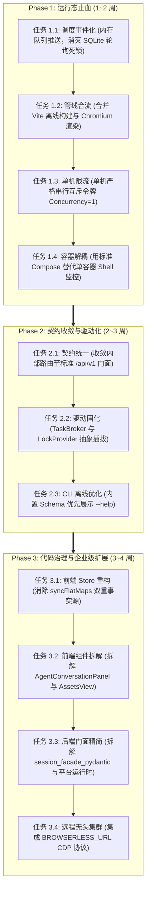

# Web Presentation 平台架构与代码质量深度评审报告

---

## 报告摘要与综合评估 (Executive Summary)

### 1. 平台定位与核心竞争力
`web-presentation` 是一个极具野心且具备较高产品技术壁垒的平台：
- **演示文稿代码化**：脱离传统二进制 PPTX 的束缚，采用 Vue 3 + Tailwind CSS 将页面、组件、主题与排版完全代码化。
- **严格的无状态执行面**：通过不可变快照（`PreviewArtifact`）与 JWT/JWKS 验签，将控制面（Backend）与渲染执行面（`web-runtime-vue`）清晰解耦。
- **AI 排版闭环能力**：在多模态 Agent 创作中，不仅依赖大模型生成代码，更通过端到端渲染和 DOM 几何测量脚本（`page_render_layout_script`），获取真实的绝对坐标、文本溢出与元素碰撞反馈，构建了高精度的 AI 视觉迭代闭环。

### 2. 综合评级与核心矛盾
- **综合技术评级**：`B-`（业务设计与闭环思路极佳，但底层工程实现与资源调度存在严重技术错配）。
- **核心矛盾**：
  > **高精度的端到端排版闭环需求，撞上了“粗暴的双重重度执行链”与“缺乏进程隔离的单机部署拓扑”，导致系统在单机轻量环境下沦为“硬件刺客”，在企业级场景下又受制于内存状态锁无法平滑扩展。**

---

## 一、 系统架构与关键链路深度解析

```
┌─────────────────────────────────────────────────────────────────────────────┐
│ 控制面 (Backend - FastAPI)                                                   │
│                                                                             │
│   Project / Page 实体 ──> ProjectArtifactBuilder (生成不可变快照)              │
│                                      │                                      │
│                                      ▼                                      │
│                            RuntimeArtifactStore                             │
│                     (modules_data + config_bundle)                          │
└──────────────────────────────────────┬──────────────────────────────────────┘
                                       │ Token 鉴权 + HTTP 虚拟模块加载
                                       ▼
┌─────────────────────────────────────────────────────────────────────────────┐
│ 执行面 (web-runtime-vue)                                                    │
│                                                                             │
│   Vite Dev Server ──(RuntimeSaaSPreview)──> 动态拉取 Artifact 虚拟模块        │
│                                      │                                      │
│                                      ▼                                      │
│   Tailwind JIT 编译 + @runtime-kit 组件装配 + 主题 YAML 注入 ──> 最终呈现 DOM │
└──────────────────────────────────────┬──────────────────────────────────────┘
                                       │ 浏览器访问
                                       ▼
┌─────────────────────────────────────────────────────────────────────────────┐
│ 诊断面 (Playwright / Chromium)                                               │
│                                                                             │
│   访问预览入口 ──> 等待 Visual Ready ──> 注入 page_render_layout_script     │
│                                      │                                      │
│                                      ▼                                      │
│   提取 getBoundingClientRect() 溢出与几何关系 ──> 返回结构化 JSON 给 AI LLM  │
└─────────────────────────────────────────────────────────────────────────────┘
```

该架构的合理性在于：**页面脱离了包含了 Tailwind 动态编译器、主题变量注入器和 `@runtime-kit` 虚拟模块的 Vite Runtime，根本无法得到真实的 CSS 盒模型**。因此，排版测量必须依托 Runtime 与无头浏览器进行。

---

## 二、 架构层面的核心缺陷审查 (Critical Architectural Flaws)

### 缺陷 1：双重重度执行管线（Double Heavy Pipeline）
在 [`code_check_service.py`](file:///c:/code/wp/web-presentation/backend/app/services/code_check_service.py) 中，对一次候选代码检查，实际上**前置串联了两个完全隔离的重型执行环境**：
1. **Node.js 离线构建诊断**：调度 `RuntimeDiagnosticsWorkspacePool`，在临时目录完整拷贝源码，启动独立 Node.js Worker 执行一次 Vite build（内存配额上限 1024MB，耗时 1~2s）；
2. **Chromium 实时渲染诊断**：上述通过后，再调度 `PlaywrightBrowserPool`，分配 Chromium 实例打开页面，二次触发 Vite 实时加载并执行 DOM 测量（内存消耗 500MB~1GB，耗时 2~3s）。
> **审查意见**：一次只读代码检查，在后台并发生起了两个独立的计算大户（Node Worker + Chromium）。这是单机部署下 CPU 飙高、内存瞬间超标的元凶。

### 缺陷 2：宏单体（Macro-monolith）与单容器“一死全死”
- **Web 进程塞入所有后台任务**：在 [`backend/app/main.py`](file:///c:/code/wp/web-presentation/backend/app/main.py#L71-L140) 的 `lifespan` 中，同一个 Uvicorn 进程同时拉起了 10+ 个后台轮询 Worker（页面变更、组件变更、图片生成、截图、产物清理等）以及 Playwright 浏览器池。
- **单容器缺少自愈守护**：[`Dockerfile.lite`](file:///c:/code/wp/web-presentation/Dockerfile.lite) 与 [`start_lite_container.sh`](file:///c:/code/wp/web-presentation/backend/scripts/start_lite_container.sh) 将 Nginx、Vite、Uvicorn 和 Chromium 硬塞在同一个容器中，仅用 `while sleep 2` 的 shell 循环做进程检测。一旦 Chromium 发生 OOM 或 Node 进程崩溃，脚本会立即杀掉全部活着的进程并退出容器，**单组件抖动直接放大为全站瘫痪**。

### 缺陷 3：在关系型数据库上自研分布式租约队列（与 SQLite 锁严重冲突）
- 系统在明知有 Redis 依赖的情况下，仍手写了基于 SQL 表的租约调度器（[`durable_job_lease_service.py`](file:///c:/code/wp/web-presentation/backend/app/services/durable_job_lease_service.py) 与 [`page_mutation_queue.py`](file:///c:/code/wp/web-presentation/backend/app/ai/page_mutation_queue.py)）。
- 单机轻量模式下使用 SQLite 时，10 多个后台 Worker 每隔 1~2 秒疯狂打压数据库执行更新与心跳，导致 SQLite 写锁被频繁独占，控制台频繁抛出 `database is locked` 警告，倒逼业务层写了大量重试补丁。

### 缺陷 4：API 契约“双轨制”分裂
- `/api/...` (内部 Editor 路由) 与 `/api/v1/...` (外部 CLI/Agent 路由) 平行存在：
  - 内部接口多为同步执行、直接返回实体；
  - 外部接口统一返回 202 异步持久化 Mutation Job。
- 业务模型有变动时，开发者必须维护两套 Controller、两套 DTO、两套权限上下文，不仅代码重复率高，而且造成了显著的契约漂移与测试维护负担。

### 缺陷 5：内存级全局状态阻断水平扩展
- [`platform_runtime.py:65-67`](file:///c:/code/wp/web-presentation/backend/app/ai/platform_runtime.py#L65-L67) 中的 `_SUBSCRIBERS`、`_RUN_EVENT_LOCKS`，以及 [`session_facade_pydantic.py:74`](file:///c:/code/wp/web-presentation/backend/app/ai/session_facade_pydantic.py#L74) 中的 `_run_locks` 均为 Python 进程全局字典。
- 一旦后端通过多 Worker 启动或集群部署，事件推送与并发锁立即击穿，无法进行无状态水平伸缩。

---

## 三、 代码质量与坏味道审查 (Code Smells & Debt)

### 1. 超大文件与“上帝类”严重违规
项目规范明确要求单文件尽量控制在 1000 行内，但核心模块严重超标：

| 模块 | 文件 | 行数 | 坏味道说明 |
| :--- | :--- | :--- | :--- |
| **前端视图** | [`AgentConversationPanel.vue`](file:///c:/code/wp/web-presentation/editor/src/components/agent/AgentConversationPanel.vue) | **2407 行** | 会话切换、SSE 增量流、Tool 状态机、草稿补丁、图片上传、Teleport 顶栏全塞在一个 SFC 中；伴生 4 个分段测试文件（近 6000 行测试）。 |
| **前端视图** | [`AssetsView.vue`](file:///c:/code/wp/web-presentation/editor/src/views/AssetsView.vue) | **1916 行** | 筛选面板、预览网格、批量管理、上传表单、导入弹窗、新建抽屉全堆在单个文件。 |
| **后端运行态** | [`platform_runtime.py`](file:///c:/code/wp/web-presentation/backend/app/ai/platform_runtime.py) | **2067 行** | 杂糅了会话 CRUD、SSE 打包、锁控制、运行态快照组装及 SQLite 锁补丁。 |
| **后端门面** | [`session_facade_pydantic.py`](file:///c:/code/wp/web-presentation/backend/app/ai/session_facade_pydantic.py) | **1819 行** | 32 个混合职责方法，既是 Facade，又是 Controller、状态机与异步任务协调器。 |
| **打包服务** | [`project_template_package_service.py`](file:///c:/code/wp/web-presentation/backend/app/services/project_template_package_service.py) | **1846 行** | 二进制校验、zip 打包解包、组件/页面/主题/字体处理全部堆砌在一起。 |

### 2. 前端状态管理反模式：双重事实源（Dual Sources of Truth）
在 [`editor/src/stores/agent-session.ts:160-201`](file:///c:/code/wp/web-presentation/editor/src/stores/agent-session.ts#L160-L201) 中：
- 同时维护树状 `sessions[sessionId]` 和平铺的 `timelineItemsBySession` 等 10 几个扁平字典；
- 每次修改前后手动调用 `syncFlatMaps` 与 `hydrateSessionFromFlatMaps` 来回搬运数据；
- 造成 Vue 响应式大面积误触重新计算，且极易出现修改遗漏的“幽灵同步 Bug”。

### 3. CLI 客户端契约校验过度偏执
- `wp --help` 查看叶子命令帮助，竟然强制要求实时在线连接后端拉取全量 OpenAPI JSON 并递归解析所有 Schema，断网或未登录时直接 `exit(1)` 拒绝展示命令说明，违背了 CLI 工具离线可用性的基本常识。

---

## 四、 单机轻量版 vs 企业集群版的平衡方案 (Balanced Architecture Blueprint)

在**必须保留“Vite 真实编译 + Chromium DOM 排版闭环”**的前提下，如何实现单机轻巧稳定、企业级弹性扩展？

```
┌────────────────────────────────────────────────────────────────────────┐
│ 平衡核心：保持统一核心抽象，通过“驱动插拔”与“拓扑差异”实现两极平衡    │
└────────────────────────────────────────────────────────────────────────┘
```

| 治理维度 | 单机轻量版（Lite / 2C4G 小主机） | 企业集群版（Enterprise / Cluster） |
| :--- | :--- | :--- |
| **排版诊断管线** | **合流单通道**：跳过离线 Node Vite Build，直接在 Chromium 访问预览时捕获 Vite HMR 错误与 DOM 测量（单次检查减少一个独立重进程）。 | 同左（管线合流在任何场景下均带来 50% 的延迟与算力节约）。 |
| **重度渲染并发** | **全局串行令牌（Concurrency = 1）**：单机强制单任务排队，严格将内存峰值锁定在 1.5GB 内，彻底杜绝 OOM。 | **Browserless 无头集群**：通过 CDP 远程连接无头集群，彻底把 Chromium 内存压力移出业务容器。 |
| **任务调度队列** | **进程内异步轻量队列**（`asyncio.Queue` / 内存队列），干掉每秒查库的 10 个轮询 Worker，解放 SQLite。 | **Redis Streams / Celery 独立 Worker**：主 API 纯粹处理请求，Worker 节点独立弹性扩缩容。 |
| **容器编排形态** | **轻量解耦 Compose**（`backend`, `runtime`, `gateway` 独立容器，设定严密 `mem_limit`），杜绝胖容器连带崩溃。 | **K8s Deployment / Swarm**：微服务解耦、Ingress 路由、多副本高可用。 |
| **诊断快照存储** | **挂载内存文件系统（tmpfs）**，零磁盘 IO 损耗，诊断完成瞬间释放。 | **对象存储 (S3/MinIO) / 分布式共享存储**。 |
| **CLI 接入支持** | **离线内嵌 Schema 优先**，保证随时查看 `--help`，在线网络仅用于实际业务交互。 | 提供完整的 `wp doctor` 深度在线契约一致性校验。 |

---

## 五、 可落地的重构演进路线图 (Actionable Implementation Roadmap)

### 演进设计原则
1. **先止血后重构**：优先解决导致单机 OOM 崩溃与 SQLite 死锁的运行态问题，不破坏任何上层 API 契约与现有功能；
2. **依赖自底向上**：先稳定底层任务调度与后端 API 契约，再推进上层前端巨石视图与测试的拆解，避免双重返工；
3. **指标量化驱动**：每个阶段必须设定可量化、可验证的性能与稳定性验收门槛。



### Phase 1：运行态止血与单机稳定 (1~2 周)
> **阶段目标**：在不改动任何对外 API 契约与业务逻辑的前提下，**彻底根除单机环境下的 SQLite 死锁与 OOM 崩溃**。

1. **任务调度由“轮询”改为“事件推送驱动”（消灭缺陷 3）**：
   - **保留 Job 状态表**：继续保留 `AiPageMutationJob` 等数据表作为状态与历史账本，不对外改变查询契约；
   - **内存通道推送**：生产者在数据库 `INSERT` 任务成功后，直接把 `job_id` 推入进程内 `asyncio.Queue`；
   - **阻塞消费**：Worker 从 `while sleep 0.5` 盲查库改为 `await queue.get()` 阻塞等待，空闲期数据库 **零 SQL 读写**；
   - **消灭高频心跳**：认领时一次性给予固定超时租约，任务超时由协程看门狗控制，彻底移除 `_heartbeat_job_lease` 对数据库的频繁写入；
   - **启动单次收敛**：仅在服务启动（`lifespan`）时执行单次过期任务扫描，彻底移除后台常驻的过期恢复死循环。
2. **排版诊断管线合二为一（消除双重构建开销）**：
   - 修改 `CodeCheckService`，页面诊断时不再调度 `RuntimeDiagnosticsClient` 发起独立的 Node.js Vite 构建；
   - 直接由 Chromium 访问单页预览，统一捕获 Vite 实时编译异常与 DOM 测量结果，直接省出一个 Node.js 进程的内存配额（~1024MB）。
3. **单机渲染全局串行限流**：
   - 在 `lite` 模式下为 Playwright 调度器施加全局严格单任务互斥锁（Concurrency = 1），重型任务内存排队；
   - 诊断快照目录挂载为内存虚拟盘（`tmpfs`），消除机械盘或低端云盘的高频 I/O 抖动。
4. **废弃脆弱单容器，改为标准 Compose**：
   - 提供解耦的 3 容器 `docker-compose.sqlite.yml`（Backend / Runtime / Nginx），配置各自的 `mem_limit` 与健康自愈规则。

> **Phase 1 验收指标**：
> - 2C4G 单机环境下并发发起 5 个页面变更任务，`database is locked` 发生次数严格降为 0；
> - 单机系统总内存峰值稳在 1.5GB 以下，无任何进程被 OOM Killer 杀掉；
> - 页面排版诊断单次耗时降低 40% 以上。

---

### Phase 2：契约统一与架构驱动化 (2~3 周)
> **阶段目标**：理顺系统边界与契约，消除双轨 API 分裂与 CLI 反常识体验，为上层重构扫清障碍。

1. **API 契约收敛与去重**：
   - 统一内部 `/api` 与外部 `/api/v1` 的领域服务层，以 `/api/v1` 作为平台唯一事实源；
   - 内部前端 Editor 逐步收敛为 External API 的首要消费者，消除维护双份 Controller、DTO 和权限校验的重复成本。
2. **任务调度与锁抽象驱动化（TaskBroker & LockProvider）**：
   - 将 Phase 1 验证成熟的内存通道正式固化为 `TaskBroker` 接口：
     - 单机模式（`QUEUE_DRIVER=memory`）：使用纯进程内 `asyncio.Queue`；
     - 企业模式（`QUEUE_DRIVER=redis`）：接入 Redis Streams，支持外部 Worker 独立容器多副本消费；
   - 统一抽象 `LockProvider`，单机走 `asyncio.Lock`，企业级走 Redis Redlock，彻底清除 `platform_runtime.py` 中写死的全局内存字典。
3. **CLI 客户端离线化与体验优化**：
   - 在 CLI 打包构建期静态固化当前版本的 OpenAPI 契约；
   - `wp --help` 与叶子命令帮助优先基于本地内嵌元数据渲染，零网络依赖、离线随时秒级查看；仅在执行真实业务请求或 `wp doctor` 时联网校验。

> **Phase 2 验收指标**：
> - 外部与内部 API 路由代码重复率下降 60% 以上；
> - 断网/未登录状态下，CLI 可完整查看所有命令与参数帮助，不再抛错退出；
> - 通过环境变量 `QUEUE_DRIVER` 和 `LOCK_DRIVER` 可一键无缝切换单机内存与集群 Redis 模式。

---

### Phase 3：代码深度治理与企业级高可用 (3~4 周)
> **阶段目标**：治理前端巨石组件与双事实源反模式，精简后端上帝类，接入外部无头集群完成企业级演进。

1. **前端单向数据流重构**：
   - 重构 `editor/src/stores/agent-session.ts`，彻底废除 `syncFlatMaps` 与 `hydrateSessionFromFlatMaps` 的双向手动搬运反模式；
   - 状态收敛为标准单一事实源，通过 Getter 派生视图数据，消除多余的响应式误触重新计算。
2. **前端巨石组件与测试下沉拆解**：
   - 拆解 `AgentConversationPanel.vue` (2407行)：分拆为 `AgentSessionManager`、`AgentMessageTimeline`、`AgentToolStateDispatcher` 与 `AgentDraftPatchEditor`；
   - 拆解 `AssetsView.vue` (1916行)：分拆为筛选器面板、网格卡片、上传导入弹窗与资产详情抽屉；
   - 重新组织并精简拆分后组件的单测，废弃动辄上千行的 `part1`~`part4` 脆弱测试链。
3. **后端上帝类职责切分**：
   - 将 `session_facade_pydantic.py` (1819行) 拆解为会话服务、运行协调器与 SSE 编排器；
   - 将 `project_template_package_service.py` (1846行) 按二进制格式处理与领域转换分拆。
4. **企业级 Browserless 远程集群接入**：
   - 在 `PlaywrightBrowserPool` 中集成 CDP 驱动分支，企业模式下配置 `BROWSERLESS_URL`，将重型 Chromium 渲染完全外置到独立无头集群。

> **Phase 3 验收指标**：
> - 前后端核心代码文件行数全部收敛至 1000 行规范以内；
> - 前端核心视图加载与响应式触发性能提升 50%；
> - 企业模式下完成 10 副本后端无状态水平伸缩压力测试，主控制面内存维持低水位。

---

## 六、 评审总结

`web-presentation` 在**“演示文稿代码化”**和**“多模态 AI 物理排版测量闭环”**这两大核心创新点上拥有极高的工程价值和业务门槛。

本次架构评审指出的缺陷，并非要求推翻这套核心链路，而是**去除粗暴堆砌中间件与过度工程的技术债务**。通过**管线合流、驱动解耦、单机串行限流与单容器正规化**，完全能够在保留全部排版视觉能力的同时，让系统在 **2C4G 入门级服务器上流畅稳健运行**，并在企业高并发需求到来时**平滑演进至分布式高可用架构**。
