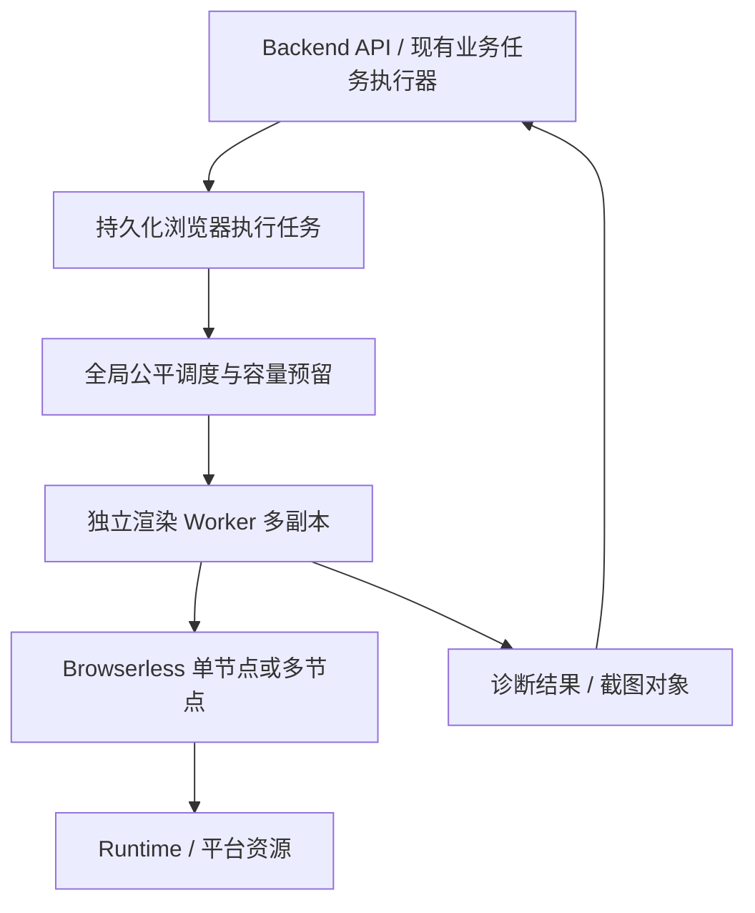

# 面向多用户与横向扩展的 CDP 浏览器服务替换方案

> **已作废（2026-09-24）**：Browserless/CDP 路线**不再作为计划**。浏览器执行边界由远程 Renderer（`renderer/` + `packages/render-contracts/`，见 `docs/developer/backend/remote-render-service-design.md`）承接。本文仅作历史对照，勿据其立项或改 Compose/镜像。

## 一、目标与架构决策

本次完整交付 **可配置 Browserless 服务、独立渲染 Worker、持久化浏览器任务、全局容量管理、多用户公平调度、故障恢复、部署及测试**，统一验收和发布，不拆分阶段。

彻底移除 Backend 内嵌 Chromium，保留 Playwright Python 客户端。采用以下边界：

**生命周期选择：每任务独立 CDP 会话，任务结束释放；任务内部复用 Browser 和 Context。**

- 不跨用户、跨任务保留 Context、Page 或浏览器连接。
- 组件默认态及 preset 检查属于一个任务，共用一次会话。
- 不启用 Browserless 持久化用户会话、重连保活或跨任务状态缓存。
- 不将服务端透明进程复用作为架构前提。Browserless 默认断连关闭浏览器，冷启动成本纳入性能验收。[会话管理说明](https://docs.browserless.io/baas/session-management)
- API 实例数、渲染 Worker 数与 Browserless 容量分别配置，扩容 API 不自动增加浏览器占用。

此次解决浏览器执行链路的横向扩展；普通 AI Run 仍遵守现有进程内运行约定，不将其改造成全平台可恢复智能体系统。

## 二、任务、调度与执行设计

### 统一浏览器执行任务

新增 `browser_render_jobs`，作为纯渲染执行记录，覆盖三种固定类型：

| 类型 | 输入 | 输出 |
|---|---|---|
| `page_screenshot` | 预览目标、视口、渲染选项 | PNG 对象引用、大小、摘要 |
| `page_diagnostics` | 预览目标、视口、诊断版本 | 现有布局诊断和布局分析结果 |
| `component_diagnostics` | 预览目标、视口、profile | 现有多场景诊断结果 |

任务保存：

- 用户、工作空间、父业务任务或请求标识。
- artifact 标识、不可变输入摘要、输入协议版本。
- 类型、优先级、创建时间、排队期限和总截止时间。
- 状态、尝试次数、Worker、租约代次、心跳、取消标记。
- Browserless 节点、会话容量预留、结果引用及脱敏错误。
- 父任务操作标识与输入摘要组成的幂等键。

状态统一为 `pending / running / succeeded / failed / cancelled`；重试通过 `next_attempt_at` 控制。

**不序列化 Python 回调、任意脚本或用户提供的 CDP 地址。** 执行端仅根据固定任务类型调用平台实现的截图和诊断处理器。

### 与现有业务任务的关系

- 页面截图业务任务、页面变更任务、组件外部任务、API mutation job 和 AI Batch 保持业务状态的单一事实源。
- 新任务只执行渲染，不提交页面版本、不更新组件源码、不直接恢复 AI Run。
- 业务执行器提交渲染任务后等待结果，期间不持有数据库事务。
- 父任务恢复时使用幂等键查找已有渲染任务，避免重复创建。
- 父任务消费结果时继续复核权限、页面版本、租约和 `AgentRunWriteFence`。
- 浏览器结果成功不等于业务写入成功；父任务失去租约后不得消费结果提交业务变更。
- 同步检查入口保留原返回结构，通过统一客户端提交并等待；持久化业务任务中的 HTTP 断开不取消实际任务。

### 全局容量与公平调度

以数据库作为调度事实源，新增节点容量记录、调度游标及会话预留记录。Redis 仅用于可选唤醒通知，通知丢失由数据库轮询补偿。

- 多 Worker 认领任务时，在同一短事务内完成任务选择、用户/工作空间额度检查、节点容量预留及租约建立。
- PostgreSQL 使用行锁保护调度；SQLite 使用显式写事务串行化同等操作。不能先查询计数再在独立事务中认领。
- 优先级全局保持交互/后台 `3:1`；同优先级按工作空间轮转，工作空间内按用户轮转，用户内部 FIFO。
- 暂时达到并发额度的用户跳过，不阻塞其他用户。
- 重试保留原提交身份和优先级，不插队到队首。
- Browserless 关闭服务端等待队列，平台只有一个可观察的渲染等待队列。
- 队列上限只限制浏览器执行任务，不替代现有业务任务入队限制。

默认配额：

| 项目 | 常规部署 | SQLite lite |
|---|---:|---:|
| 全局浏览器容量 | 2 | 1 |
| 每 Worker 最大执行数 | 2 | 1 |
| 每用户最大运行数 | 2 | 1 |
| 每工作空间最大运行数 | 2 | 1 |
| 全局等待数 | 128 | 16 |
| 每用户等待数 | 16 | 8 |
| 每工作空间等待数 | 32 | 16 |
| 排队期限 | 60 秒 | 60 秒 |

配额均为部署级可配置值，实际取全局和局部限额的交集。用户身份必须从认证或父任务继承，不接受客户端任意指定。

### Worker、超时与故障恢复

提供独立 `browser-render-worker` 入口，复用 Backend 镜像和代码，但不启动 FastAPI、模型 Run 管理器或其他业务队列。

- 每个本地执行槽使用受监督子进程运行同步 Playwright，使超时或取消时可以实际终止执行；子进程可复用驱动，Browser 会话逐任务创建。
- 正常结束按 Page/Context、Browser、结果提交的顺序清理。
- 单次尝试总上限默认 `900` 秒，包含建连和浏览器操作；建连上限 `15` 秒。
- 保留当前导航、视觉资源等待限制，补齐字体等待等无界等待。
- 最多两次执行尝试，仅瞬时连接失败、异常断线或 Worker 丢失允许重试；源码错误、确定性渲染错误、鉴权失败和任务执行超时不自动重试。
- 总任务截止时间默认 `2100` 秒，重试不能延长。
- Browserless 容量拒绝使用有界退避重新调度，受原排队期限限制，不形成无限重试。
- Worker 心跳默认 `10` 秒、租约 `60` 秒；所有结果提交复核 Worker 和租约代次，旧执行者结果不能覆盖新结果。

**租约过期不能直接认定远程浏览器已释放。**

连接已建立但无法确认关闭时，保留对应容量为隔离占用，直到确认服务释放或远程会话硬上限到期；随后才能重新分配。预留期限包含建连时间和服务端会话超时，避免 Worker 崩溃后瞬间重复分配容量。

取消先记录请求，停止执行并清理后释放容量。关闭 Worker 时停止认领、限时排空；超过关闭宽限期则终止子进程，并按上述规则处理未确认释放的会话。

## 三、资源、网络与接口影响

### artifact 和结果生命周期

当前部分诊断在调用结束后立即删除 artifact，必须调整为跟随渲染任务的实际生命周期。

- 入队前确认 artifact 有效期覆盖任务总截止时间及清理余量。
- artifact 被任务引用时不得被父调用的 `finally` 提前删除。
- 预览凭证沿用现有签名和权限约束，保存到任务中的敏感输入加密；有效期不足时在入队前重新准备专用预览，不在重试时延长授权。
- Worker 使用已授权的不可变预览目标，不重新读取最新页面源码生成候选内容。
- 终态结果由父任务消费后释放引用；孤立任务、过期结果及失去围栏的临时对象由清理器回收。
- PNG 写入现有 `ObjectStorageService`，使用任务 ID 和尝试代次生成不可冲突的临时键；父业务任务仍负责最终截图发布。
- 诊断结果保留现有有界结构。数据库不保存 PNG Base64。
- 终态未消费结果默认保留 24 小时；消费后进入清理流程，仅保留任务摘要。

### 浏览器访问地址

统一截图、页面诊断和组件诊断使用三项配置：

- `PLAYWRIGHT_BROWSER_RUNTIME_BASE_URL`：访问 Runtime 预览文档。
- `PLAYWRIGHT_BROWSER_RUNTIME_PUBLIC_BASE_URL`：加载 Runtime 脚本与样式，包含部署路径。
- `PLAYWRIGHT_BROWSER_BACKEND_BASE_URL`：加载平台图片、字体等资源。

Backend 到 Runtime 的 `RUNTIME_BASE_URL` 保持独立。

- 删除截图地址默认回退到 `127.0.0.1` 的行为。
- 页面和组件诊断生成专用 artifact 时共同注入浏览器资源基址。
- Editor 普通预览、公开资源链接和发布构建继续使用公开地址。
- Runtime 鉴权头只附加到指定预览文档，不作为全局请求头发送给第三方资源。
- 浏览器目标只允许平台构造的预览入口；业务 API 不提供任意 URL 浏览能力。

### 外部接口与错误语义

不新增用户直接调用的渲染任务 API，不改变 AI 工具参数或 Runtime Kit manifest。

现有服务客户端内部改为 `submit / wait / cancel`，传递明确的认证上下文、父任务标识和固定类型输入。

- 新增队列满、用户额度超限、服务不可用、连接超时和鉴权失败的稳定基础设施错误。
- 页面截图将相应错误映射到现有业务任务失败结果。
- 页面诊断继续返回现有不可用 warning，不改变页面写入规则。
- 组件诊断保持 `unavailable/retryable` 与确定性源码错误的区别。
- 新的浏览器重试不得重复触发 Batch 续跑、页面写入或截图发布。
- 原始 CDP URL、查询参数、Authorization、预览 Token 和 Playwright 原始异常中的凭证统一脱敏。

### 多用户安全

- 每任务创建独立 Context，不使用默认 Context。
- Browserless 控制端口只允许 Worker 网络访问；跨主机连接使用 WSS。
- 浏览器容器不挂载数据库、源码、密钥目录或 Docker socket。
- 浏览器网络允许 Runtime、必要资源和业务允许的外部资源，阻断数据库、Redis、云元数据及管理端口。
- 配置容器 CPU、内存和进程限制；不把 Context 或独立会话宣称为容器级安全隔离。
- Browserless 节点配置、凭证和配额仅允许运维管理，不进入工作空间设置或 AI 上下文。

## 四、部署、配置与可观测性

### CDP 节点配置

采用服务端配置文件描述一个或多个 Browserless 节点，每项包含：

- 稳定节点 ID。
- CDP endpoint。
- 可选建连请求头。
- 节点最大会话数。
- 启用状态和远程会话硬超时。

凭证使用环境变量或 Secret 文件引用。节点 ID 和非敏感容量信息进入调度记录，完整凭证不进入数据库或日志。

- 单节点和多节点使用同一配置结构，不增加 Backend 私有长连接池。
- 调度按可用容量比例分配节点，比例相同时轮转。
- 节点故障后暂停分配并有界探测；失效期间不取消其他节点任务。
- 节点下线先停止分配，待现有会话释放后删除。
- Worker 启动校验配置版本与调度节点配置一致，避免不同副本使用冲突容量。

Browserless 使用固定版本和 digest，`QUEUED=0`，会话硬超时设为 `930000` 毫秒，比 Worker 的执行上限留出清理余量。上线前实测版本的断连清理和超时行为，不使用无限会话或客户端覆盖服务端上限的配置。[Browserless 配置文档](https://docs.browserless.io/enterprise/docker/config)

移除本地浏览器 executable path、跨任务 reuse、任务数和年龄 recycle 配置。旧配置显式存在时给出迁移错误，不静默忽略。

### 部署拓扑

| 场景 | 配置要求 |
|---|---|
| 常规部署 | Backend、Runtime、独立渲染 Worker、Browserless；数据库和 Redis 使用现有部署方式 |
| 横向扩展 | PostgreSQL、共享 Redis、共享对象存储；多个 Worker 和 Browserless 节点 |
| SQLite lite | 平台容器、独立渲染 Worker、Browserless；共享本地 SQLite/结果卷，限定单机和一个 Worker |
| 本地开发 | 本地 Backend/Runtime 加容器化 Worker/Browserless，显式配置容器到宿主机访问地址 |

lite 可继续使用平台进程内 `memory://` artifact 存储：Worker 通过预览入口访问，不直接读取该内存。平台重启导致内存 artifact 丢失时，任务明确失败或由父业务按既有规则重建，不承诺跨重启保留该 artifact。多 Backend 部署必须使用共享 Redis。

本地存储跨进程必须共享实际目录；跨主机部署使用 S3 或明确配置的共享文件系统，不能让各实例读取自身本地副本。

四套 Compose、两种平台 Dockerfile、启动脚本和 CI 一并更新。生产镜像删除 Chromium 安装及专用依赖，保留 Playwright 客户端；字体、浏览器依赖转入 Browserless 镜像。

### 健康与监控

- API 存活检查不依赖 Browserless，避免浏览器故障触发所有 API 重启。
- Worker 就绪要求数据库、结果存储和配置有效；浏览器容量、节点可用性单独报告。
- 记录队列长度、最老等待时间、各任务类型等待/执行时间、节点占用、隔离占用、重试、超时、租约丢失及清理失败。
- 日志关联业务任务、渲染任务、尝试代次和 Worker；指标不使用用户 ID 作为高基数标签。
- Browserless 无可用节点、持续排队超时、隔离容量异常和清理积压触发告警。

Browserless 配套发布需落实适用许可，并在文档中区分主仓库 Apache-2.0 与 Browserless 的许可证。[Browserless LICENSE](https://github.com/browserless/browserless/blob/main/LICENSE)

## 五、验证、迁移与交付标准

### 必须通过的测试

| 范围 | 验收场景 |
|---|---|
| CDP 兼容 | Context、请求拦截、脚本注入、console/pageerror、字体、动画截图、布局检查和组件全部场景 |
| 全局并发 | 多 Worker 同时认领不超节点、用户及工作空间配额 |
| 公平性 | 单用户大量提交时，其他用户可以获得执行机会；交互/后台维持全局权重 |
| 幂等与围栏 | 重复提交、父任务恢复、旧 Worker 回写均不造成重复业务提交 |
| 故障 | Browserless 重启、断网、错误凭证、容量拒绝、Worker 强杀、租约失效和远程孤立会话 |
| 取消与退出 | HTTP 断开、显式取消、Worker 排空及强制退出不会提前释放未知会话容量 |
| artifact | 调用方退出不提前删除；等待期间不过期；结果消费和孤立任务清理正确 |
| 网络与权限 | 常规、lite、本地三种拓扑；资源加载、Token 不外泄、跨工作空间访问拒绝 |
| 业务回归 | 页面截图、页面/组件修改、版本复核、AI Batch 单次续跑、SSE `waiting_external` |
| 部署 | 镜像不含内嵌 Chromium；真实服务依赖、数据库迁移和所有 Compose 配置有效 |

Playwright 官方明确 CDP 连接兼容程度低于原生 Playwright 协议，因此真实浏览器兼容测试不得由 mock 或 HTTP 健康检查代替。[Playwright CDP 文档](https://playwright.dev/python/docs/api/class-browsertype)

保留 E2E 自身的本地测试浏览器安装；Backend 的真实渲染测试全部走 CDP。运行相关 Backend unit/API/integration、根仓 contracts、E2E smoke 和 runtime-heavy；新增多 Worker 调度测试和租约故障注入。

性能测试在相同机器、页面、字体和视口下，对比现有复用实现与新实现，覆盖短截图、重页面、多场景组件和多用户混合负载。每组至少 200 个任务，报告吞吐、P50/P95、连接成本、总 CPU/RSS 和失败率，不预先宣称迁移后更快或更省内存。

硬性验收要求：无未解释的截图/诊断差异、无超配额运行、无重复业务提交、正常结束后会话归零、故障后孤立会话在配置上限内回收。

### 一次性交付与发布

- 新增数据库表、索引及版本化迁移，复用现有任务租约基础能力。
- 同时交付 Worker、调度器、三类渲染适配、配置、部署、清理器、监控和测试，不留下依赖后续建设才能成立的横向扩展能力。
- 发布窗口暂停新渲染相关业务执行并排空旧浏览器任务；迁移数据库，统一切换平台与 Worker 版本，完成真实截图及诊断验证后恢复。
- 不允许新旧版本同时认领同一执行链路；不提供新代码内的 local Chromium 回退。
- 回滚前停止新 Worker 并处理在途任务，恢复上一版平台镜像和配置；新增表可保留，不自动删除业务数据。

同步更新 README、AGENTS、Backend 文档、部署和 CI 文档，并新增完整的 CDP 架构与排障专题。保留现有未提交的 Editor、Runtime 和文档改动。

当前已完成仓库与官方资料调查，尚未执行真实 CDP、多 Worker 故障或性能测试；这些均属于本次完整交付的验收内容。
