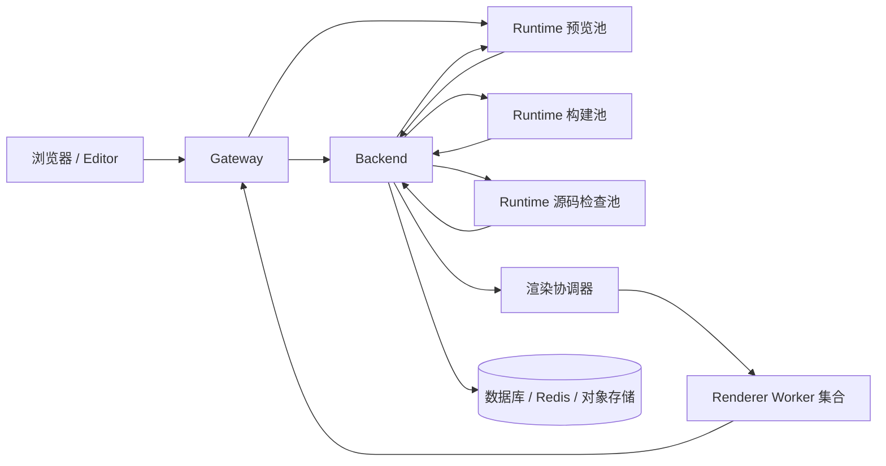

# 运行服务多部署形态与横向扩容规划（草案）

> 状态：规划草案，尚未实施。编写日期：2026-09-23。本文依据当前仓库的代码与部署模板制定；容量、故障恢复时间和性能收益均需实测，不将设计目标表述为已具备的能力。

## 1. 目标与范围

同一套 Backend、Runtime、Renderer 代码和协议支持以下形态：

1. **SQLite Lite**：`platform-lite` 内运行一个 Backend、一个 Runtime 和 Gateway，配一个独立 Renderer；适合个人和小团队，不支持增加 Backend/Runtime 副本。
2. **常规单实例**：Backend、Runtime、Renderer 可在独立容器中运行，使用 PostgreSQL/Redis；各执行角色各一个实例。
3. **分角色单机部署**：预览、构建、源码检查使用独立 Runtime 进程或容器，Renderer 独立；优先解决资源争用和独立重启。
4. **分布式部署**：预览、构建、源码检查和 Renderer 分别按负载扩容；Backend 通过共享数据库、运行态存储、对象存储和一致的签名密钥运行。Backend 多副本与普通 AI Run 的可用性承诺另设验收门槛。

用户 API、预览 URL 形态、项目构建结果和页面校验语义在各形态中保持一致。拓扑差异由部署配置与实例数表达，不维护单实例专用的另一套业务实现。

本文聚焦预览、项目构建、源码检查、截图和视觉诊断的执行链路。Renderer 仍是唯一浏览器执行角色；Backend 不引入 Chromium。Runtime Kit manifest、模块导入边界和现有公开 API 的调整必须按仓库契约同步验证。

## 2. 当前基线与阻塞点

| 领域 | 当前实现 | 扩容影响 |
| :--- | :--- | :--- |
| Runtime 进程 | [Vite 配置](../../../runtime/vite.config.ts)在同一服务中注册预览、构建、诊断、可视化编辑和资源测量插件。 | 容器副本数与职责、资源预算绑定，构建可能与交互预览争用 CPU/内存。 |
| 预览鉴权 | [预览插件](../../../runtime/src/core/plugins/runtime-saas-preview.ts)按 artifact ID 在进程内缓存预览令牌和 Runtime 服务令牌；Vue SFC 子请求可能没有 `ctx`。 | 初始 HTML 和后续模块/CSS/资源请求分到不同副本时，后者无法依赖本地缓存完成回源。 |
| 构建与源码检查 | [Runtime 构建插件](../../../runtime/src/core/plugins/runtime-build-runner.ts)共用进程内有界队列；构建用临时工作区，产物上传 Backend。 | 单个请求具备分散到其它实例的基础，但队列、权重和容量目前只在本进程生效。 |
| 构建调度 | [构建路由](../../../backend/app/api/routes/build_jobs.py)用 FastAPI `BackgroundTasks` 发起长 HTTP 调用；[构建服务](../../../backend/app/services/project_build_service.py)在启动时把仍为 `running` 的任务标为失败。 | 增加执行实例可提高吞吐，但进程故障后的任务接管和迟到结果处理尚不足。 |
| 截图与视觉诊断 | Backend 的 `render_requests` 协调器按 Worker ID/epoch 派发到独立 [Renderer](../../../renderer/wp_renderer/control/slot.py)；每个 Renderer 一个执行槽。 | 已有独立扩容边界，新增 Worker 须注册独立身份和直达地址，不能把控制 API 随机转发到任意副本。 |
| 部署入口 | [Gateway](../../../deploy/docker/nginx/web-presentation.conf)代理 `/runtime/` 到一个 `runtime:7373` 目标；Backend 用单个 `RUNTIME_BASE_URL` 调用所有 Runtime 内部能力。 | 需要区分预览入口与私有计算入口，并提供健康感知和实例变更时的路由策略。 |
| 持久化与密钥 | 预览 artifact 位于 Backend 运行态存储，构建快照位于数据库；对象服务支持本地或 S3。Backend [TokenService](../../../backend/app/services/token_service.py)从本地文件读取或生成 RSA 私钥。 | 多 Backend 副本必须共享同一签名身份及对象可见性；`memory://lite` 与各副本本地磁盘不能充当分布式共享状态。 |

当前 [四类 Compose 模板](../../developer/deployment/compose.md)均以单个 Runtime 为默认拓扑；本规划不把现有模板视为已经具备 Runtime 多副本支持。

## 3. 目标服务边界

| 角色 | 入口和职责 | 状态与扩容单位 |
| :--- | :--- | :--- |
| `runtime-all` | 在 Lite 和兼容部署中同时开放预览、构建、源码检查和轻量内部工具。 | 单 Runtime 进程；继续使用同一套鉴权和任务协议。 |
| `runtime-preview` | 提供 `/__preview`、远程模块、预览 Tailwind、必要的 Vite 资源和截图资源代理。只读回源 Backend。 | 无任务持久状态；以预览请求、模块转换负载和内存为扩容依据。 |
| `runtime-build` | 接收构建任务，拉取不可变 snapshot、执行 Vite 构建、归档并向 Backend 上传。 | 按构建任务扩容；每实例有独立并发和临时磁盘预算。 |
| `runtime-check` | 执行页面/组件源码编译诊断。可视化编辑 AST 分析/应用与资源比例测量先归入此内部角色，再按实际负载决定是否继续拆分。 | 按交互诊断延迟扩容；与构建使用相同 Runtime 源码及版本。 |
| `renderer` | 截图、页面布局诊断和 Renderer 协议已有的组件渲染诊断。内容助手当前组件校验仍按既有编译链路，不在本计划中直接接入组件远程渲染诊断。 | 一个 Worker 一个浏览器执行槽；由 Backend 按 Worker ID/epoch 定向调度。 |
| Backend | 权限、快照、任务协调、结果合并、产物托管与对外 API。 | 不运行 Vite 构建或 Chromium。完整多副本发布须满足第 6 节前提。 |

运行角色的分离优先通过**同一 Runtime 源码、同一版本镜像、按角色选择插件和入口**完成。构建与源码检查可以先共用镜像但使用独立容器和队列；不复制 Runtime Kit、Tailwind 配置或页面编译规则。待作业调度稳定后，再决定是否把构建 HTTP 处理器改为独立 Worker 进程。

## 4. 一套实现对应多种部署方式

### 4.1 配置契约

建议增加以下逻辑配置；具体名称在接口实现时统一确定，现阶段**不是已生效的环境变量**：

| 逻辑配置 | 单实例取值 | 分角色/分布式取值 |
| :--- | :--- | :--- |
| Runtime 角色 | `all` | `preview`、`build`、`check` 分别部署 |
| 预览内部目标 | 原 `RUNTIME_BASE_URL` | `runtime-preview` 的内部服务地址 |
| 构建内部目标 | 原 `RUNTIME_BASE_URL` | `runtime-build` 的内部服务地址 |
| 源码检查内部目标 | 原 `RUNTIME_BASE_URL` | `runtime-check` 的内部服务地址 |
| 浏览器 Runtime 地址 | `RUNTIME_PUBLIC_BASE_URL` | 稳定的预览 Gateway 地址，仍为 `RUNTIME_PUBLIC_BASE_URL` |
| Renderer 地址 | 一项 `RENDER_WORKERS_CONFIG` | 多项具备不同 `worker_id` 的直达地址 |

Backend 客户端按业务职责读取目标地址；新增配置未填时回退到现有 `RUNTIME_BASE_URL`，因此 Lite 与现有单 Runtime 模板不需要两套业务调用。`RUNTIME_PUBLIC_BASE_URL`、`RUNTIME_SERVER_BASE_PATH` 和 Renderer 浏览器可达地址必须指向同一预览路由及正确路径前缀。构建、源码检查、可视化编辑等内部端点只在受信网络开放。

角色配置需要启动期校验：Lite 的 `memory://lite`、SQLite 和本地私钥只允许单 Backend；`preview` 角色不开放构建与诊断入口；`build/check` 角色不通过公开 Gateway 暴露；分布式模式缺少共享存储、密钥或必要依赖时应明确报错。

### 4.2 部署形态矩阵

| 形态 | 服务拓扑 | 数据与资源 | 发布承诺 |
| :--- | :--- | :--- | :--- |
| SQLite Lite | 现有 `platform-lite` 内一个 Backend + `runtime-all` + Gateway，外加一个 Renderer。 | SQLite、`memory://lite`、`lite-data` 本地持久卷。 | 单实例；重启可中断短期预览和正在执行的任务。 |
| 常规单实例 | 现有简化版或 production env 版；一个 Backend、一个 `runtime-all`、一个 Renderer。 | PostgreSQL、Redis；对象可先保存在 Backend 本地持久卷。 | 模块可独立重启，但不承诺任务无中断迁移。 |
| 分角色单机 | 一个 Backend；预览、构建、源码检查各一实例；一个或多个 Renderer。 | PostgreSQL、Redis；如仍只有一个 Backend，可继续使用其本地对象卷。 | 资源隔离与独立容量管理，尚不等于跨主机高可用。 |
| 多机分布式 | 各 Runtime 角色多副本；Renderer 多 Worker；Backend 至少先保持一个稳定实例，满足第 6 节后再增加 Backend 副本。 | PostgreSQL、Redis、可供所有 Backend 访问的对象存储；统一签名密钥和服务凭证。 | 经故障演练后逐项声明预览、构建、渲染及 Backend 的可用性范围。 |

## 5. 横向扩容所需的执行改造

### 5.1 预览：先消除进程亲和

`runtime-preview` 扩成多副本前，必须让任一副本仅凭当前请求和受信 Backend 服务即可完成鉴权与 artifact 读取：

- 远程模块、Vue SFC 样式/脚本子请求、预览 CSS 和截图资源代理都必须携带或可安全恢复当前 artifact 的短期预览上下文；不能依赖某个 Runtime 进程先收到 `/__preview`。
- 后续请求需要的 Backend 访问授权由受信代理或内部换票链路提供；浏览器只获得最小权限的预览票据，不获得 Runtime 服务级令牌。需明确票据的作用域、过期、重放和日志脱敏规则。
- `manifest`、Tailwind CSS、Vite 模块等缓存只用于提速，设置容量与过期边界；副本丢失缓存不能影响正确性。artifact 失效时不得由旧缓存继续声称可用。
- Gateway 为公开预览池提供可更新的实例发现、Upgrade 透传和连接排空。初始 Backend→Runtime 请求与后续浏览器→Gateway 请求来自不同客户端，普通浏览器 Cookie 粘性不能作为正确性基础。
- 滚动发布期间固定一个预览页面使用的 Runtime 版本，或在旧版请求排空后再让新版接管，避免 HTML、Runtime Kit 和 Vite 变换模块跨版本混用。

在上述改造完成前，`runtime-preview` 保持单副本；增加 `runtime-build` 或 `runtime-check` 副本不受此限制。

### 5.2 构建：持久任务与结果围栏

保留 Backend 的 `ProjectBuildJob` 和不可变 build snapshot 作为事实源，逐步替换仅依赖 `BackgroundTasks` 的派发方式：

1. Backend 从数据库有条件领取待执行任务，保存 `attempt_id`、拥有者、租约截止和重试预算；SQLite Lite 保持一个领取者，PostgreSQL 支持多个协调者竞争。
2. Runtime 构建实例只接收已领取的任务与限权令牌，在本机工作区执行；失败、超时或实例退出后由 Backend 在总 deadline 内决定是否重试。
3. 构建产物按任务和 attempt 写入不可变对象键；Backend 仅在任务版本、有效租约和 attempt 均匹配时将结果提升为最终产物。迟到上传不得覆盖新结果。
4. 按全局、工作空间和单实例设置并发及排队上限；记录等待、快照拉取、Vite、压缩、上传各阶段耗时。负载均衡不能仅靠 Runtime 进程内队列形成全局公平性。
5. 容器下线先停止接收新任务，等待或受控结束在途构建；后续由同一快照重试，不能盲目重发可能已上传成功的 POST。

### 5.3 源码检查与视觉诊断

- 页面完整校验保留“Runtime 编译诊断通过 → Renderer 页面视觉诊断”的顺序；Renderer 不可用必须输出独立的基础设施状态，不能合并成“完整检查通过”。
- `runtime-check` 复用当前 Vite 编译与诊断工作区池，使用独立于正式构建的容量；轻量模式可继续在 `runtime-all` 中共享有界队列。
- 视觉诊断与截图继续复用 Renderer 控制面和共享调度，不在 Backend 或 Runtime 新启 Chromium。若将来按截图/诊断分别设置 Renderer 池，应先扩展能力声明与调度选择，而非仅靠不同负载均衡地址。
- Renderer 扩容使用不同 `worker_id`、受信直达地址和当前 Worker epoch；Backend 继续按指定 Worker 查询状态、取消和获取产物。

## 6. Backend、存储与发布一致性前提

Runtime 和 Renderer 横向扩容可以先在**单 Backend**控制面下交付。若进一步增加 Backend HTTP 副本，需要完成以下工作：

- PostgreSQL 与 Redis 成为所有 Backend 的共同事实源；不把 `memory://lite` 用于多 Backend。对象、截图和构建归档使用共享对象存储或经验证的共享文件层，本计划优先采用现有 S3 驱动。
- Runtime 签名私钥、JWKS、AI 凭证加密密钥和 Renderer 服务凭证在各 Backend 实例间保持一致，并定义密钥轮换与旧票据有效期。当前 Runtime RSA 私钥位于 Backend 本地数据目录，不能让不同副本各自生成。
- 数据库迁移单独执行一次；后台协调器、构建领取、artifact 清理等需要租约或幂等边界，不依赖“恰好只有一个 Backend 进程”保证正确性。
- 普通 AI Run 当前使用 Backend 进程内后台管理器，进程退出按 `AI_RUN_PROCESS_STOPPED` 收敛。多 Backend HTTP 副本可以遵守这一已声明语义，但**不能据此宣称普通 Run 可跨实例无中断续跑**；若产品要求该承诺，另设可恢复执行与工具副作用幂等方案。
- 发布清单固定 Backend、Editor、Runtime Kit manifest、Runtime 各角色、Renderer、渲染协议和字体/Chromium profile 的匹配版本。预览与截图缓存身份需要反映真实运行环境版本；`profile.v1` 之类手填标签不足以证明镜像一致。

## 7. 临时工作区与内存文件系统

Runtime 构建和源码诊断工作区使用实例本地临时目录，Renderer 也在本机暂存截图结果；这些目录不需要跨实例共享。默认选有容量限制、可清理的本地临时磁盘，并监控磁盘空间、I/O 等待、RSS 和 OOM。

本规划**不要求增加 tmpfs**。当前构建会把 `dist` 文件读入内存并同步生成 ZIP Buffer，若工作区也位于 tmpfs，文件页与 Node/Worker 堆、归档 Buffer 同时占用容器内存。只有在负载基线证明磁盘 I/O 是主要瓶颈且内存预算充足时，才对单个执行角色试验有大小上限的 tmpfs。Renderer 的成功 PNG 会保留到 Backend 确认消费或 TTL 到期，tmpfs 容量需计入未消费结果。数据库、Redis、签名密钥和 Backend 持久产物不放入 tmpfs。

## 8. 分阶段实施与交付门槛

| 阶段 | 工作包 | 完成门槛 |
| :--- | :--- | :--- |
| 0. 基线与正确性 | 固定四类现有拓扑的预览、构建、源码检查、截图链路；采集混合负载的队列、P50/P95、CPU、RSS、磁盘和失败分类。 | 有可复现基线；Renderer 不可用不被报告为完整检查通过；在途任务和产物状态可追踪。 |
| 1. 角色拆分 | 增加 Runtime 角色选择及 Backend 按职责选址，保留 `RUNTIME_BASE_URL` 回退；新建分角色单机部署示例。 | Lite 与现有单实例行为不变；公开 Gateway 只到预览角色；内部端点不能从浏览器访问；相同快照在 `all` 与拆分模式产生等价结果。 |
| 2. 预览无状态化 | 改造每类后续请求的上下文与服务授权，限制缓存；预览池接入健康感知路由与排空。 | 两个预览副本间强制交叉分流 HTML、远程模块、SFC 子请求、CSS 和截图资源，均能正确加载；任一副本重启后可恢复。 |
| 3. 构建/检查扩容 | 构建持久领取、attempt 围栏、受控重试；检查池独立并发；增加多副本容量路由。 | 两个构建/检查副本并发工作；杀死执行实例、超时和迟到上传时最终结果只提交一次；满载返回稳定错误且其它空闲副本可接单。 |
| 4. 分布式发布 | Renderer 多 Worker、共享对象/密钥、版本指纹、readiness、灰度排空、备份回滚与多机模板。 | 两个 Runtime 预览副本、两个构建/检查副本、两个 Renderer Worker 的真实跨容器 E2E 和故障演练通过；发布清单可复现。 |
| 5. Backend 多副本 | 在前述共享依赖与任务围栏成立后验证多 Backend 竞争、密钥一致、AI Run 停机语义。 | 多实例不重复提交任务或产物；普通 AI Run 的已声明中断行为有测试和用户可理解的恢复路径。 |

每一阶段完成后才能扩大其部署承诺。阶段 0 的资源与时延基线用于制定扩容目标，不预先宣称固定倍数的吞吐收益。

## 9. 验证矩阵与发布检查

至少覆盖以下组合：

- **单实例回归**：SQLite Lite；现有简化版；production env 单 Runtime。验证登录、预览、代码检查、页面视觉诊断、截图、项目构建和产物下载。
- **分角色回归**：`runtime-preview/build/check` 各一实例，Gateway 与 Renderer 通过真实网络访问；验证内部路由不暴露以及 Runtime Kit 版本一致。
- **多副本回归**：至少两个预览、两个构建/检查、两个 Renderer Worker；强制跨副本子请求、并发混合负载、实例重启、网关摘流、Renderer 失联、Backend 重启和 Redis/对象存储短暂不可用。
- **安全与一致性**：过期/跨 artifact 票据、不同租户请求、迟到上传、重复派发、取消、版本不匹配、资源缺失、Renderer 基础设施故障均不得产生错误成功结果。
- **容量验证**：分别记录预览、构建、代码检查、截图/视觉诊断的等待与执行时间、队列年龄、每副本 CPU/RSS/临时盘、OOM 与 429；根据阶段 0 的目标硬件和实际负载确定验收阈值。

对应测试入口包括 `pnpm run test:runtime:gate`、`pnpm run test:backend:unit`、`pnpm run test:backend:integration`、`pnpm run test:renderer`、`pnpm run test:render-e2e`、`pnpm run test:contracts`、`pnpm run test:contracts:gateway`、`pnpm run test:repository`。镜像还需进行真实构建、生产依赖裁剪后启动和跨容器预览/截图验证。规划文档本身不代表这些门禁已经通过。

## 10. 发布与回退顺序

1. 先发布同时支持旧 `RUNTIME_BASE_URL` 与新角色目标的 Backend/Runtime 版本，仍以 `runtime-all` 单实例运行，验证兼容性。
2. 部署 `runtime-build` 和 `runtime-check`，逐项切换 Backend 内部目标；切换前排空对应在途任务，保留旧 `runtime-all` 作短期回退目标。
3. 完成预览无状态化后才建立 `runtime-preview` 多副本，先对测试流量验证跨副本子请求，再扩大全量流量。
4. 按独立 Worker ID 增加 Renderer；核对容量、profile 和旧 Worker epoch 的未释放 attempt 后再摘除旧实例。
5. 最后启用共享对象存储和多 Backend；数据库迁移、密钥和镜像版本作为一组发布。回退前先停止新任务、保存在途状态，并校验旧版本能读取当前 schema 与产物。

实施时同步更新 `deploy/.env.example`、四类 Compose 模板、Gateway 配置、部署文档、Runtime 自身说明及必要的根仓协作规范。Lite 的单实例限制应继续明确展示；分布式模板只有通过对应多实例门禁后才能标记为可用。
