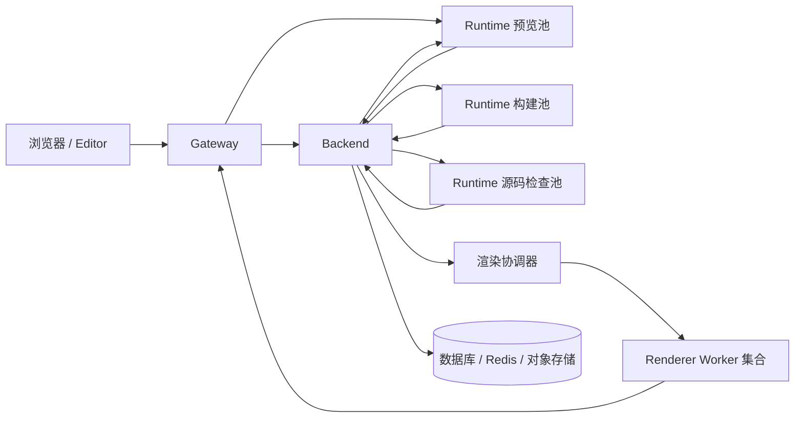

# 运行服务多部署形态与横向扩容规划（草案）

> 状态：**T0-1…T4-3 已于 `e2efe6c..HEAD` 落地（2026-09-25）**，见文末第 13 节实施记录与 [`../review-multi-deployment-e2efe6c-head.md`](../review-multi-deployment-e2efe6c-head.md)；落地后评审仍存 3 Critical / 5 Major，多副本拓扑与跨副本 E2E 未就绪，分布式模板不得标记为可用。编写日期 2026-09-23；2026-09-25 依据 `dev @ e2efe6c` 代码复核修订并追加实施记录。本文依据当前仓库的代码与部署模板制定；容量、故障恢复时间和性能收益均需实测，不将设计目标表述为已具备的能力。
>
> 本轮修订要点：① 把 Runtime 计算治理（主进程阻塞、峰值内存、重复编译）提前到角色拆分之前，不再以完整性能评估为前置；② 把 Preview 多副本从计算池扩容的前置阶段中解开；③ 新增第 6 节「计算复用与重复编译治理」，形成隔离负载与减少计算两条并行演进线；④ 第 9、10 节改为按实测负载排序的阶段与任务清单。

## 1. 目标与范围

### 1.1 Runtime 演进目标

> Runtime 是平台动态预览、编译诊断和项目构建的主要计算执行面。后续演进优先围绕**交互响应保护**与**计算资源隔离**展开：在共享 Runtime Kit、编译规则和协议的前提下，把 Preview、Check、Build 建设为可独立部署、可独立分配资源的执行角色；优先保护交互响应，再通过计算复用和独立扩容提升吞吐。

重点不是三个服务名称，而是三类任务的处理策略不同：

| 角色 | 执行方式 | 最重要的目标 |
| :--- | :--- | :--- |
| **Preview** | 常驻服务、模块按需转换、受控缓存 | 用户操作后尽快看到页面，不被后台构建拖慢 |
| **Check** | 有界常驻 Worker 池、受控复用 | 检查等待时间稳定，避免每次从冷启动开始 |
| **Build** | 任务级执行、独立临时目录、可重试 | 完整产物可靠生成，不挤占交互容量 |

三者可以共享代码实现，但不应被迫共享同一份并发容量和故障边界。

Renderer 独立的价值是浏览器故障与资源隔离，不代表它一定是资源消耗最大的服务；**扩容顺序按实测负载决定，不默认优先扩 Renderer**。

### 1.2 支持的部署形态

同一套 Backend、Runtime、Renderer 代码和协议支持以下形态：

1. **SQLite Lite**：`platform-lite` 内运行一个 Backend、一个 Runtime 和 Gateway，配一个独立 Renderer；适合个人和小团队，不支持增加 Backend/Runtime 副本。
2. **常规单实例**：Backend、Runtime、Renderer 可在独立容器中运行，使用 PostgreSQL/Redis；各执行角色各一个实例。
3. **分角色单机部署**：预览、构建、源码检查使用独立 Runtime 进程或容器，Renderer 独立；优先解决资源争用和独立重启。
4. **分布式部署**：预览、构建、源码检查和 Renderer 分别按负载扩容；Backend 通过共享数据库、运行态存储、对象存储和一致的签名密钥运行。Backend 多副本与普通 AI Run 的可用性承诺另设验收门槛。

用户 API、预览 URL 形态、项目构建结果和页面校验语义在各形态中保持一致。拓扑差异由部署配置与实例数表达，不维护单实例专用的另一套业务实现。

**Lite 是同一套能力的合并部署形态，团队部署是同一套能力的分角色形态。** 两者共享契约和业务实现，差异只体现在角色组合、Worker 数量和资源预算配置上。不强迫低资源 Lite 常驻三个完整服务，也不因 Lite 只能单 Runtime 就让常规部署长期共享一个计算队列。

本文聚焦预览、项目构建、源码检查、截图和视觉诊断的执行链路。Renderer 仍是唯一浏览器执行角色；Backend 不引入 Chromium。Runtime Kit manifest、模块导入边界和现有公开 API 的调整必须按仓库契约同步验证。

## 2. 当前基线与阻塞点

### 2.1 部署与链路基线

| 领域 | 当前实现 | 扩容影响 |
| :--- | :--- | :--- |
| Runtime 进程 | [Vite 配置](../../../runtime/vite.config.ts)在同一服务中注册预览、构建、诊断、可视化编辑和资源测量插件。 | 容器副本数与职责、资源预算绑定，构建可能与交互预览争用 CPU/内存。 |
| 预览鉴权 | [预览插件](../../../runtime/src/core/plugins/runtime-saas-preview.ts)按 artifact ID 在进程内缓存预览令牌和 Runtime 服务令牌；Vue SFC 子请求可能没有 `ctx`。 | 初始 HTML 和后续模块/CSS/资源请求分到不同副本时，后者无法依赖本地缓存完成回源。 |
| 构建与源码检查 | [Runtime 构建插件](../../../runtime/src/core/plugins/runtime-build-runner.ts)共用进程内有界队列；构建用临时工作区，产物上传 Backend。 | 单个请求具备分散到其它实例的基础，但队列、权重和容量目前只在本进程生效。 |
| 构建调度 | [构建路由](../../../backend/app/api/routes/build_jobs.py)用 FastAPI `BackgroundTasks` 发起长 HTTP 调用；[构建服务](../../../backend/app/services/project_build_service.py)在启动时把仍为 `running` 的任务标为失败。 | 增加执行实例可提高吞吐，但进程故障后的任务接管和迟到结果处理尚不足。 |
| 截图与视觉诊断 | Backend 的 `render_requests` 协调器按 Worker ID/epoch 派发到独立 [Renderer](../../../renderer/wp_renderer/control/slot.py)；每个 Renderer 一个执行槽。 | 已有独立扩容边界，新增 Worker 须注册独立身份和直达地址，不能把控制 API 随机转发到任意副本。 |
| 部署入口 | [Gateway](../../../deploy/docker/nginx/web-presentation.conf)代理 `/runtime/` 到一个 `runtime:7373` 目标；Backend 用单个 `RUNTIME_BASE_URL` 调用所有 Runtime 内部能力。 | 需要区分预览入口与私有计算入口，并提供健康感知和实例变更时的路由策略。 |
| 持久化与密钥 | 预览 artifact 位于 Backend 运行态存储，构建快照位于数据库；对象服务支持本地或 S3。Backend [TokenService](../../../backend/app/services/token_service.py)从本地文件读取或生成 RSA 私钥。 | 多 Backend 副本必须共享同一签名身份及对象可见性；`memory://lite` 与各副本本地磁盘不能充当分布式共享状态。 |

当前 [四类 Compose 模板](../../developer/deployment/compose.md)均以单个 Runtime 为默认拓扑；本规划不把现有模板视为已经具备 Runtime 多副本支持。

### 2.2 已核对的执行面事实（基线 `e2efe6c`）

现状不是「没有做隔离」，而是隔离尚未覆盖完整负载。以下判断基于代码复核，未做部署性能测试。

**（1）构建与诊断共享并发槽，权重不解决正在执行的资源争用。**
[任务调度器](../../../runtime/src/core/plugins/runtime-vite-task-scheduler.ts)为 `diagnostics` 与 `project` 分别维护等待队列，但共享同一个 `activeCount` 与 `concurrency`（默认 1）。诊断权重只影响**下一个取哪个任务**，不抢占已经开始执行的构建：若槽位已被长构建占用，权重更高的诊断仍然等待。因此**提高诊断权重不等于为诊断保留资源，提高总并发也不等于提高吞吐**。

**（2）Vite 已进入子进程，但 ZIP 归档仍在 Runtime 主进程同步执行。**
构建 Worker 用独立 Node 子进程执行 Vite；但 [构建流程](../../../runtime/src/core/plugins/runtime-build-runner.ts)在 Worker 返回后回到主进程调用 `createZipArchiveFromDirectory()`，先递归读入整个 `dist`，再 `Buffer.from(zipSync(archiveEntries, { level: 9 }))`。文件内容集中进入内存且压缩同步执行，**大项目归档阶段仍会阻塞承载预览的主线程**。这一项可先修，不必等分角色部署完成。

**（3）诊断 Worker 常驻不等于增量编译。**
[诊断工作区池](../../../runtime/src/core/plugins/runtime-diagnostics-workspace-pool.ts)复用基础工作区并按任务数、存活时间、内存等条件回收 Worker，减少了工作区准备与启动成本；但每次 IPC 任务仍新建配置与插件，并在 [Worker 源码](../../../runtime/src/core/plugins/runtime-build-worker.ts)中执行 `viteBuild(createOptions(input))`。诊断模式设置 `write: false`，**不写出产物不代表只做一次廉价语法检查**，仍走完整 Vite 构建链路。若实际负载以 AI 反复改页面、检查页面为主，Check 很可能比正式 Build 更值得优先优化——这需要用调用次数与阶段耗时验证，不能按服务名称判断。

**（4）轻量内部工具当前完全没有准入控制。**
[可视化编辑](../../../runtime/src/core/plugins/runtime-visual-edit.ts)的 SFC 分析/改写与[资源比例测量](../../../runtime/src/core/plugins/runtime-asset-render-hint-measurer.ts)的 SVG/LaTeX 计算不进入上述调度器队列，直接在预览 serve 进程内同步执行。它们既不受权重保护，也不受队列上限约束，与预览共享同一事件循环。

**（5）计算角色目前必须启动完整 Vite serve 壳。**
构建、诊断、可视化编辑、测量、健康检查插件均声明 `apply: 'serve'` 并通过 `configureServer` 注册 HTTP 端点，而实际 Worker 已直接调用 Vite 构建 API。近期按角色选择插件与入口是兼容改造；长期应收敛为直接执行入口（见 3.2）。

**（6）容器与 Node 的默认预算不构成资源隔离。**
Docker 容器默认不施加 CPU/内存限制，**仅把一个容器拆成三个容器不会自动消除宿主机上的资源争抢**，必须同时设置资源约束。`--max-old-space-size` 限制的是 V8 老生代堆，不能当成 Worker 或容器的内存上限；工作区文件页、Buffer、子进程与 Worker 堆都要单独计入预算。

## 3. 目标服务边界

### 3.1 角色与职责

| 角色 | 入口和职责 | 状态与扩容单位 |
| :--- | :--- | :--- |
| `runtime-all` | 在 Lite 和兼容部署中同时开放预览、构建、源码检查和轻量内部工具。 | 单 Runtime 进程；继续使用同一套鉴权和任务协议，但**保留按任务类别的准入策略**，不因合并部署退化为单一权重参数。 |
| `runtime-preview` | 提供 `/__preview`、远程模块、预览 Tailwind、必要的 Vite 资源和截图资源代理。只读回源 Backend。 | 不持有必须保留的业务事实；以预览请求、模块转换负载和内存为扩容依据。 |
| `runtime-build` | 接收构建任务，拉取不可变 snapshot、执行 Vite 构建、归档并向 Backend 上传。 | 按构建任务扩容；每实例有独立并发、临时磁盘与归档内存预算。 |
| `runtime-check` | 执行页面/组件源码编译诊断。可视化编辑 AST 分析/应用与资源比例测量先归入此内部角色。 | 按交互诊断延迟扩容；与构建使用相同 Runtime 源码及版本。 |
| `renderer` | 截图、页面布局诊断和 Renderer 协议已有的组件渲染诊断。内容助手当前组件校验仍按既有编译链路，不在本计划中直接接入组件远程渲染诊断。 | 一个 Worker 一个浏览器执行槽；由 Backend 按 Worker ID/epoch 定向调度。 |
| Backend | 权限、快照、任务协调、结果合并、产物托管与对外 API。 | 不运行 Vite 构建或 Chromium。完整多副本发布须满足第 7 节前提。 |

`runtime-check` 内部必须区分两类负载：**轻量交互工具（可视化编辑、资源比例测量）与完整编译诊断使用不同执行通道或独立容量**，避免短请求排在长编译之后。否则只是把 Runtime 内原有的混合负载平移进 `runtime-check`。先分通道即可，不需要马上拆出第四个 Runtime 服务；是否继续拆分由阶段 0 的实测负载决定。

运行角色的分离优先通过**同一 Runtime 源码、同一版本镜像、按角色选择插件和入口**完成。构建与源码检查可以先共用镜像但使用独立容器、独立队列和独立资源约束；不复制 Runtime Kit、Tailwind 配置或页面编译规则。

### 3.2 长期入口收敛

同镜像按角色运行适合近期改造。角色拆分与任务协议稳定后，继续收敛为共享能力实现而非共享启动方式：

```text
共享编译核心、Runtime Kit、配置与诊断规则
       ├─ Preview 服务入口：需要 Vite serve 能力（模块图、按需转换、HMR）
       ├─ Check Worker 入口：直接执行检查，不启动 serve 壳
       └─ Build Worker 入口：直接执行构建、归档与上传
```

这一步放在角色拆分与任务协议稳定之后，不作为第一阶段的重构前提。

### 3.3 目标拓扑

近期目标是把 Check、Build 的计算资源从交互服务中独立出来，不要求一开始就多副本：


```mermaid
flowchart LR
    Browser[浏览器 / Editor] --> Gateway[Gateway]
    Gateway --> Backend[Backend]
    Gateway --> Preview[Runtime 预览池]
    Backend --> Preview
    Backend --> Build[Runtime 构建池]
    Backend --> Check[Runtime 源码检查池]
    Backend --> Coordinator[渲染协调器]
    Coordinator --> Renderer[Renderer Worker 集合]
    Renderer --> Gateway
    Preview --> Backend
    Build --> Backend
    Check --> Backend
    Backend --> Shared[(数据库 / Redis / 对象存储)]
```

**先保留一个 Preview，把 Check、Build 的计算资源独立出来，通常比先做 Preview 多副本更容易取得直接收益。** 先拆 Check 还是 Build，取决于哪类任务在占用资源：持续压力来自高频代码检查则优先 Check；主要是导出时拖慢全站则优先 Build，尤其是主进程归档路径。各链路满足自己的正确性条件后即可独立演进，不必先完成 Backend 多副本或统一所有任务类型。

## 4. 一套实现对应多种部署方式

### 4.1 配置契约

建议增加以下逻辑配置；具体名称在接口实现时统一确定，现阶段**不是已生效的环境变量**：

| 逻辑配置 | 单实例取值 | 分角色/分布式取值 |
| :--- | :--- | :--- |
| Runtime 角色 | `all` | `preview`、`build`、`check` 分别部署 |
| 预览内部目标 | 原 `RUNTIME_BASE_URL` | `runtime-preview` 的内部服务地址 |
| 构建内部目标 | 原 `RUNTIME_BASE_URL` | `runtime-build` 的内部服务地址 |
| 源码检查内部目标 | 原 `RUNTIME_BASE_URL` | `runtime-check` 的内部服务地址 |
| 各角色执行预算 | 共用现有并发/队列配置 | 每角色独立的并发、队列上限、排队超时、Worker 数与内存预算 |
| 浏览器 Runtime 地址 | `RUNTIME_PUBLIC_BASE_URL` | 稳定的预览 Gateway 地址，仍为 `RUNTIME_PUBLIC_BASE_URL` |
| Renderer 地址 | 一项 `RENDER_WORKERS_CONFIG` | 多项具备不同 `worker_id` 的直达地址 |

Backend 客户端按业务职责读取目标地址；新增配置未填时回退到现有 `RUNTIME_BASE_URL`，因此 Lite 与现有单 Runtime 模板不需要两套业务调用。`RUNTIME_PUBLIC_BASE_URL`、`RUNTIME_SERVER_BASE_PATH` 和 Renderer 浏览器可达地址必须指向同一预览路由及正确路径前缀。构建、源码检查、可视化编辑等内部端点只在受信网络开放。

角色配置需要启动期校验：Lite 的 `memory://lite`、SQLite 和本地私钥只允许单 Backend；`preview` 角色不开放构建与诊断入口；`build/check` 角色不通过公开 Gateway 暴露；分布式模式缺少共享存储、密钥或必要依赖时应明确报错。

分角色部署必须同时给出容器级 CPU/内存约束与 Runtime 内部执行预算，两者配套才算完成隔离；只拆容器不设约束不视为达成阶段 1 门槛。

### 4.2 部署形态矩阵

| 形态 | 服务拓扑 | 数据与资源 | 发布承诺 |
| :--- | :--- | :--- | :--- |
| SQLite Lite | 现有 `platform-lite` 内一个 Backend + `runtime-all` + Gateway，外加一个 Renderer。 | SQLite、`memory://lite`、`lite-data` 本地持久卷。 | 单实例；重启可中断短期预览和正在执行的任务。 |
| 常规单实例 | 现有简化版或 production env 版；一个 Backend、一个 `runtime-all`、一个 Renderer。 | PostgreSQL、Redis；对象可先保存在 Backend 本地持久卷。 | 模块可独立重启，但不承诺任务无中断迁移。 |
| 分角色单机 | 一个 Backend；预览、构建、源码检查各一实例；一个或多个 Renderer。 | PostgreSQL、Redis；如仍只有一个 Backend，可继续使用其本地对象卷。 | 资源隔离与独立容量管理，尚不等于跨主机高可用。 |
| 多机分布式 | 各 Runtime 角色多副本；Renderer 多 Worker；Backend 至少先保持一个稳定实例，满足第 7 节后再增加 Backend 副本。 | PostgreSQL、Redis、可供所有 Backend 访问的对象存储；统一签名密钥和服务凭证。 | 经故障演练后逐项声明预览、构建、渲染及 Backend 的可用性范围。 |

## 5. 横向扩容所需的执行改造

### 5.1 预览：授权可恢复，缓存非正确性依赖

`runtime-preview` 扩成多副本前，必须让任一副本仅凭当前请求和受信 Backend 服务即可完成鉴权与 artifact 读取。这里对「无状态」的准确表述是：

> **Preview 不持有必须保留的业务事实；每次请求所需的鉴权和输入都可恢复；本地缓存仅用于加速。**

不要求它完全没有内存状态——Vite 本身维护模块图、转换接口和 HMR 状态，不能把它当成只返回静态文件的无状态 HTTP 服务。当前 [预览插件](../../../runtime/src/core/plugins/runtime-saas-preview.ts)在初始预览请求中缓存 `previewToken` 与 `serviceToken`，后续模块加载读取本进程 `serviceTokenCache`，取不到即抛「缺少 Runtime 服务令牌缓存」。因此存在真实失败路径：

```text
初始 HTML 请求进入 Preview A → 浏览器模块请求进入 Preview B
→ B 没有 A 的服务令牌缓存 → 模块加载失败
```

需要完成两件事：

1. **授权可恢复**：远程模块、Vue SFC 样式/脚本子请求、预览 CSS 和截图资源代理都必须携带或可安全恢复当前 artifact 的短期预览上下文，不能依赖某个 Runtime 进程先收到 `/__preview`。后续请求需要的 Backend 访问授权由受信代理或内部换票链路提供；浏览器只获得最小权限的预览票据，不获得 Runtime 服务级令牌，也不能只靠 Cookie 粘性掩盖问题。需明确票据的作用域、过期、重放和日志脱敏规则。
2. **编译环境一致**：同一个预览不能混用不同版本的 HTML、Runtime Kit、转换模块和样式。滚动发布期间固定一个预览页面使用的 Runtime 版本，或在旧版请求排空后再让新版接管。**建议把稳定内容身份与短期授权身份分开设计**，避免每次换票都形成新的计算缓存身份。

`manifest`、Tailwind CSS、Vite 模块等缓存只用于提速，设置容量与过期边界；副本丢失缓存不能影响正确性，artifact 失效时不得由旧缓存继续声称可用。Gateway 为公开预览池提供可更新的实例发现、Upgrade 透传和连接排空。完成上述改造后，可以为提高缓存命中率采用「软亲和」路由，但副本故障后仍须能恢复——**亲和可以是性能优化，不能再是正确性的前提**。

在上述改造完成前，`runtime-preview` 保持单副本；增加 `runtime-build` 或 `runtime-check` 副本不受此限制。

### 5.2 构建：主进程止损与可靠任务语义

**先止损，再改协议。** 归档不必等完整分角色部署：

1. 把 ZIP 归档移出承载预览的主进程（Worker/子进程执行，或直接流式写出到磁盘）；压缩级别按实际产物测试，不默认所有文件都用最高级别。
2. 之后把构建整理为完整执行单元：`准备工作区 → 物化快照 → Vite 构建 → 归档 → 上传 → 清理`，每阶段单独计时并纳入 deadline。
3. 长期再考虑流式归档与流式上传，消除整包 Buffer 的峰值内存。

**协议改造**保留 Backend 的 `ProjectBuildJob` 和不可变 build snapshot 作为事实源，逐步替换仅依赖 `BackgroundTasks` 的派发方式：

1. Backend 从数据库有条件领取待执行任务，保存 `attempt_id`、拥有者、租约截止和重试预算；SQLite Lite 保持一个领取者，PostgreSQL 支持多个协调者竞争。
2. Runtime 构建实例只接收已领取的任务与限权令牌，在本机受限执行，**不自建第二套重试事实源**；失败、超时或实例退出后由 Backend 在总 deadline 内决定是否重试。任务可以被重新执行，但最终产物只能由有效 attempt 提交，不承诺物理执行永远只发生一次。
3. 构建产物按任务和 attempt 写入不可变对象键；Backend 仅在任务版本、有效租约和 attempt 均匹配时将结果提升为最终产物。迟到上传不得覆盖新结果。
4. Runtime 本地队列应当较短，主要承担容量保护。**不要让 Backend 排一条长队、Runtime 再排一条长队，最后无法判断等待发生在哪里。** 按全局、工作空间和单实例设置并发及排队上限；记录等待、快照拉取、Vite、压缩、上传各阶段耗时。负载均衡不能仅靠 Runtime 进程内队列形成全局公平性。
5. 容器下线先停止接收新任务，等待或受控结束在途构建；后续由同一快照重试，不能盲目重发可能已上传成功的 POST。

### 5.3 源码检查：初期保留受控 RPC，分通道隔离负载

- 页面完整校验保留「Runtime 编译诊断通过 → Renderer 页面视觉诊断」的顺序；Renderer 不可用必须输出独立的基础设施状态，不能合并成「完整检查通过」。
- 对于有明确超时、没有业务写入副作用的编译检查，**初期不必为每次检查再增加一套持久化 Job**，保留受控 RPC 即可：领域任务持有业务生命周期 → 调用 Check 池 → 有界排队、超时、取消、返回结构化结果。当检查耗时、重试成本或跨进程恢复需求确有实测依据时，再引入持久化检查任务，避免在现有页面 Job、ExternalTask、RenderRequest 之外又叠加一套重叠状态机。
- `runtime-check` 复用当前 Vite 编译与诊断工作区池，使用独立于正式构建的容量；轻量交互工具与完整编译诊断分通道（见 3.1）。轻量模式可继续在 `runtime-all` 中共享有界队列，但仍需保留类别准入。
- 视觉诊断与截图继续复用 Renderer 控制面和共享调度，不在 Backend 或 Runtime 新启 Chromium。若将来按截图/诊断分别设置 Renderer 池，应先扩展能力声明与调度选择，而非仅靠不同负载均衡地址。
- Renderer 扩容使用不同 `worker_id`、受信直达地址和当前 Worker epoch；Backend 继续按指定 Worker 查询状态、取消和获取产物。

### 5.4 全链路准入与容量观测

扩 Check 会更快产生视觉诊断请求；扩 Renderer 又会增加 Preview 的模块加载与页面转换请求。**准入控制必须放在完整链路上考虑，而不是每个服务各自把并发调到最大。**

观测至少同时覆盖：每类任务的排队年龄、执行耗时、超时率、进程与容器内存、主事件循环延迟，以及下游是否已满载。**不要只看 CPU 利用率。**

## 6. 计算复用与重复编译治理

拆分角色、扩副本、持久任务只解决「计算放在哪里」；本节解决「每次检查和预览到底需要计算多少」。优先级从高到低分三层。

### 6.1 避免对同一输入重复做相同检查

以**完整输入指纹**识别检查结果，而不是只用页面源码 hash：

```text
页面/组件源码
+ 依赖组件版本
+ Runtime Kit 版本
+ 编译配置
+ 会影响结果的主题、样式等输入
+ 编译器与检查规则版本
```

- 相同输入可复用有效结果；同一时刻的多个相同检查合并成一次执行（in-flight dedup）。
- **鉴权仍逐次执行，缓存不能替代权限校验。**
- 基础设施超时、Renderer 不可用等瞬态失败**不得作为稳定的「代码检查失败」长期缓存**。
- 缓存需要有界容量、明确失效条件与命中率指标；指纹任一组成变化即失效。

### 6.2 快速反馈与权威校验分开

编辑过程中的快速语法反馈可以使用轻量路径；写入或发布所需的权威检查继续沿用约定的编译规则。这里不是删掉编译，也不是把 AST 检查直接等同于完整检查通过。规划已要求保留「Runtime 编译诊断 → Renderer 页面视觉诊断」的阶段语义，这一点继续坚持。

### 6.3 最后再评估真正的增量编译

当前常驻 Worker 每个任务仍新建插件并调用 `viteBuild()`。要进一步复用编译状态，必须先证明工作区重置、依赖失效和跨任务隔离正确，不能简单地把编译器对象永久保留。

> 优先级结论：**结果复用与重复请求合并在前，复杂的编译状态复用在后。**

## 7. Backend、存储与发布一致性前提

Runtime 和 Renderer 横向扩容可以先在**单 Backend**控制面下交付。若进一步增加 Backend HTTP 副本，需要完成以下工作：

- PostgreSQL 与 Redis 成为所有 Backend 的共同事实源；不把 `memory://lite` 用于多 Backend。对象、截图和构建归档使用共享对象存储或经验证的共享文件层，本计划优先采用现有 S3 驱动。
- Runtime 签名私钥、JWKS、AI 凭证加密密钥和 Renderer 服务凭证在各 Backend 实例间保持一致，并定义密钥轮换与旧票据有效期。当前 Runtime RSA 私钥位于 Backend 本地数据目录，不能让不同副本各自生成。
- 数据库迁移单独执行一次；后台协调器、构建领取、artifact 清理等需要租约或幂等边界，不依赖「恰好只有一个 Backend 进程」保证正确性。
- 普通 AI Run 当前使用 Backend 进程内后台管理器，进程退出按 `AI_RUN_PROCESS_STOPPED` 收敛。多 Backend HTTP 副本可以遵守这一已声明语义，但**不能据此宣称普通 Run 可跨实例无中断续跑**；若产品要求该承诺，另设可恢复执行与工具副作用幂等方案。
- 发布清单固定 Backend、Editor、Runtime Kit manifest、Runtime 各角色、Renderer、渲染协议和字体/Chromium profile 的匹配版本。预览与截图缓存身份需要反映真实运行环境版本；`profile.v1` 之类手填标签不足以证明镜像一致。

## 8. 临时工作区与内存文件系统

Runtime 构建和源码诊断工作区使用实例本地临时目录，Renderer 也在本机暂存截图结果；这些目录不需要跨实例共享。默认选有容量限制、可清理的本地临时磁盘，并监控磁盘空间、I/O 等待、RSS 和 OOM。

本规划**不要求增加 tmpfs**。当前构建会把 `dist` 文件读入内存并同步生成 ZIP Buffer，若工作区也位于 tmpfs，文件页与 Node/Worker 堆、归档 Buffer 同时占用容器内存。只有在负载基线证明磁盘 I/O 是主要瓶颈且内存预算充足时，才对单个执行角色试验有大小上限的 tmpfs；归档改造（5.2）完成前不引入。Renderer 的成功 PNG 会保留到 Backend 确认消费或 TTL 到期，tmpfs 容量需计入未消费结果。数据库、Redis、签名密钥和 Backend 持久产物不放入 tmpfs。

## 9. 分阶段实施与交付门槛

阶段顺序以「先治理 Runtime 计算，再隔离角色，再扩容计算池，最后才做 Preview 多副本」为准。计算池扩容（阶段 2）不受 Preview 尚未无状态化的限制；阶段 0 只需收集足以决定优先级的基线，**不必等所有部署形态的完整性能评估结束才开始修同步归档或隔离计算入口**。

**与现行评估的关系**：本表阶段编号只表达 Runtime 拓扑的演进顺序，不覆盖全仓处理顺序。全仓顺序以 [`architecture-assessment-2026-09-25.md`](../architecture-assessment-2026-09-25.md) §7.3 为准：

- P3 任务运行时契约冻结与 D2 写路径基线（评估序 1–2）先于本规划的**角色拆分**（评估序 9）；未达成前不启动阶段 1 的容器拆分。
- **Build 持久领取与 attempt 围栏**（T2-2）在评估中为序 3，属 Backend 侧改造，不依赖 Runtime 角色拓扑，可提前或与阶段 1 并行推进。
- 阶段 0 的指标采集与归档止损是评估中「多 Runtime 副本应等 D2 与阶段 0」门禁的组成部分，不受序 1–2 限制，可先行。

| 阶段 | 优先工作 | 验收重点 |
| :--- | :--- | :--- |
| **0. 定位负载与直接止损** | 区分预览、检查、构建各阶段耗时与调用次数；把同步归档移出承载预览的主进程。 | 构建期间预览是否仍被明显阻塞；峰值内存是否可控；能用数据回答压力来自 Check 还是 Build。 |
| **1. Runtime 角色与资源隔离** | 独立 Preview、Check、Build 入口与执行预算，保留 `all`；轻量内部工具分通道；容器级 CPU/内存约束。 | Lite 与现有单实例行为不变；公开 Gateway 只到预览角色；内部端点不可从浏览器访问；相同输入结果等价；计算角色满载不拖垮预览。 |
| **2. 计算优化与计算池扩容** | 检查去重与结果复用；构建持久领取、attempt 围栏与受控重试；按实测瓶颈增加 Check/Build 实例与容量路由。 | 空闲实例可接单；失败重试与迟到上传不覆盖结果；没有无界排队；检查命中率与失效正确性有指标。 |
| **3. Preview 多副本** | 请求授权可恢复、缓存有界、内容身份与授权身份分离、版本路由与排空。 | 强制跨副本的 HTML、远程模块、SFC 子请求、CSS 与截图资源均正确加载；任一副本重启后可恢复。 |
| **4. 更大范围分布式部署** | 跨主机容量、共享对象/密钥、版本指纹、readiness、灰度排空、备份回滚与多机模板；按需扩 Renderer；最后验证 Backend 多副本。 | 两预览副本、两构建/检查副本、两 Renderer Worker 的真实跨容器 E2E 与故障演练通过；发布清单可复现；Backend 多实例不重复提交任务或产物，普通 AI Run 停机语义有测试与用户可理解的恢复路径。 |

每一阶段完成后才能扩大其部署承诺。阶段 0 的资源与时延基线用于制定扩容目标，不预先宣称固定倍数的吞吐收益。

## 10. 后续任务清单

按阶段列出可独立交付的任务；「落点」指主要改动位置，不代表唯一改动文件。

| 编号 | 任务 | 主要落点 | 依赖 | 完成门槛 |
| :--- | :--- | :--- | :--- | :--- |
| T0-1 | 补齐阶段耗时与调用次数指标：预览模块转换、诊断各阶段、构建 `workspace/inject/materialize/vite/archive/upload` | `runtime-build-runner.ts` 既有 `logRuntimeBuild` 事件、诊断链路、Runtime 健康快照 | — | 能从日志区分预览、Check、Build 的调用次数与阶段耗时，并判断当前主要压力来源 |
| T0-2 | 归档移出主进程：`createZipArchiveFromDirectory` 改为子进程/Worker 执行或流式写出；压缩级别按实测产物设定 | `runtime-build-runner.ts`、`runtime-build-worker.ts` | T0-1 | 大项目构建期间预览事件循环延迟不显著上升；归档阶段峰值 RSS 有记录且可控 |
| T0-3 | 主事件循环延迟与 RSS 纳入 Runtime 健康/容量输出 | `runtime-health.ts`、调度器 `snapshot()` | T0-1 | 可按角色读出排队年龄、活跃数、事件循环延迟与内存 |
| T1-1 | Runtime 角色配置（`all/preview/build/check`）、启动期校验与 Backend 按职责选址，保留 `RUNTIME_BASE_URL` 回退 | `runtime/vite.config.ts`、Runtime 插件注册、Backend Runtime 客户端、`deploy/.env.example` | T0-1；评估 §7.3 序 1–2（P3 契约冻结 + D2 基线） | 相同快照在 `all` 与拆分模式产生等价结果；`preview` 不开放构建/诊断入口；内部端点不经公开 Gateway 暴露 |
| T1-2 | 各角色独立执行预算：Check 与 Build 各自并发、队列上限、排队超时；Lite 合并部署保留类别准入 | `runtime-vite-task-scheduler.ts` 及角色配置 | T1-1 | 长构建占满 Build 容量时诊断等待时间稳定；单靠权重参数不再作为交互响应的唯一保障 |
| T1-3 | 轻量内部工具分通道：可视化编辑、资源比例测量与完整编译诊断使用不同通道或独立容量 | `runtime-visual-edit.ts`、`runtime-asset-render-hint-measurer.ts`、`runtime-check` 入口 | T1-1 | 短请求不排在长编译之后；两类负载各自有并发上限与超限错误 |
| T1-4 | 分角色 Compose 模板与容器 CPU/内存约束、健康检查与依赖顺序 | `deploy/compose/`、`deploy/docker/` | T1-1 | 模板可启动分角色单机拓扑；每角色有显式资源上限；文档说明约束取值依据 |
| T2-1 | 检查结果复用与重复请求合并：完整输入指纹、有界缓存、in-flight 合并、鉴权逐次执行 | Backend 页面/组件校验服务与 Runtime 诊断入口 | T0-1 | 相同输入命中复用、任一指纹组成变化即失效；瞬态基础设施失败不被长期缓存；命中率有指标 |
| T2-2 | 构建持久领取、attempt 身份、租约与结果围栏，替换仅依赖 `BackgroundTasks` 的派发 | `backend/app/api/routes/build_jobs.py`、`backend/app/services/project_build_service.py`、Runtime 构建入口 | 评估 §7.3 序 1–2；**不依赖角色拆分**，可提前推进 | 杀死执行实例、超时与迟到上传时最终结果只提升一次；Runtime 本地队列仅承担容量保护 |
| T2-3 | 按实测瓶颈增加 Check/Build 副本与容量路由、全链路准入上限 | Backend 内部选址、Gateway/内部路由、部署模板 | T1-2、T2-2 | 两个计算副本并发工作；满载返回稳定错误且其它空闲副本可接单；下游 Renderer/Preview 不被打穿 |
| T3-1 | 预览授权可恢复：消除对进程内 `serviceTokenCache` 的正确性依赖，票据最小权限与换票链路 | `runtime-saas-preview.ts`、Backend 预览票据签发、Gateway | T1-1 | 任一副本仅凭当前请求与受信 Backend 完成鉴权与回源；浏览器不获得服务级令牌 |
| T3-2 | 预览缓存有界化，内容身份与授权身份分离 | `runtime-saas-preview.ts` 及预览缓存实现 | T3-1 | 副本丢失缓存不影响正确性；换票不产生新的计算缓存身份；artifact 失效不被旧缓存掩盖 |
| T3-3 | 预览版本固定/排空与多副本路由、健康感知摘流 | Gateway 配置、发布流程、Runtime 版本指纹 | T3-1、T3-2 | 强制跨副本的 HTML、远程模块、SFC 子请求、CSS 与截图资源均正确加载；副本重启后可恢复 |
| T4-1 | 共享对象存储、签名密钥一致性与密钥轮换 | Backend TokenService、对象存储配置、部署模板 | T2-2 | 多 Backend 副本读取同一签名身份与产物；轮换期旧票据行为明确 |
| T4-2 | Renderer 按需扩容：Worker 身份注册、epoch 与未释放 attempt 处理 | Renderer 控制面、Backend 渲染协调器 | T0-1 | 新增 Worker 可被定向调度；摘除旧实例前核对未释放 attempt |
| T4-3 | Backend 多副本验证与 AI Run 停机语义 | Backend 后台管理器、协调器租约 | T4-1 | 多实例不重复提交任务或产物；普通 AI Run 中断行为有测试与用户可理解的恢复路径 |

长期项（不列入近期门槛）：构建流式归档与流式上传（T0-2 之后）；诊断编译状态复用/增量编译（须在 6.3 的隔离与失效正确性得到证明后）；计算角色脱离 Vite serve 壳的直接执行入口（3.2）。

## 11. 验证矩阵与发布检查

至少覆盖以下组合：

- **单实例回归**：SQLite Lite；现有简化版；production env 单 Runtime。验证登录、预览、代码检查、页面视觉诊断、截图、项目构建和产物下载。
- **分角色回归**：`runtime-preview/build/check` 各一实例，Gateway 与 Renderer 通过真实网络访问；验证内部路由不暴露以及 Runtime Kit 版本一致。
- **多副本回归**：至少两个预览、两个构建/检查、两个 Renderer Worker；强制跨副本子请求、并发混合负载、实例重启、网关摘流、Renderer 失联、Backend 重启和 Redis/对象存储短暂不可用。
- **安全与一致性**：过期/跨 artifact 票据、不同租户请求、迟到上传、重复派发、取消、版本不匹配、资源缺失、Renderer 基础设施故障均不得产生错误成功结果。
- **计算复用正确性**：相同指纹命中、任一输入变化失效、并发相同检查合并为一次执行、鉴权不被缓存跳过、瞬态失败不被长期缓存。
- **容量验证**：分别记录预览、构建、代码检查、截图/视觉诊断的等待与执行时间、队列年龄、每副本 CPU/RSS/临时盘、主事件循环延迟、OOM 与 429；根据阶段 0 的目标硬件和实际负载确定验收阈值。

对应测试入口包括 `pnpm run test:runtime:gate`、`pnpm run test:backend:unit`、`pnpm run test:backend:integration`、`pnpm run test:renderer`、`pnpm run test:render-e2e`、`pnpm run test:contracts`、`pnpm run test:contracts:gateway`、`pnpm run test:repository`。镜像还需进行真实构建、生产依赖裁剪后启动和跨容器预览/截图验证。规划文档本身不代表这些门禁已经通过。

## 12. 发布与回退顺序

1. 先落地阶段 0 的归档止损与指标采集，仍以 `runtime-all` 单实例运行，验证预览在构建期间不再被主进程阻塞。
2. 发布同时支持旧 `RUNTIME_BASE_URL` 与新角色目标的 Backend/Runtime 版本，仍单实例运行，验证兼容性。构建持久领取与 attempt 围栏（T2-2）属 Backend 侧改造，可随本次或提前发布，不必等角色拆分。
3. 部署 `runtime-build` 和 `runtime-check`（含各自资源约束与执行预算），逐项切换 Backend 内部目标；切换前排空对应在途任务，保留旧 `runtime-all` 作短期回退目标。前置条件：现行评估 §7.3 序 1–2（P3 契约冻结 + D2 基线）已完成。
4. 按实测瓶颈增加 Check/Build 副本与容量路由，并启用全链路准入上限。
5. 完成预览授权可恢复后才建立 `runtime-preview` 多副本，先对测试流量验证跨副本子请求，再扩大全量流量。
6. 按独立 Worker ID 增加 Renderer；核对容量、profile 和旧 Worker epoch 的未释放 attempt 后再摘除旧实例。
7. 最后启用共享对象存储和多 Backend；数据库迁移、密钥和镜像版本作为一组发布。回退前先停止新任务、保存在途状态，并校验旧版本能读取当前 schema 与产物。

实施时同步更新 `deploy/.env.example`、四类 Compose 模板、Gateway 配置、部署文档、Runtime 自身说明及必要的根仓协作规范。Lite 的单实例限制应继续明确展示；分布式模板只有通过对应多实例门禁后才能标记为可用。

## 13. 实施记录（2026-09-25）

`e2efe6c..HEAD`（13 提交 / 82 文件 / +9678/−817）把 §10 任务表 T0-1…T4-3 **一次性全部落地**。逐项结论、门禁实测与落地后评审见 [`../review-multi-deployment-e2efe6c-head.md`](../review-multi-deployment-e2efe6c-head.md)。此处只记状态摘要与**未覆盖项**。

### 任务落地摘要

| 任务 | 主提交 | 状态 |
| :--- | :--- | :--- |
| T0-1 指标 | `24b7f29` | 已落地 |
| T0-2 归档子进程化 | `24b7f29` | 已落地（评审 M5：超时不升级 SIGKILL） |
| T0-3 健康/容量输出 | `24b7f29` | 已落地 |
| T1-1 角色配置 | `e80cf56` `f38a5a4` | 已落地（拓扑仍单副本） |
| T1-2 独立预算 | `f38a5a4` | 已落地 |
| T1-3 轻量通道 | `f38a5a4` | 已落地 |
| T1-4 分角色 Compose | `e80cf56` | 已落地（副本数 = 1） |
| T2-1 检查复用 | `b410d94` | 已落地（评审 M2：瞬态失败被长期缓存） |
| T2-2 构建持久领取 | `e156630` | 已落地（评审 C1/C2：启动 force 恢复、回收未作废 attempt） |
| T2-3 容量路由 | `fd09322` | 已落地（评审 M3/M4：错误码映射、非幂等重试） |
| T3-1 预览授权可恢复 | `f38a5a4` | 部分落地（评审 C3/M1：缓存票据回退、header 信任） |
| T3-2 缓存有界化 | `9c0d58d` | 已落地 |
| T3-3 摘流与版本指纹 | `eb75f20` | 已落地 |
| T4-1 签名与共享 | `979d039` | 已落地（评审认定为整批最扎实） |
| T4-2 Renderer attempt | `0896cc7` | 已落地 |
| T4-3 多副本协调与 Run 停机 | `0f89c97` | 测试与文档已补；宣称能力未完全可证 |

### 门禁

Backend 全量 / Runtime gate / 新增单测集成 ✅；`test:repository` 与 `test:contracts` 各红一项，均为 `documentation.test.ts` 断链（46 条，其中 10 条由 `e2efe6c` 移动 archive 文件时引入）。

### 未覆盖项（必须在后续处理）

1. **Critical 修复**：C1 启动 force 恢复抢健康租约、C2 回收未作废 `attempt_id`、C3 预览缓存票据回退（详见评审 §2）。
2. **Major 修复**：M1 伪造 `x-runtime-service-token` 缓存投毒、M2 瞬态 503 缓存成检查失败、M3 配置错误误判满载、M4 构建 POST 盲目重发、M5 归档 worker 不升级 SIGKILL（详见评审 §3）。
3. **§11 多副本回归与故障演练**：两预览 / 两构建检查 / 两 Renderer 的跨副本回归、强制跨副本子请求、实例重启与摘流演练**均未执行**。
4. **AGENTS.md 未同步**：Runtime 角色、构建 attempt 围栏、检查指纹缓存、签名密钥环缺席，违反其 §5 文档维护规则。
5. **文档断链**：`test:repository` 的 10 条新断链待修；`PROJECT_BUILD_*` / `RUNTIME_BUILD_ID` 未进 `deploy/.env.example` 与 `env-vars.md`。
6. **分布式模板可用性**：`compose.runtime-roles.yml` 角色副本数均为 1，不得标记为多副本可用。

### 修复记录（2026-09-26，对照评审 C/M/# 编号）

| 项 | 处理 |
| :--- | :--- |
| **C1** | `recover_expired_build_jobs` 去掉全局 `force`；启动恢复只回收过期租约或 `force_owner_prefix` 前缀任务，不再抢走其它副本健康租约 |
| **C2** | 回收/回 pending/失败终态一律 `attempt_id=None` 并清空 `artifact_*`；`assert_attempt_fence` 在无 `lease_owner` 时直接 `BUILD_LEASE_MISSING` |
| **C3** | `runtime-saas-preview.ts` 的 `load`/`resolveId` 只认请求/importer 自带 `previewToken`，禁止从进程缓存取凭证 |
| **M1** | 请求头服务令牌未经验签不得入缓存（防跨用户缓存投毒）；TTL 封顶 15 分钟；不新鲜/无 exp 的 header 令牌视为缺失回退换票。工具令牌 scope 分离（`runtime-internal-tool`）作为纵深防御 |
| **M2** | `build_code_check_failed_result` 支持 `retryable`；瞬态基础设施失败不入检查缓存 |
| **M3** | 配置/鉴权类 503（`JWKS_URL_MISSING` 等）保留真实错误码，不映射为 `RUNTIME_CAPACITY_EXCEEDED` |
| **M4** | build 角色 POST 超时不换副本重发非幂等请求 |
| **M5** | 归档 worker 超时 SIGTERM 后升级 SIGKILL，避免槽位永久泄漏 |
| **M6** | `compose.runtime-roles.yml` 三角色改用最小 `environment`，不再注入 DB/Redis/AI/签名私钥 |
| **M7** | `persist_uploaded_artifact` 改为条件 UPDATE（attempt+status+lease）提升产物 |
| **M9** | 启动校验 `PROJECT_BUILD_LEASE_SECONDS > RUNTIME_BUILD_REQUEST_TIMEOUT_SECONDS` |
| **M10** | `complete_job(success=True)` 强制 `artifact_storage_key` 非空 |
| **M12** | 轻量工具独立 `role="light"` 准入计数（`RUNTIME_LIGHT_MAX_INFLIGHT`） |
| **M13** | 服务令牌强制绑定 `artifact_id`（缺失 401）；工具令牌不再走 artifact 读路径 |
| **断链** | archive 相对链接深度修正，`test:repository` / `test:contracts` 转绿 |
| **文档** | `resource-queues.md` 独立 lane、`compose.md:112` 路由指引、`multi-backend.md` Run 全局收敛语义、`deploy/.env.example` 补 `PROJECT_BUILD_*` / `RUNTIME_BUILD_ID` / `RUNTIME_LIGHT_MAX_INFLIGHT` |

**仍未覆盖（后续）**：M8 代码侧 Run owner 过滤（现仅文档改为如实描述全局收敛）；M11 指纹三处缺口；#14–#20 门槛项；§11 跨副本演练；AGENTS.md 全面同步；§4.2 Minor 清单。

### 复审修复（2026-09-26 P1/P2）

| 项 | 处理 |
| :--- | :--- |
| P1 compose 写死域名/audience | `x-runtime-role-env` 改为 `env_file: ../runtime.env`；新增 `deploy/runtime.env.example`，部署者按域名/audience 定制，与 `deploy/.env` 保持一致；密钥仍不进 Runtime 容器 |
| P1 构建 POST ReadError 重发 | `RequestError` 中仅 `ConnectError` 可换副本；`ReadError`/`WriteError` 等对 build POST 直接失败，不再重发非幂等请求 |
| P2 light 准入 0 回退 check | `runtime_light_max_inflight <= 0` 按配置语义视为不限制，不再 `or` 回退 check 上限 |
| P1 构建 POST 错误响应仍换副本 | build POST 对 5xx、非法 JSON、ReadError、超时及非执行前容量码的 429/503 不换副本；仅明确的队列满、排队超时、调度器关闭可换副本，不确定错误打 `dispatch_may_have_started` 标记 |
| P1 超时后立即重派 | 队列对不确定错误先确认产物（有则成功），无产物则保留租约等过期收敛，不立即新 attempt；回收时已有产物直接 succeeded |
