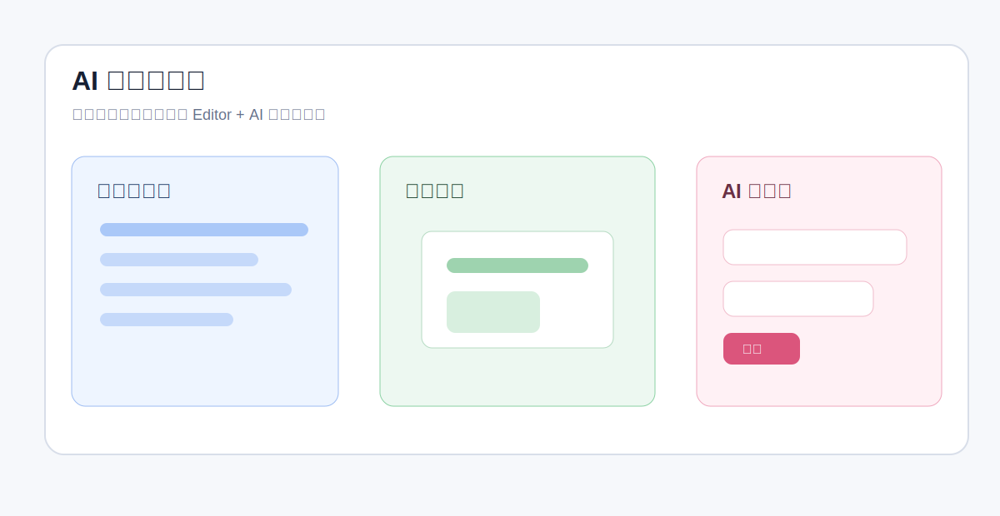

# AI 协作创作指南

平台 AI Agent 会读取当前用户有权限访问的工作空间、项目、页面、会话和工具说明等上下文，帮助完成内容生成、页面改写、组件管理和资源使用建议。AI 更适合承担结构化、可描述、可验证的创作任务。

## 阅读入口

| 文档 | 内容 |
| :--- | :--- |
| [协作流程与提示词](./workflow.md) | 说明适合交给 AI 的任务、提示词结构和协作节奏 |
| [当前上下文注入](./context-injection.md) | 说明当前代码会在什么时候注入上下文、怎么注入、注入哪些内容 |
| [工具确认与会话](./tools-and-confirmation.md) | 说明会话范围、工具确认、图片附件和中断恢复 |
| [能力边界](./boundaries.md) | 说明内容助手、组件助手、资源助手当前能做什么和不能做什么 |

## 当前助手

| 助手 | 主要职责 | 常见入口 |
| :--- | :--- | :--- |
| 内容助手 | 页面和项目任务主执行者，按需调度组件助手或资源助手 | 项目页、页面详情、AI 侧边栏 |
| 组件助手 | 工作空间组件库管理，支持组件草稿、源码修改、发布和资源读取 | 组件库 |
| 资源助手 | 工作空间资源库管理，支持可编辑文本资源、元数据、复制和归档 | 资源库 |

内容助手需要进入具体项目后才能启动。组件助手和资源助手以工作空间为主要范围工作，分别面向组件库和资源库。

## 使用原则

- 先明确目标页面、目标项目或目标库，再描述希望 AI 做什么。
- 涉及写入、覆盖、归档、删除或发布的操作，先检查工具确认中的目标对象和参数。
- 页面源码、组件源码、资源内容、项目路由、资源列表等业务事实以工具读取结果为准，不要求 AI 凭印象推断。
- 对视觉结果有要求时，尽量用预览或截图结果描述问题，例如“右侧文字拥挤”或“封面标题不够突出”。
