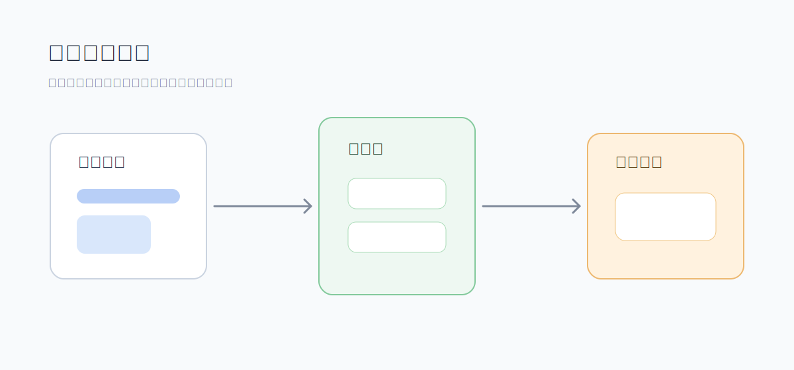

<!-- 文件功能：面向平台用户说明当前工作空间组件库的草稿、发布版本、引用关系、离线包和 AI 协作方式。 -->
# 组件管理体系

组件库用于维护可复用的 Vue 工作空间组件。当前组件采用“单一草稿 + 正式发布版本”模型：草稿可以频繁保存和预览，但只有发布后的版本才能被页面或其他组件引用。



## 组件基本信息

一个工作空间组件包含：

- 组件名称：用户可见名称。
- `import_name`：源码默认导入名，必须是 PascalCase 英文标识符，并且在同一工作空间启用组件内唯一。
- 组件类型：当前用于组件库筛选和分类。
- 组件摘要：说明用途和适用边界。
- 源码内容：当前可编辑草稿。
- `previewSchema`：声明组件预览时可调的 props、slots、mocks 和 presets。
- 状态：启用或归档。

组件 `code` 由后端生成，用户不需要手工维护。

## 草稿与发布版本

组件草稿和发布版本的关系如下：

| 对象 | 是否可编辑 | 是否可被页面引用 | 说明 |
| :--- | :--- | :--- | :--- |
| 当前草稿 | 可编辑 | 不可直接引用 | 用于日常编辑、预览和发布前校验 |
| 发布版本 | 不可变 | 可引用 | 发布后生成版本号，例如 `v1`、`v2` |

页面和其他组件引用组件时使用已发布版本路径：

```ts
import SalesMetricCard from '@workspace-components/<component_code>/v/<version_no>'
```

引用未发布组件或不存在的组件版本时，保存页面或组件会被后端拒绝。

## 组件工作台

工作空间“组件库”页当前提供：

- 左侧组件列表和 Runtime Kit 可预览能力列表。
- 右侧组件预览、源码编辑和 `previewSchema` 编辑。
- 草稿保存。
- 发布当前草稿，发布时可填写发布名和变更说明。
- 发布历史查看。
- 指定发布版本预览。
- 指定发布版本与当前草稿 diff。
- 将某个发布版本恢复到草稿。
- 查看当前组件被页面和其他组件直接引用的情况。
- 批量升级页面和组件草稿中的直接引用到当前发布版本。

恢复发布版本到草稿不会改变外部引用；只有再次发布后，才会生成新的可引用版本。

## 离线分享包

组件库支持导入和导出组件离线分享包。导入前会预检包内组件、资源和字体摘要；正式导入后会把组件及其依赖资源、字体配置带入目标工作空间。

当前组件分享包使用组件指纹判断是否可复用：同一组件的源码、`previewSchema`、依赖组件、静态资源文件 hash 和字体配置一致时，导入会复用目标工作空间中已有的已发布组件；同 `import_name` 但指纹不同会被视为冲突，需要先重命名、归档或重新整理组件后再导入。旧版本分享包不再兼容，应使用当前版本重新导出。

这适合在不同工作空间之间迁移稳定组件，而不是用来同步未整理的临时页面片段。

## 与 Runtime Kit 的关系

组件库页面同时展示 Runtime Kit 可预览能力。Runtime Kit 是 Runtime 暴露给页面和组件使用的版本化公共能力；工作空间组件是用户在平台内维护的可复用组件。两者都可以预览，但来源和发布方式不同。

工作空间组件源码和 `previewSchema` 中引用 Runtime Kit 能力时，必须使用 Runtime Kit manifest 中允许的版本化路径。

## 与资源和字体的关系

组件源码可以引用工作空间资源，也可以依赖其他已发布工作空间组件。平台会维护组件依赖索引和组件资源索引，用于引用展示、删除阻断、分享包导出和导入。

组件分享包会携带相关资源和字体配置摘要，避免组件迁移后缺素材或缺字体。

## 与 AI 协作

当前稳定的组件助手可以管理工作空间组件库，支持组件列表、详情、版本、依赖、Runtime Kit 能力查询、资源读取、组件创建、源码修改、元数据维护、发布和删除。

使用 AI 时建议明确：

- 目标是新建组件、修改草稿、发布组件，还是只查看依赖。
- 组件要接收哪些 props，预览时需要哪些 presets。
- 是否允许改 `import_name`、摘要和组件类型。
- 是否需要发布；只保存草稿不会让页面引用到新版本。

组件删除是高影响操作，会进入确认流程。组件源码写入前会经过 Runtime validate，校验失败不会落库。

## 使用建议

- 先保存草稿并预览，确认后再发布。
- 组件被页面引用后，优先通过新版本演进，不要频繁破坏既有版本。
- 需要让页面使用新组件版本时，使用引用关系弹窗批量升级直接引用。
- `previewSchema` 应贴近真实使用场景，否则预览不能暴露内容长度和状态变化问题。
