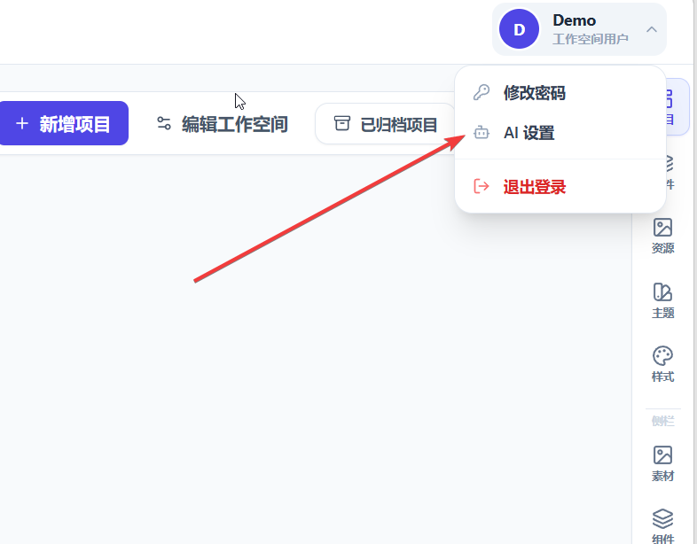

# Demo 使用指南

## 访问方式

- Demo 地址：[https://demo.926655.xyz/](https://demo.926655.xyz/)
- 账号：`Demo`
- 密码：`Demo123456`

Demo 环境用于功能体验，部署在海外轻量服务器上，访问速度和稳定性可能受网络环境影响；同时环境可能被多人共用或定期清理，不建议上传敏感资料、正式客户数据或需要长期保存的内容。

## 推荐体验流程

1. 打开 Demo 地址并使用上方账号登录。
2. 进入工作空间后，先浏览已有项目、页面、资源、组件、主题和样式。
3. 选择一个测试项目或创建新的测试项目，在页面中查看代码编辑区、预览区和页面配置。
4. 在 AI 侧边栏描述希望完成的创作任务，例如生成页面初稿、调整版式、补充页面文案或引用资源。
5. 涉及写入、删除、发布等操作时，先检查工具确认内容，再决定是否执行。
6. 修改后通过实时预览或截图预览确认效果，必要时继续让 AI 迭代。

更完整的基础流程见 [用户快速上手](./getting-started.md)，AI 协作方式见 [AI 协作创作指南](./ai/README.md)。

## AI 设置说明

Demo 环境系统预置了小米 mimo（MiMo），用于直接体验 AI 创作能力。预置额度有限，只有几元钱；如果额度用完，可能会出现 AI 调用失败、余额不足、限额或鉴权相关提示。

遇到预置额度不可用时，需要在账号 AI 设置中配置自己的模型和 API Key：

1. 打开账户或个人中心中的 AI 设置页面。
2. 新增或编辑模型配置，填写模型名称、服务地址、API Key 等必要信息。
3. 保存后回到项目页面或 AI 侧边栏，选择可用配置继续使用。

平台会对保存的 API Key 做加密存储，避免在数据库中直接保存明文密钥。但 Demo 环境仍然是公开体验环境，API Key 安全需要自行注意：

- 优先使用专门为 Demo 创建的低额度、低权限 API Key。
- 不要使用生产环境、高权限或无法快速吊销的密钥。
- Demo 账号可能被多人共用，保存的模型配置可能被同账号会话使用，体验结束后不要长期保留密钥。
- 为 API Key 设置用量限制或预算告警。
- 体验结束后，如不再需要继续使用，建议删除对应 AI 配置或吊销密钥。
