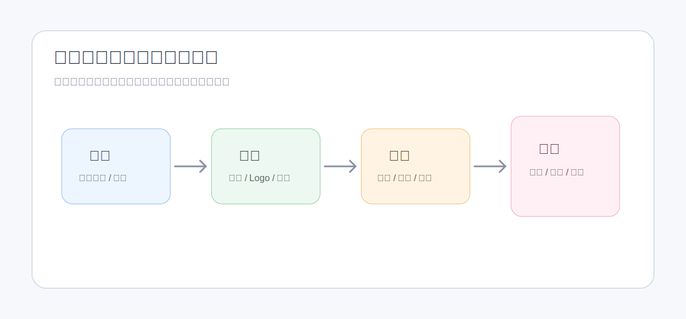

<!-- 文件功能：面向平台用户说明当前主题、字体和样式库的实际管理模型、应用关系和使用边界。 -->
# 主题、字体与样式管理体系

平台把视觉配置拆成三类：主题、字体和样式。当前实现中，主题与字体在“主题与字体”页维护，样式在“样式库”页维护。三者不是同一个对象，也不是上下级完全包含关系。

## 当前对象边界

| 对象 | 当前维护位置 | 主要内容 | 不负责的内容 |
| :--- | :--- | :--- | :--- |
| 主题 | 工作空间“主题与字体”页的主题库 | 主题 key、名称、描述、Logo、反色 Logo、项目图标、标题/正文/代码字体绑定、颜色 token | 页面宽高、基础字号、图标默认描边、菜单模式、PDF 按钮 |
| 字体注册 | 工作空间“主题与字体”页的字体管理 | 字体文件、font-family、font-format、font-weight、font-style、font-display、启用/归档状态 | 主题颜色、页面尺寸、样式规范 |
| 样式 | 工作空间“样式库”页 | 页面宽高、基础字号、图标默认描边、菜单模式、PDF 导出按钮、可选主题 key、Markdown 样式规范 | Logo、字体文件本身、主题色板本身 |

关键约束：主题只负责颜色、字体绑定、Logo 与项目图标。基础字号和默认描边宽度属于项目页面展示配置，也可以通过样式库沉淀和应用，不写入主题配置。

## 主题库

主题用于生成 Runtime 使用的主题配置。一个主题包含：

- `key`：Runtime 和项目配置引用的稳定标识，保存时会归一化为小写。
- 名称和描述：便于用户、团队成员和 AI 理解用途。
- 品牌资源：主题 Logo、反色 Logo、项目图标。
- 字体绑定：标题字体、正文字体、代码字体，来自已注册字体。
- 色板：文字、背景、边框、链接和强调色组。

工作空间可以设置默认主题。项目创建后会自动带上工作空间默认主题；项目和组件预览默认配置优先保存 `theme_key`。

## 字体注册

字体先作为字体资源文件存在，再注册为可被主题选择的字体配置。当前支持的字体文件扩展名包括 `.woff2`、`.woff`、`.ttf`、`.otf`。

注册字体时需要关注：

- `font-family` 是主题绑定和页面 CSS 使用时最重要的名称。
- `font-weight`、`font-style`、`font-display` 会影响 Runtime 下发的字体声明。
- 字体配置可以启用或归档。
- 删除字体注册时，可以选择是否一并删除关联字体文件；未注册字体文件也可以单独删除。

## 样式库

样式库不是一组 CSS 片段库，而是工作空间级“项目展示配置 + 样式规范”的预设。一个样式包含：

- 页面宽度和高度。
- 基础字号。
- 图标默认描边宽度。
- 菜单模式：侧边缩略图、底部缩略图或文本。
- PDF 导出按钮显示/隐藏。
- 可选主题 key：为空时，应用样式不会覆盖项目当前主题。
- Markdown 样式规范：记录版式、排版、色彩和组件使用约束。
- 建议组件：一组有序的已发布工作空间组件，供内容助手在项目中优先查询。

样式可以应用到项目配置草稿中；应用动作只是填充外层表单，保存后才会写入项目。建议组件不是项目到样式的持续绑定，而是在保存项目配置时复制成项目级建议组件快照；之后修改样式建议组件不会影响已经应用过该样式的项目。项目页也可以直接打开“建议组件”手动维护项目自己的建议组件；重新应用样式并保存时会用样式建议组件覆盖项目当前快照。

## 离线包

样式库支持导出和导入离线包。当前样式离线包 schema_version 为 3，导入时会带上相关样式、主题、资源、字体配置和建议组件。同 key 样式会按离线包内容覆盖，包括样式规范 Markdown 和建议组件关联；导入预检中可以查看最终写入的样式规范。建议组件会随样式包一起导出源码、预览 schema、组件依赖、组件引用资源和字体配置；导入时会通过组件指纹复用目标工作空间中内容一致的已发布组件，并把导入后的组件重新关联到样式。

组件指纹包含组件源码、`previewSchema`、依赖组件指纹、静态资源文件 hash 和字体配置签名。同 `import_name` 但指纹不同的组件不会自动复用，预检会提示冲突；旧版本样式离线包不再兼容，需要重新导出。

主题库本身当前提供列表、创建、复制、编辑和删除；样式库提供列表、创建、复制、编辑、删除、导出包、导入预检和导入。

## 推荐使用流程

1. 在资源体系中准备 Logo、项目图标和字体文件。
2. 在“主题与字体”页注册字体。
3. 创建或复制主题，绑定品牌资源、字体和色板。
4. 在“样式库”页沉淀页面尺寸、基础字号、菜单模式、PDF 按钮、Markdown 样式规范和建议组件。
5. 在项目配置中选择主题，或应用样式后保存项目配置。
6. 需要覆盖样式带来的默认组件范围时，在项目页“建议组件”中手动调整项目建议组件。
7. 组件预览需要统一规格时，使用组件预览配置覆盖页面尺寸、主题 key 等预览选项。

## 与 AI 协作

AI 可以读取项目描述、项目样式配置、组件和资源上下文，也可以通过项目样式配置写入工具更新项目级配置。涉及项目样式配置写入时，平台会要求用户确认。

给 AI 的描述应区分对象：

| 目标 | 更准确的说法 |
| :--- | :--- |
| 改颜色和字体 | “请基于当前主题调整页面视觉，不要改页面尺寸。” |
| 改页面尺寸和字号 | “请更新项目样式配置：页面 1920x1080，基础字号 20px。” |
| 使用某套预设 | “请参考工作空间样式库中的某个样式规范，保持当前项目主题不变。” |
| 新建主题方向 | “请给出主题草案建议，包括色板、Logo 使用和标题/正文/代码字体绑定。” |

## 注意事项

- 不要把单页临时视觉写成主题；主题会影响使用该 `theme_key` 的项目或预览。
- 不要把字体文件上传后就认为主题可用；需要先完成字体注册。
- 样式里的 `theme_key` 为空表示不覆盖项目当前主题。
- 样式规范是 Markdown 文本约束，不能替代页面源码校验。
