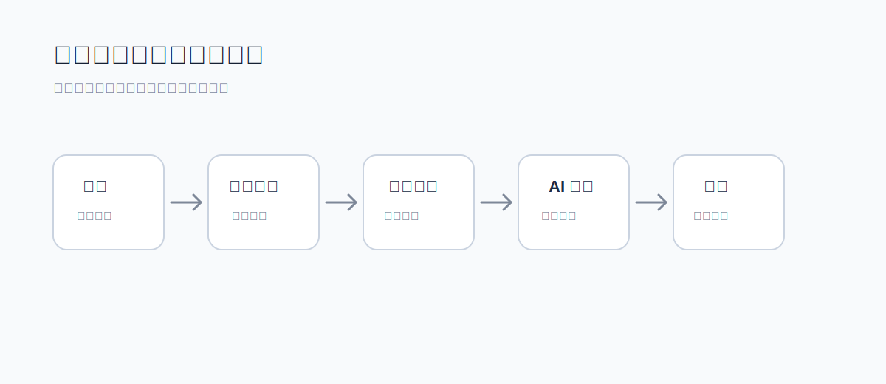

<!-- 文件功能：说明平台用户从登录到创建项目、编辑页面、预览和构建的基础上手流程。 -->
# 用户快速上手

本文面向第一次使用 `web-presentation` 的用户，说明从进入平台到完成第一批页面创作的基础流程。

## 1. 登录平台

打开管理员提供的平台访问地址，使用分配的账号登录。自托管试部署环境通常会先创建默认管理员账号，正式使用前建议由管理员创建个人账号并配置工作空间权限。

## 2. 准备工作空间

进入工作空间后，先确认以下内容：

- 当前用户是否拥有目标工作空间的访问权限。
- 工作空间中是否已有可复用资源、组件、主题和样式。
- 需要使用 AI 时，账户 AI 设置中是否已绑定可用模型。

## 3. 创建项目和页面

在项目区域创建新项目，并按内容结构创建页面。常见页面组织方式包括：

- 按演示顺序创建封面、目录、章节页、正文页和结束页。
- 按报告模块创建摘要、数据解读、问题分析和行动建议页。
- 按素材用途创建图文卡片、海报局部页或复用模板页。

页面创建后，可以在编辑区调整代码、展示配置和页面内容，并通过预览区查看结果。

## 4. 上传和引用资源

把创作需要的图片、图标、字体或参考素材放入工作空间资源库。页面和组件应优先引用资源库中的素材，减少散落的临时链接和重复上传。

## 5. 使用组件、主题和样式

如果项目中多页需要相同结构，优先创建或复用工作空间组件。主题用于统一颜色、Logo、项目图标和字体绑定；样式用于复用页面尺寸、基础字号、图标描边、菜单模式和样式规范。

## 6. 让 AI 辅助创作

在 AI 侧边栏中描述要修改的页面目标，例如补充内容结构、调整版式、生成组件或替换视觉风格。涉及写入、删除或较高风险操作时，平台会要求确认后再执行。

更完整的 AI 使用建议见 [AI 协作创作指南](./ai-assisted-creation/README.md)。

## 7. 预览、截图和构建

页面编辑过程中优先通过实时预览确认视觉效果。完成阶段可以使用截图预览或构建入口生成交付产物。构建结果会由平台保存，便于后续下载、访问或追踪历史。

## 使用建议

- 先沉淀项目主题和核心组件，再批量扩展页面。
- 上传资源时使用清晰命名，便于 AI 和团队成员理解素材用途。
- 对 AI 的要求尽量包含目标页面、风格约束、输出范围和不希望改动的内容。
- 重要页面改动后及时预览，避免连续修改后再排查视觉问题。
