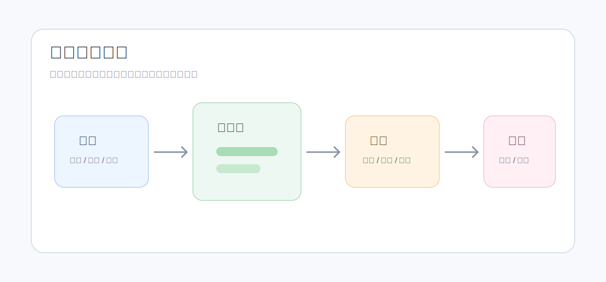

<!-- 文件功能：面向平台用户说明当前资源库的资源类型、引用关系、替换归档删除、字体资源和 AI 协作边界。 -->
# 资源管理体系

资源库用于维护工作空间内可被页面、组件、主题、字体注册和 AI 使用的素材。当前资源体系已经包含上传、文本创建、预览、替换、复制、归档、恢复、引用检查、批量归档和批量删除。

## 资源分组和类型

当前轻量资源侧边栏按两组展示：

| 分组 | 类型 |
| :--- | :--- |
| 图标资源 | 图标 |
| 内容资源 | 图片、视频、DrawIO、Mermaid、图表、公式 |

字体文件也是工作空间资源的一种，但主要在“主题与字体”页的字体管理中上传和注册。字体注册后，才能被主题的标题字体、正文字体和代码字体绑定。

常见上传格式包括：

| 类型 | 支持扩展名 |
| :--- | :--- |
| 图标 | `.svg`、`.png`、`.jpg`、`.jpeg`、`.webp`、`.gif` |
| 图片 | `.png`、`.jpg`、`.jpeg`、`.webp`、`.gif`、`.svg` |
| 视频 | `.mp4`、`.webm`、`.ogg`、`.ogv`、`.mov`、`.m4v` |
| 字体 | `.woff2`、`.woff`、`.ttf`、`.otf` |
| DrawIO | `.drawio`、`.xml` |
| Mermaid | `.mmd`、`.mermaid`、`.txt` |
| 图表 | `.json`、`.yaml`、`.yml` |
| 公式 | `.tex`、`.txt` |

## 可编辑内容资源

平台支持通过文本创建和编辑部分资源：

- SVG 图标。
- SVG 图片。
- DrawIO。
- Mermaid。
- 图表配置。
- 公式。

编辑这类资源时可以先预览内容 diff，再写入。写入或替换文件前，平台会生成历史副本。

## 资源元数据

资源记录包含：

- 资源 `name`：页面、组件和 AI 更常使用的逻辑名。
- 原文件名。
- 描述。
- 标签。
- 资源类型和渲染类型。
- 文件大小、文件哈希和公开访问 URL。
- 状态：启用、归档或历史副本。
- 图标分析元数据：例如渲染方式、图标风格、是否支持描边宽度调整。
- 字体配置摘要：字体资源已注册时会展示对应字体配置。

资源命名应优先让团队成员和 AI 理解用途。避免使用 `image1`、`final-final`、`新建文件` 这类难以追踪的名称。

## 替换、复制、归档和删除

当前资源操作的实际语义如下：

| 操作 | 语义 |
| :--- | :--- |
| 上传同名覆盖 | 覆盖已有资源时生成历史归档副本，现有引用指向新文件 |
| 替换文件 | 保留资源记录和逻辑引用，替换物理内容，并生成历史副本 |
| 复制资源 | 复制资源记录，复用物理文件指针 |
| 归档资源 | 资源退出普通 active 列表，但仍保持公开访问和引用解析能力 |
| 恢复资源 | 恢复普通归档资源；历史副本不能直接恢复 |
| 删除资源 | 只允许删除已归档且无业务引用的资源 |

资源库有 active、archived 和 history 三类视图。active 视图支持批量归档；archived 或 history 视图支持批量删除。

## 引用关系

资源引用检查会汇总资源被哪些对象使用，包括：

- 主题引用。
- 字体注册引用。
- 页面引用。
- 组件草稿或组件发布版本引用。

存在引用时，资源卡片和详情中会展示相关阻断或警告信息。删除资源前应先处理引用；归档资源仍可被已有页面、组件或主题解析。

## 与主题、字体和组件的关系

- 主题 Logo、反色 Logo 和项目图标来自图标或图片资源。
- 字体注册依赖字体资源文件。
- 页面和组件可以引用图标、图片、视频、DrawIO、Mermaid、图表和公式等内容资源。
- 组件离线分享包和样式离线包会带上相关资源和字体摘要。

## 与 AI 协作

当前资源助手可以管理工作空间资源库，支持资源查询、内容预览/写入、元数据维护、复制和归档。内容助手也可以读取资源列表、资源内容和资源标签，用于页面生成或改写。

给 AI 的资源请求应尽量明确：

- 资源名称或标签。
- 是否允许创建新资源。
- 是否允许修改可编辑资源内容。
- 是否只是读取建议，还是要执行归档、复制或写入。

资源内容写入建议先查看 diff；归档和删除类操作应谨慎确认。

## 使用建议

- 用资源 `name` 表达业务用途，用原文件名保留来源线索。
- 需要长期复用的 SVG、Mermaid、图表和公式优先创建为可编辑内容资源。
- 替换品牌图、字体或被组件引用的素材前，先查看引用关系。
- 字体文件上传后还要注册字体，主题才可以绑定使用。
